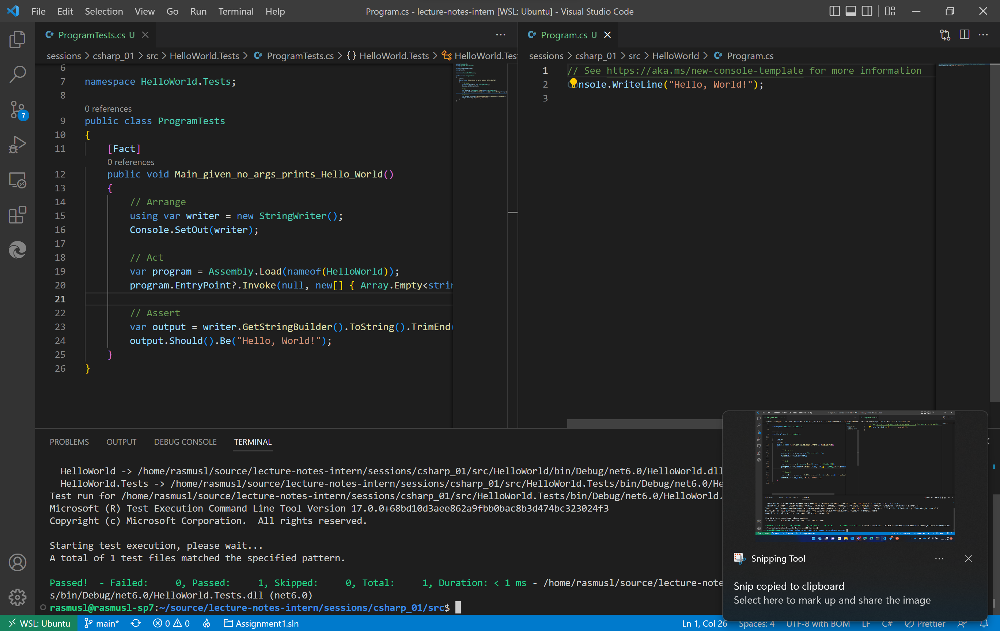
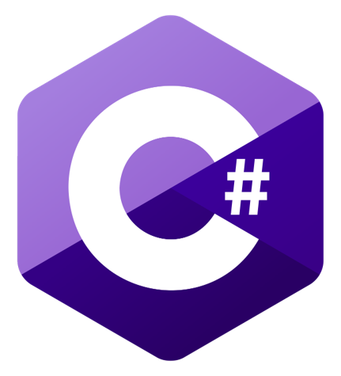
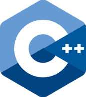
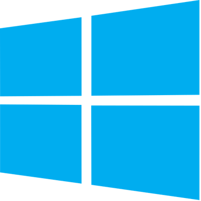
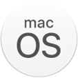
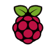
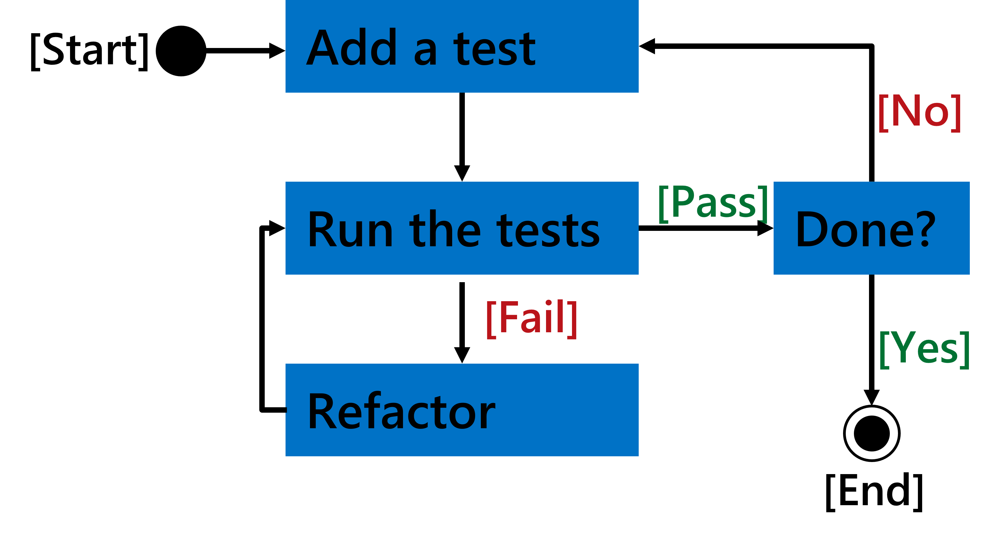
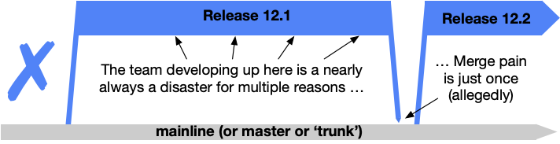
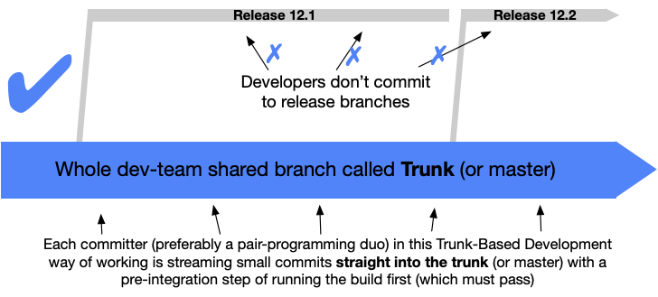
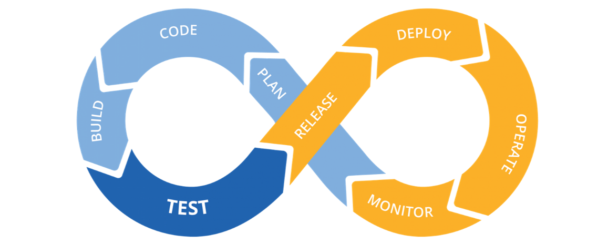

<style>
.container {
    height: 300px;
    width: 100%;
    display: block;
    justify-content: right;
    text-align: right;
}
</style>

<div class="container">

# C♯ 1 - Test Driven C♯



Rasmus Lystrøm
Associate Professor
ITU

</div>

---

# About Me


Senior Cloud Solution Architect @ Microsoft
Associate Professer @ ITU
Captain/Battalion Chief of Staff @ Danish Army (Reserves)

M[]().Sc. IT, ITU (2012)
Thesis: *Forecalc – Developing a core spreadsheet implementation in F♯*

Wife: Katrine
Children: Lærke (4), Laura (7), and Alma (14)
Origin: Aarhus
Currently residing: Vanløse (Copenhagen)

Live music and festivals (Copenhell, Brutal Assault, Hellfest, etc.)
Cross-fit

---

# Agenda

- How to reach me
- *Boring stuff*
- Test-Driven Development
- Trunk Based Development
- Continuous Integration
- Show and Tell

---

# How to reach me

Do not write me an email!
Use Discord: the TAs or your fellow students might have the answer.
You may tag me.
You may DM me for personal questions.

---

# Curriculum


Test-Driven C♯
Generics
Lambdas and Linq
Data Access (ORM)
Asynchronous and Parallel
Web APIs
Design Patterns
Mobile and Desktop Apps
Web apps
Security
Cloud

Updated version cf. <https://github.com/itu-bdsa/lecture-notes>

---

# C♯

> "C♯ is intended to be a simple, modern, general-purpose, object-oriented programming language."

ECMA-334 ISO/IEC 23270:2018(E)
C♯ language specification, 5th edition, December 2017

---

# Why C♯

- Popular cf. [Stack Overflow Annual Developer Survey 2022](https://survey.stackoverflow.co/2022/)
- Ubiquitous
- Open Source
- Cross-platform
- Industry / Enterprise
- Tool for your toolbox
- IRON
- .NET CLR

---

# Why not C♯

## It's just like Java

- Curly brackets and semicolons from C
- Statically typed
- Object-oriented
- Single inheritance
- Cross platform
- Open source
- Industry / enterprise
- JVM

---

# Enterprise

<https://github.com/joaomilho/Enterprise>

<https://github.com/EnterpriseQualityCoding/FizzBuzzEnterpriseEdition>

---

# Build on what you know already

- No basic stuff
- Read the book
- Do the exercises
- Learn the advanced patterns and syntactic sugar
- Idiomatic C♯
- Focus on clean, testable code
- Stop the enterprise madness!

---


<br>
<br>
<br>
<br>
<br>
<br>
<br>
<br>
<br>
<br>
<br>
<br>

# .NET - a brief introduction

---

# .NET

> .NET is a free, cross-platform, open source developer platform for building many different types of applications.

> With .NET, you can use multiple languages, editors, and libraries to build for web, mobile, desktop, games, IoT, and more.

<https://dotnet.microsoft.com/en-us/learn/dotnet/what-is-dotnet>

---

<!-- _class: default -->







<br>
<br>
<br>
<br>
<br>
<br>
<br>
<br>
<br>

# .NET Languages

<https://dotnet.microsoft.com/en-us/languages>

---

<!-- _class: default -->








<br>
<br>
<br>
<br>
<br>
<br>
<br>
<br>
<br>

# .NET Platforms

---

# .NET Timeline

2002: .NET, C♯, Visual Basic, Visual Studio .NET
2003: .NET 1.1, Visual Studio .NET 2003
2005: .NET 2.0, C♯ 2, F♯, Generics, VS2005
2007: .NET 3.5, C♯ 3, Auto-properties, Linq, Lambda, VS2008
2010: .NET 4.0, C♯ 4, F♯ 2, Dynamic, Parallel, VS2010
2012: .NET 4.5, C♯ 5, F♯ 3, Async/await, VS2012
2015: .NET 4.6, C♯ 6, F♯ 4, VS2015
2016: **.NET Core**, Open Source on GitHub!, Visual Studio Code
2017: .NET 4.7, **.NET Core 2**, C♯ 7, VS2017
2019: .NET 4.8, **.NET Core 3**, C♯ 8, VS2019
2020: **.NET 5**, C♯ 9, F♯ 5
2021: **.NET 6**, C♯ 10, F♯ 6
2022: **.NET 7**, C♯ 11, [.NET Conf 2022 8-10 November](https://www.dotnetconf.net/)

---

<!-- _class: default -->


<br>
<br>
<br>
<br>
<br>
<br>
<br>
<br>
<br>
<br>
<br>
<br>

# Test-Driven Development

---

# Test-Driven Development

- What?
- Why?
- How?

---

<!-- _class: default -->



<br>
<br>
<br>
<br>
<br>
<br>
<br>
<br>
<br>
<br>
<br>
<br>
<br>

# Red-Green-Refactor

---


<br>
<br>
<br>
<br>
<br>
<br>
<br>
<br>
<br>
<br>
<br>
<br>

# Trunk Based Development

---

# Trunk Based Development - What?

> A source-control branching model, where developers collaborate on code in a single branch called 'trunk'*), resist any pressure to create other long-lived development branches by employing documented techniques. They therefore avoid merge hell, do not break the build, and live happily ever after.

*) master/main, in Git nomenclature

Source: <https://trunkbaseddevelopment.com/>

---

<!-- _class: default -->

# Shared branches off mainline/master/trunk are bad at any release cadence



---

<!-- _class: default -->

# Trunk Based Development – How?



---

# Branching strategy

- Short-lived < 1 day
- Branching enables automated tests as gates
- It's not a *strategy*...

---



<br>
<br>
<br>
<br>
<br>
<br>
<br>
<br>
<br>
<br>
<br>
<br>
<br>

# Continuous Integration

---

# Continuous Integration – What?

> Continuous Integration (CI) is the process of automating the build and testing of code every time a team member commits changes to version control.

Source: <https://docs.microsoft.com/en-us/devops/develop/what-is-continuous-integration>

---

# Demo

Test-Driven C♯ using Continuous Integration and Trunk Based Development

---


<br>
<br>
<br>
<br>
<br>
<br>
<br>
<br>
<br>
<br>
<br>
<br>

# Thank you

---

# Appendix

---

# Create a C♯ console app with a test library

```bash
mkdir MyApp
cd MyApp

dotnet new console -o MyApp
dotnet new xunit -o MyApp.Tests

dotnet new sln
dotnet sln add MyApp
dotnet sln add MyApp.Tests
dotnet add MyApp.Tests reference MyApp

dotnet build
dotnet test
dotnet run --project MyApp

dotnet list package --outdated
dotnet add MyApp.Tests package xunit # add/update package

dotnet watch test --project HelloWorld.Tests/
```

---

# The C♯ class

```csharp
namespace Namespace;

public class Class
{
    private string _field;
        
    protected DateTime _fieldAvailableInSubClass;
        
    public string Property { get => _field; } // Getter
        
    public int AutoProperty { get; set; }
        
    public Class() { }

    public string InstanceMethod(string parameter)
    {
        return $"Hello {parameter}";
    }

    public virtual bool OverridableInstanceMethod(bool parameter) => !parameter;

    public static void StaticMethod() { }
       
    private void PrivateInstanceMethod() { }

    public event EventHandler Event;

    protected virtual void OnEvent(EventArgs e)
    {
        EventHandler handler = Event;
        handler?.Invoke(this, e);
    }

    public delegate void MyEventHandler(object sender, EventArgs e);
}
```

---

# Naming Conventions

**Composed names**
`currentLayout`, `CurrentLayout`

**Variables and fields**
`vehicle`, `leftElement`

**Private fields**
`_vehicle`, `_leftElement`

**Methods**
`CurrentVehicle()`, `Size()`

**Properties**
`Pi`, `Name`, `Size`

**Classes**
`MyClass`, `List<T>`

**Interfaces**
`IException`, `IObserver`

<https://docs.microsoft.com/en-us/dotnet/standard/design-guidelines/naming-guidelines>

---

# Built-in Types

```csharp
bool boolean; // true || false
char character;  // 'a', 'b', 'c', '1', '2', '3' 

// Integral numeric types
byte integer8bit;                                sbyte signedByte;
int integer32bit;                                uint unsignedInteger32bit;
long integer64bit;                               ulong unsignedInteger64bit;
short integer16bit;                              ushort unsignedInteger16bit;

// Floating point numeric types                  Reference types
decimal precisionFloatingPoint;                  object obj;
double floatingPoint64bit;                       string str;
float floatingPoint32Bit;                        dynamic dyn;
```

<https://docs.microsoft.com/en-us/dotnet/csharp/language-reference/builtin-types/built-in-types>

---

# Basic Unit Test

```csharp
public class Ticker
{
    public int Counter { get; private set; }
    public void Increment() => Counter++;
    public Ticker(int start = 0) => Counter = start;
}

public class TickerTests
{
    [Fact]
    public void Increment_when_called_increases_Counter_by_1()
    {
        // Arrange
        var sut = new Ticker(41);

        // Act
        sut.Increment();

        // Assert
        sut.Counter.Should().Be(42);
    }
}
```