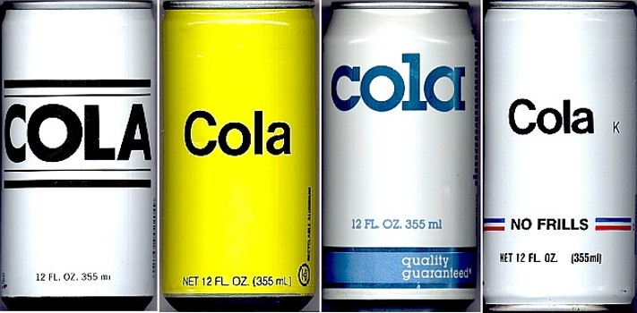

# C♯ 2 - Generics, Collections, Iterators, and Regular Expressions



Rasmus Lystrøm
Associate Professor
ITU

---

<!-- _class: default -->


<br>
<br>
<br>
<br>
<br>
<br>
<br>
<br>
<br>
<br>

# Parametric Polymorphism – "Generics"

---

# Generics


Collections (Generic)
Iterators
Create your own?
Type Constraints
(Co- and contravariance)

---

# `ArrayList` --> `List<T>`

```csharp
// Non-generic
IList list = new ArrayList();
list.Add("hello");
var s = (string)list[0];

// Generic
IList<string> list = new List<string>();
list.Add("hello");
var s = list[0];
```

---


# Generic collections

<br>
<br>
<br>
<br>
<br>
<br>
<br>
<br>
<br>
<br>
<br>
<br>

---

<!-- _class: default -->

# `System.Collections`


---

<!-- _class: default -->

# `System.Collections.Generic`


---

<!-- _class: default -->

# `System.Collections.Generic` - Key/Value


---

<!-- _class: default -->

# `System.Collections.Concurrent`


---

# Generic Collections

## Demo

---


<br>
<br>
<br>
<br>
<br>
<br>
<br>
<br>
<br>
<br>
<br>
<br>

# Iterators

---

<!-- _class: default -->

# Iterators


- Producer
- Building block for *LINQ*
- Enables:

    ```csharp
    foreach (var item in items)
    {
        Console.WriteLine(item.Name);
    }
    ```

- Built using:

    ```
    yield return 42;
    yield break;
    ```

---

# Iterators

## Demo

---

# Create your own generic class

```csharp
class MyGenericClass<T> where T : IComparable<T>
{
    void Add(T value) { }
    void Remove(T value) { }
    bool Contains(T value) { }
}
```

---

# Create your own generic class 2

```csharp
class MyGenericMap<TKey, TValue>
{
    void Add(TKey key, TValue value) { }
    bool ContainsKey(TKey key) { }
    bool ContainsValue(TValue key) { }
    TValue this[TKey key] { get; set; }
}
```

---

# Create your own generic method

```csharp
public string Serialize<T>(T obj) {}

public T2 Convert<T1, T2>(T1 obj) { }
```

---

# Type constraints

```csharp
public class MyConstrainedGenericClass<T> 
    where T : class, new() { }

public class MyConstrainedGenericClass<T> 
    where T : struct { }

public class MyConstrainedGenericClass<T1, T2> 
    where T1 : Foo 
    where T2 : IBar { }

public T2 MyConstrainedMethod<T1, T2>(T1 item)
    where T1 : Foo
    where T2 : IBar, new() { }
```

---

# Custom Generics

## Demo

---


<br>
<br>
<br>
<br>
<br>
<br>
<br>
<br>
<br>
<br>
<br>
<br>

# Covariance – Contravariance – Invariance?

---

### Covariance

Enables you to use a more derived type than originally specified.
You can assign an instance of `IEnumerable<Derived>` to a variable of type `IEnumerable<Base>`.

### Contravariance

Enables you to use a more generic (less derived) type than originally specified.
You can assign an instance of `Action<Base>` to a variable of type `Action<Derived>`.

### Invariance

Means that you can use only the type originally specified. An invariant generic type parameter is neither covariant nor contravariant.
You cannot assign an instance of `List<Base>` to a variable of type `List<Derived>` or vice versa.

Source: [docs.microsoft.com/.../generics/covariance-and-contravariance](https://docs.microsoft.com/en-us/dotnet/standard/generics/covariance-and-contravariance).

---

# Built-in Generics

```csharp
public interface IComparer<in T>
{
    int Compare(T x, T y);
}

public interface IEnumerable<out T> : IEnumerable
{
    IEnumerator<T> GetEnumerator();
}
```

---

# Covariance and Contravariance

## Demo

---


<br>
<br>
<br>
<br>
<br>
<br>
<br>
<br>
<br>
<br>
<br>
<br>
<br>

# Enumerations

---

# Enumerations

## Demo

Source: [docs.microsoft.com/.../language-reference/builtin-types/enum](https://docs.microsoft.com/en-us/dotnet/csharp/language-reference/builtin-types/enum)

---


<br>
<br>
<br>
<br>
<br>
<br>
<br>
<br>
<br>
<br>
<br>
<br>
<br>

# Regular Expressions

---

# Regular Expressions reference 1

`*` Zero or more times the previous character
`+` Once or more times the previous character
`?` Zero or one time the previous character
`.` Any single character (not \n)
`\s` Any whitespace character (e.g. tab)
`\S` Any non-whitespace character
`\b` Word boundary
`\B` Any non-word boundary position
`\w` Any word character (a-z, A-Z, 0-9)
`\W` Any non-word character
`^` Start of the input text
`$` End of the input text

---

# Regular Expressions reference 2

`[1c]` matches character ‘1’ or ‘c’
`[a-z]` matches all lower-case letters
`[a-zA-Z]` matches all letters
`[0-9]+` matches integer numbers
`[0-9]+\.[0-9]+` matches a floating point
`[0-2][0-9]:[0-5][0-9]` matches a time e.g. 12:34

---

# Regular Expressions reference 3

`[^abc]`	matches character not in ‘a’, ‘b’, or ‘c’
`(capture)` capturing group
`(?:non)` non-capturing group
`(?<name>name)` named capturing group
`[a-z]+(\d{5})` matches a standard Danish license plate where the numeric part is a capturing group
`(?<given_name>\w+) (?<surname>\w+)` matching a given name followed by a surname (named capturing groups)
`(?:Jane|John) (\w+) (?:Doe)` matching the middle name of Jane or John Doe

---

# Regular Expressions

## Demo

---


# Thank you

<br>
<br>
<br>
<br>
<br>
<br>
<br>
<br>
<br>
<br>
<br>
<br>
<br>
