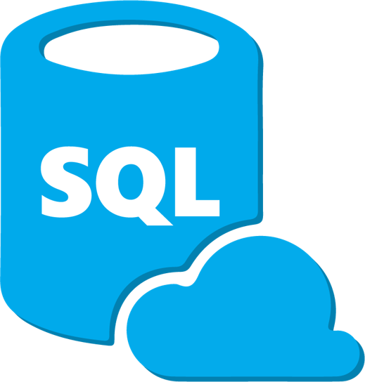
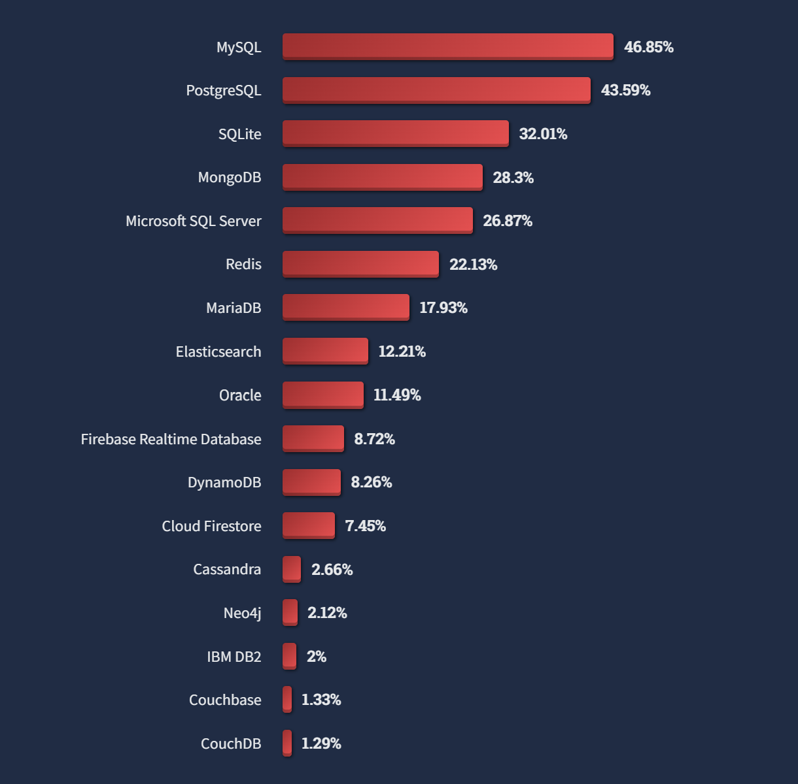
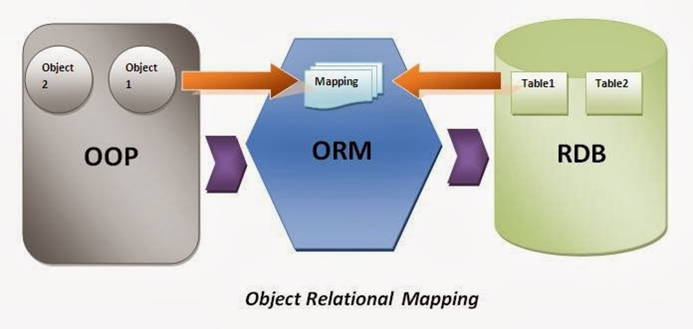
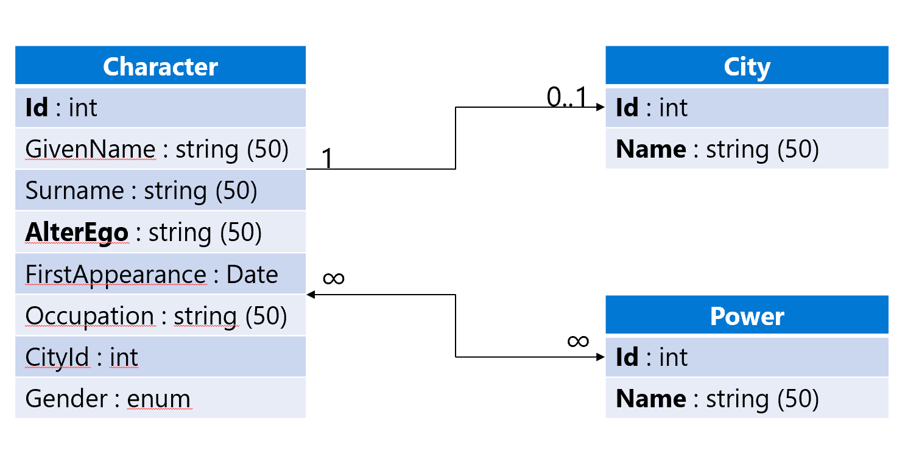
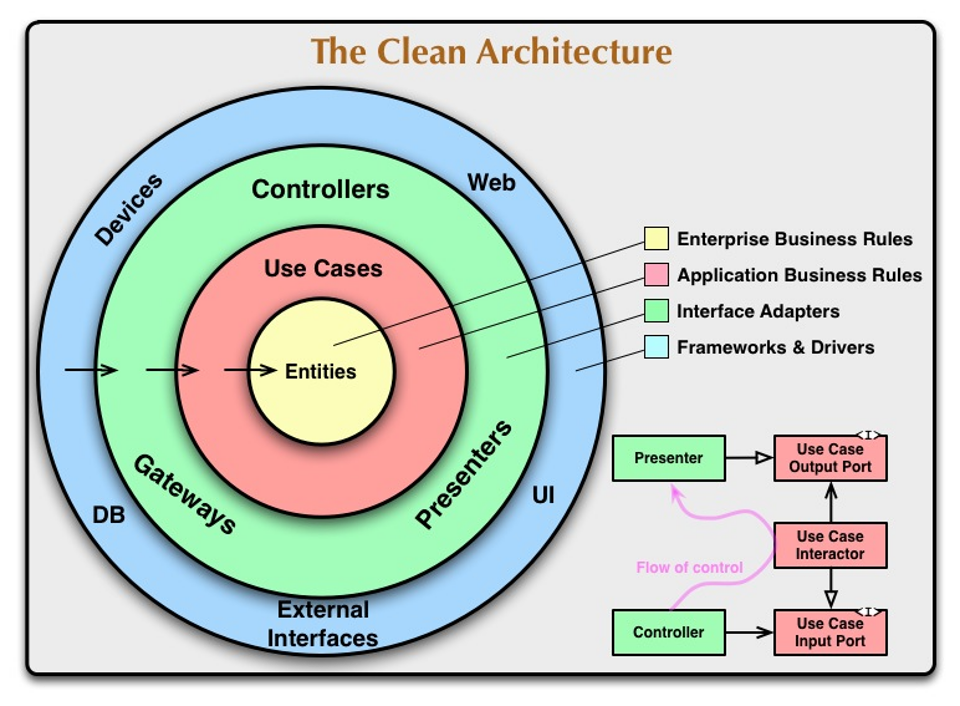

# C♯ 4 - Data Access and Entity Framework Core



Rasmus Lystrøm
Associate Professor
ITU

---

# Assignment feedback

## Conformance to requirements!

> To submit the assignment you need to create a PDF document using LaTeX that contains the answers to the questions **and** a link to a public GitHub repository that contains a fork of the assignments repository with the completed code.

> The PDF file must conform to the following **naming convention: `group_<x>_<id1>_<id2>_<id3>_assignment_01.pdf`**, where `<x>` is replaced by the number of your group from [README_GROUPS.md](./README_GROUPS.md) and `<id1>`, `<id2>`, and `<id3>` are your respective ITU identifiers.

> You submit via [LearnIT](https://learnit.itu.dk/mod/assign/view.php?id=164354).

> <https://github.com/itu-bdsa/assignment-01/#submitting-the-assignment>

---

# Pop quiz!

# Which of the following PDF files conforms to the file name requirement above?

1. `Assignment1.pdf`
1. `Group_1_aaaa_bbbb_cccc_assignment_01.pdf`
1. `group_1_aaaa_bbbb_cccc.pdf`
1. `Assignment_01-2.pdf`
1. `group_1_aaaa_bbbb_cccc_assignment_01.pdf`

---

# Pop Quiz!

# Which of the following PDF files conforms to the file name requirement above?

1. ✗ `Assignment1.pdf`
1. ✗ `Group_1_aaaa_bbbb_cccc_assignment_01.pdf`
1. ✗ `group_1_aaaa_bbbb_cccc.pdf`
1. ✗ `Assignment_01-2.pdf`
1. ✓ `group_1_aaaa_bbbb_cccc_assignment_01.pdf`

---

# Pop Quiz!

## Which of the following actions satisfies the requirement above?

- Handing in a link to a repository only
- Handing in a PDF file only
- Handing in a link to a repository and a PDF file

---

# Pop Quiz!

## Which of the following actions satisfies the requirement above?

- ✗ Handing in a link to a repository only
- ✗ Handing in a PDF file only
- ✓ Handing in a link to a repository and a PDF file

---

# Topics

<!-- _class: default -->


Databases
Old school SQL in C♯
Package managers and dependencies
Secrets
The IDisposable interface
SQL Injection
Object Relational Mapping
Entity Framework Core
Clean Onions
Lazy vs. Eager Loading

---


# Databases

<br>
<br>
<br>
<br>
<br>
<br>
<br>
<br>
<br>
<br>
<br>
<br>

---

# Relational Databases (SQL)

Microsoft SQL Server
Oracle Database
IBM Db2
MySQL
MariaDB
PostgreSQL
SQLite


---

## Document (NoSQL)

Azure Cosmos DB
Amazon DynamoDB
MongoDB
Couchbase
Redis
Elasticsearch
Neo4j


---

# Most popular databases

Source: <https://survey.stackoverflow.co/2022/#most-popular-technologies-database>



---

<!-- _class: default -->

# SQL Server

```bash
sudo docker pull mcr.microsoft.com/mssql/server:2019-latest

MSSQL_SA_PASSWORD=<YourStrong@Passw0rd>

docker run -e "ACCEPT_EULA=Y" -e "MSSQL_SA_PASSWORD=$MSSQL_SA_PASSWORD" -p 1433:1433 -d mcr.microsoft.com/mssql/server:2019-latest
```

<https://learn.microsoft.com/en-us/sql/linux/quickstart-install-connect-docker>

---

# SQL Server Demo

## SQL Server Docker Container + Azure Data Studio

---


<https://twitter.com/overflow_meme/status/1223835574848630784>

---


# IDisposable

<br>
<br>
<br>
<br>
<br>
<br>
<br>
<br>
<br>
<br>

---

<!-- _class: default -->

# <strike>IDisposable</strike>

```csharp
var connection = new SqlConnection("...");
try
{
    ...
}
finally
{
    if (connection != null)
    {
        connection.Dispose();
    }
}
```

---


<br>
<br>
<br>
<br>
<br>
<br>
<br>
<br>
<br>
<br>
<br>
<br>
<br>

# Package Manager

---

# NuGet Package Manager

Source: <https://www.nuget.org/>

`dotnet add package …`

Criteria:

- Downloads
- License
- Dependencies
- Update frequency
- Check source repository

---


# Dependabot

## Demo

---

# Old School SQL

```bash
dotnet add package System.Data.SqlClient
```

```csharp
var cmdText = "SELECT * FROM Animals";
using var connection = new SqlConnection(connectionString);
connection.Open();
using var command = new SqlCommand(cmdText, connection);
using var reader = command.ExecuteReader();
while (reader.Read())
{
    ...
}
```

---

<!-- _class: default -->

# IDisposable (Much better)

```csharp
{
    using var connection = new SqlConnection("...");

    ...
}
```

---


# Secrets

---

<!-- _class: default -->

# Secrets

```bash
dotnet user-secrets init
dotnet user-secrets set "ConnectionStrings:ConnectionString" "..."
dotnet add package Microsoft.Extensions.Configuration.UserSecrets
```

```csharp
using Microsoft.Extensions.Configuration;

var configuration = new ConfigurationBuilder()
    .AddUserSecrets<Program>()
    .Build();
var connectionString = configuration.GetConnectionString("ConnectionString");
```

---


<br>
<br>
<br>
<br>
<br>
<br>
<br>
<br>
<br>
<br>
<br>
<br>

# SQL Injection

---

# SQL Injection

A SQL injection attack consists of insertion or "injection" of a SQL query via the input data from the client to the application.

A successful SQL injection exploit can:

- read sensitive data from the database,
- modify database data (Insert/Update/Delete),
- execute administration operations on the database (such as shutdown the DBMS),
or worse

Source: <https://owasp.org/www-community/attacks/SQL_Injection>

---

<!-- _class: default -->



---

# Object Relational Mapping

The act of converting incompatible types in OOP to tables/columns/rows/relations in SQL

Object–relational impedance mismatch

> Me not understand object me table

---

<!-- _class: default -->



<br>
<br>
<br>
<br>
<br>
<br>
<br>
<br>
<br>
<br>
<br>
<br>
<br>

# Model

---


# Entity Framework Core

<br>
<br>
<br>
<br>
<br>
<br>
<br>
<br>
<br>
<br>
<br>
<br>

---

<!-- _class: default -->

# Entity Framework Core

```bash
dotnet tool install --global dotnet-ef
dotnet add package Microsoft.EntityFrameworkCore.Design
dotnet ef migrations add InitialCreate 
dotnet ef database update
```

<https://docs.microsoft.com/en-us/ef/core/miscellaneous/cli/dotnet>
<https://docs.microsoft.com/en-us/ef/core/modeling/>

---


<div style="text-align: right;">

# Onion Architecture

</div>

---

<!-- _class: default -->



---

# Lazy Loading

```bash
dotnet add package Microsoft.EntityFrameworkCore.Proxies
```

```csharp
protected override void OnConfiguring(DbContextOptionsBuilder optionsBuilder)
    => optionsBuilder.UseLazyLoadingProxies()
                     .UseSqlServer(...);
```

<https://docs.microsoft.com/en-us/ef/core/querying/related-data/lazy>

---


# Thank you
