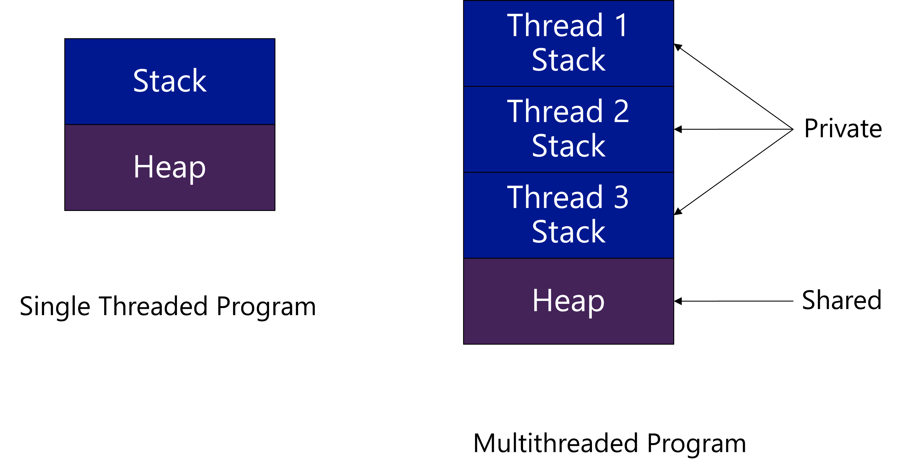
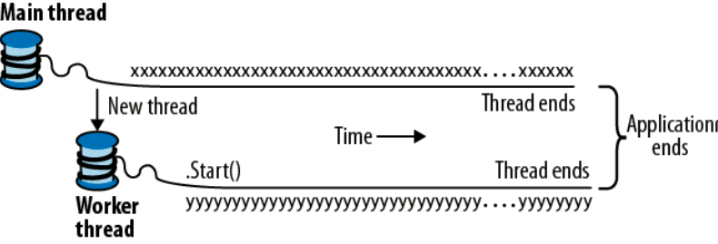

# C♯ 06: Asynchronous and Parallel Programming

Rasmus Lystrøm
Associate Professor
ITU

---

# The Gilded Rose

Introduction

---

# Dictionary

 
 
 
 
 
 
 
 
 
 
 
 

---

# Async ≠ Parallel ≠ Threads

---

# Concurrency

---

# Concurrency I

> A property of systems in which several computations are executing simultaneously, and potentially interacting with each other. The computations may be executing on multiple cores in the same chip, preemptively time-shared threads on the same processor, or executed on physically separated processors.

---

# Concurrency II

> Multiple tasks which start, run, and complete in overlapping time periods, in no specific order.

---

# Parallelism

---

# Parallelism

> When multiple tasks OR several parts of a unique task literally run at the same time, e.g., on a multi-core processor.

---

<!-- _class: default -->

# Multithreading

 
 
 
 
 
 
 
 
 
 

---

# Multithreading

> Software implementation which allows different threads to be executed concurrently.
> A multithreaded program appears to be doing several things at the same time even when it's running on a single-core machine.
> Compare to chatting with different people through various IM windows; although you're switching back and forth, the net result is that you're having multiple conversations at the same time.

---

<!-- _class: default -->

# Asynchronous methods

 
 
 
 
 
 
 
 
 
 
 
 

---

# Asynchronous methods

> Asynchrony is used to present the impression of concurrent or parallel tasking.
> Normally used for a process that needs to do work away from the current application where we don't want to wait and block our application awaiting the response.

---

<!-- _class: default -->

# Threads

---

<!-- _class: default -->

---

<!-- _class: default -->

# Threads Example

 
 
 
 
 
 
 
 
 
 
 
 

---

# Race Condition

 
 
 
 
 
 
 
 
 
 
 
 

---

# Race Condition

> Behavior of a program where the output is dependent on the sequence or timing of other uncontrollable events.
--> Bug, when events do not happen in the order the programmer intended.

---

<!-- _class: default -->

# Race Condition

## Demo

---

# Deadlock

 
 
 
 
 
 
 
 
 
 
 
 

---

# Deadlock

> A situation in which two or more competing actions are each waiting for the other to finish, and thus neither ever does.

---

# Deadlock

## Demo

---

<!-- _class: default -->

# Task Parallel Library

## Demo

---

# TPL

Task.Run
Task.Factory…
Task.Delay
Parallel.For
Parallel.ForEach
Parallel.Invoke

Parallel Linq --> .AsParallel()

---

 
 
 
 
 
 
 
 
 
 
 
 

# Concurrent Collections

---

# `System.Collections.Concurrent`

`ConcurrentQueue<T>`
`ConcurrentStack<T>`
`BlockingCollection<T>`
`ConcurrentDictionary<TKey, TValue>`

---

<!-- _class: default -->

# Asynchronous Programming

 
 
 
 
 
 
 
 
 
 
 
 
 

---

# Asynchronous Programming

> **Asynchronous programming** is a means of **parallel programming** in which a unit of work runs separately from the main application thread and notifies the calling thread of its completion, failure or progress.

---

# Asynchronous Programming

## Demo

---

# `async` / `await`

`async` -->

Method must return `void`, `Task`, `Task<T>`, `ValueTask`, `ValueTask<T>`, or a task-like type.

Specifically: a type, which satisfy the *async* pattern, meaning a `GetAwaiter` method must be accessible.

`await` --> Await task(s)...

Note: Asynchronous `Main` and *test* methods must return `Task`

---

# Async ≠ Parallel ≠ Threads

*Async*: Non-blocking UI, background tasks, asynchronous

*Parallel*: Speed, Multiprocessor, Parallel execution

*Thread*: Low-level building block. Do not use directly!

---

# Thank you
