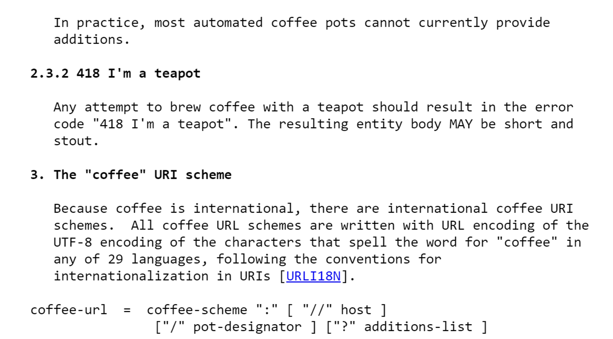
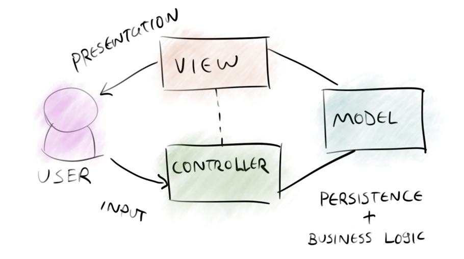
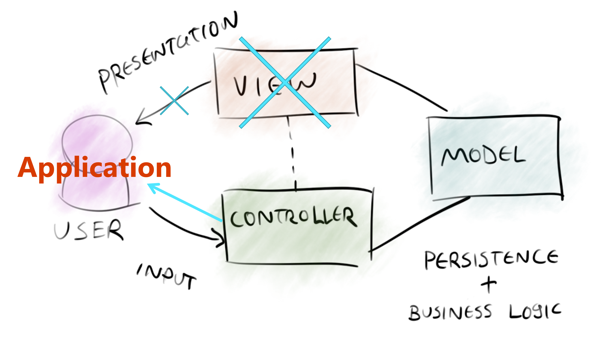

# C♯ 07: JSON and the REST


Rasmus Lystrøm
Associate Professor
ITU

---

# The Project

More info on Monday

---

# The Gilded Rose

Recap

---

# Parallel LINQ

Carry-over from last week

---

# XML

eXtensible Markup Language
Markup language like HTML
Designed to carry data, not to display data
Tags are not predefined – You must define your own tags
Designed to be self-descriptive

---

<!-- _class: default -->

# XML does not do anything

XML was created to structure, store, and transport information

```xml
<?xml version="1.0" encoding="UTF-8"?> 
<note id="1">
  <to>Kathleen B.</to>
  <from>Tom W.</from>
  <subject>Reminder</subject>
  <body>Don't forget to bring small change!</body>
</note>
```

---

# How Can XML be Used?

Separates data from HTML
Simplifies data sharing
Simplifies data transport
Simplifies platform changes
Used to create new (Internet) languages

- XHTML
- WSDL for describing web services
- RSS and ATOM for news feeds
- XAML

---

<!-- _class: default -->


---

<!-- _class: default -->

# SOAP request

```http
POST https://store.com/services/PriceService/getPrice
```

```xml
<?xml version="1.0"?>
<soap:Envelope
    xmlns:soap="http://www.w3.org/2003/05/soap-envelope/"
    soap:encodingStyle="http://www.w3.org/2003/05/soap-encoding">
  <soap:Body>   
    <m:GetPrice xmlns:m="https://www.w3schools.com/prices">
      <m:Item>Apples</m:Item>   
    </m:GetPrice>
  </soap:Body>
</soap:Envelope>
```

---

<!-- _class: default -->

# SOAP response

```xml
<?xml version="1.0"?>
<soap:Envelope
    xmlns:soap="http://www.w3.org/2003/05/soap-envelope/"
    soap:encodingStyle="http://www.w3.org/2003/05/soap-encoding">  <soap:Body>   
        <m:GetPriceResponse xmlns:m="https://www.w3schools.com/prices">
            <m:Price>1.90</m:Price>   
        </m:GetPriceResponse>
    </soap:Body>
</soap:Envelope>
```

---


<br>
<br>
<br>
<br>
<br>
<br>
<br>
<br>
<br>
<br>
<br>
<br>

# JSON

---

# JSON

JavaScript Object Notation
Lightweight text-data interchange format
Language independent (uses JavaScript syntax)
"Self-describing" and easy to understand

---

# JSON Syntax

(subset of the JavaScript object notation syntax)

Data is in name/value pairs
Data is separated by commas
Curly braces hold objects
Square brackets hold arrays

---

# JSON Name/Value Pairs

A name/value pair consists of a field name (in double quotes), followed by a colon, followed by a value:

```json
"givenName": "John"
```

This is simple to understand, and equals to the JavaScript statement:

```javascript
givenName = "John"
```

---

JSON Data Types

Number: `42` or `2.71828182845905`
String: `"this is a string"`
Boolean: `true` or `false`
Array: `[]`
Object: `{}`
Null: `null`

---

<!-- _class: default -->

# Examples

```json
{ "alterEgo": "Batman", "firstAppearance": 1939 }
```

```json
[
  { "givenName": "Bruce", "surname": "Wayne" },
  { "givenName": "Bruce", "surname": "Lee" },
  { "givenName": "Bruce", "surname": "Dickinson" }
  { "givenName": "Bruce", "surname": "Campbell" }
  { "givenName": "Robert", "surname": "the Bruce" }
]
```

```json
null
```

```json
"Batman"
```

---

# Best of both worlds?

<https://www.ibm.com/support/knowledgecenter/en/SS9H2Y_7.7.0/com.ibm.dp.doc/json_jsonxconversionexample.html>

---


# YAML

---

# YAML

YAML Ain't Markup Language

Human-readable data-serialization language.

It is commonly used for configuration files and in applications where data is being stored or transmitted.

Superset of JSON

---

<!-- _class: default -->

# YAML Example

```yaml
version: '3.9'
services:
  sql-server:
    image: mcr.microsoft.com/mssql/server:2019-latest
    hostname: sql-server
    container_name: sql-server
    ports:
      - 1433:1433
    environment:
      ACCEPT_EULA: 'Y'
      MSSQL_SA_PASSWORD_FILE: /run/secrets/sa_password
      MSSQL_PID: Express
secrets:
  sa_password:
    file: ./local/sa_password.txt
```

---

# REST

# REpresentational State Transfer

---

# HTTP request

**URI**: string
**(Query)**: key/value pairs
**Method**: string
**Header**: key/value pairs
**Body**: string/binary

---

# HTTP response

**Status-Code**: number
**Header**: key/value pairs
**Body**: string/binary

---

# REST

Maps your CRUD actions to HTTP verbs:

|Action|Verb|
|:----|:----|
|Create|POST|
|Read (Retrieve)|GET|
|Update (Replace)|PUT|
|Update (Modify)|PATCH|
|Delete|DELETE|

---

# HTTP status codes

|Code|Meaning|
|:----|:----|
|200|OK|
|201|Created|
|202|Accepted|
|204|No Content|
|301|Moved Permanently|
|302|Found (Previously "Moved temporarily")|
|307|Temporary Redirect|
|308|Permanent Redirect|
|400|Bad Request|
|401|Unauthorized|
|403|Forbidden|
|404|Not Found|
|409|Conflict|
|415|Unsupported Media Type418|I’m a Teapot|
|422|Unprocessable Entity|
|500|Internal Server Error|
|501|Not Implemented|
|503|Service Unavailable|

---

<!-- _class: default -->

# RFC2324: Hyper Text Coffee Pot Control Protocol



Source: <https://tools.ietf.org/html/rfc2324>

---

# HTTP headers

|Header Field|Description|Examples|
|:----|:----|:----|
|Accept|I understand|`text/plain`<br>`application/json`<br>`application/xml`|
|Content-Type|I'm sending|`application/x-www-form-urlencoded`<br>`application/json; charset=utf-8`|
|Authorization|Who I am|`Bearer ey…`|

---

# Why REST?

Simple, both conceptually and programmatically

Simpler and cleaner than SOAP

REST is the new black

---

# REST request

```http
GET https://store.com/prices/Apples
```

---

# REST response

```json
1.9
```

---

# HTTP request

**URI**: <https://futurama.com/api/characters>
**Method**: `POST`
**Header**:
`Content-Type`: `application/json; charset=utf-8`
`Authorization`: `Bearer ey...`
**Body**:

```json
{
    "name": "Bender",
    "species": "Robot",
    "planet": "Earth"
}
```

---

# HTTP response

**Status-Code**: `201`
**Header**:
`Content-Type`: `application/json; charset=utf-8`
`Location`: `https://futurama.com/api/characters/42`
**Body**:

```json
{
    "id": 42,
    "name": "Bender",
    "species": "Robot",
    "planet": "Earth"
}
```

---

# ASP&period;NET Core

---

<!-- _class: default -->

# Model – View – Controller



---

<!-- _class: default -->

# ASP&period;NET Core Web API



---

# MVC elsewhere

- [Spring Framework](https://spring.io/projects/spring-framework): 2002 (Java)
- [Ruby on Rails](https://rubyonrails.org/): 2004
- [CakePHP](https://cakephp.org/): 2005
- [Catalyst](http://catalyst.perl.org/): 2005 (Perl)
- [CodeIgniter](https://codeigniter.com/): 2006 (PHP)
- ASP&period;NET MVC: 2009
- ASP&period;NET Core: 2016

---

# ASP&period;NET Core Web API

## Demo

`dotnet new --list`

---

# Controller

## Class

Derive from `ControllerBase`
Decorate with `[ApiController]` and `[Route("[controller]")]`

## Method

Decorate with `[HttpGet]`,`[HttpPost]`, `[HttpPut]`, or `[HttpDelete]`
Return specific type, `IActionResult`, `ActionResult<T>`, or `async Task<...>`.

---

# Thank You
