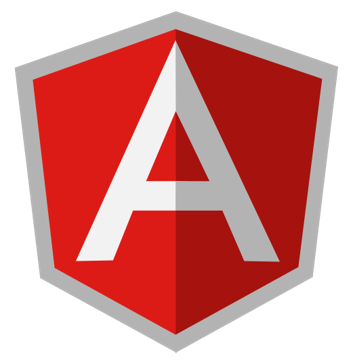

# C♯ 09: .NET Web Applications


Rasmus Lystrøm
Associate Professor
ITU

---


# .NET Conf 2022

November 8–10

- .NET 7
- ASP&period;NET Core
- Blazor
- Minimal APIs
- .NET MAUI
- C♯ 11

<https://www.dotnetconf.net/>

---


<br>
<br>
<br>
<br>
<br>
<br>
<br>
<br>
<br>
<br>
<br>

# ASP&period;NET Web Applications

---

# ASP&period;NET Web Applications

<strike>ASP&period;NET Web Forms (2002)</strike>
ASP&period;NET MVC (2010) --> Core
ASP&period;NET Web Pages (2010) --> Core
ASP&period;NET Core (2016)

- Razor Pages
- MVC
- Blazor (Server or WebAssembly) (2018)
- SPA (Angular or React)
- Hybrid MVC + Blazor

<https://learn.microsoft.com/en-us/aspnet/core/tutorials/choose-web-ui>

---

<!-- _class: default -->

# ASP&period;NET Core Razor Pages

Razor Pages can make coding page-focused scenarios easier and more productive than using controllers and views.

```bash
dotnet new webapp
```

<https://learn.microsoft.com/en-us/aspnet/core/razor-pages/>

---

<!-- _class: default -->


# ASP&period;NET Core MVC

ASP.NET Core MVC is a rich framework for building web apps and APIs using the Model-View-Controller design pattern.

```bash
dotnet new mvc
```

<https://learn.microsoft.com/en-us/aspnet/core/mvc/overview>

---

<!-- _class: default -->

# Blazor

Blazor is a framework for building interactive client-side web UI with .NET:

[Beginner's Series to: Blazor
](https://learn.microsoft.com/en-us/shows/beginners-series-to-blazor/)

```bash
dotnet new blazorserver
dotnet new blazorwasm
```

<https://learn.microsoft.com/en-us/aspnet/core/blazor/>
<https://dotnet.microsoft.com/en-us/apps/aspnet/web-apps/blazor>

---

<!-- _class: default -->

# Single Page Application (SPA)

  

```bash
dotnet new angular
dotnet new react
```

---

# ASP&period;NET Web Applications

## Demo

---

<!-- _class: default -->


# Building your own components

---

# Component Vendors

Telerik: <https://www.telerik.com/>
DevExpress: <https://devexpress.com/>
Radzen: <https://blazor.radzen.com/>

---

# Components

## Demo

---

# How to choose a framework

---

# How to choose a framework

1. Install Studio Professional/VisualEnterprise/for Mac
1. TEST out all the templates one by one
1. Get your own feel for pros/cons of each framework for your scenario
1. **When your done; select Blazor!**

---

# No, really

- Pick the one where you believe you will be the most productive
- Don’t be afraid to change your mind
- Be prepared: The next great thing which is better than all the others will arrive tomorrow or next year approx.

---

# Thank You
