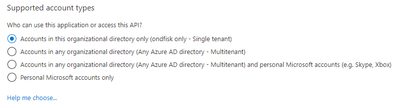
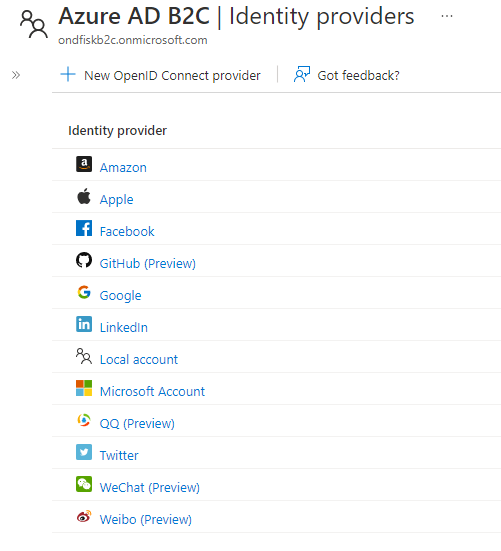

# C♯ 11: Security

Rasmus Lystrøm
Associate Professor
ITU

---


---

# Upgrading .NET Applications

Use Dependabot: <https://docs.github.com/en/code-security/dependabot>.

Get the latest .NET SDK: <https://dot.net/>.

```bash
dotnet tool install --global upgrade-assistant

dotnet tool install --global try-convert

upgrade-assistant analyze <csproj/sln>

upgrade-assistant upgrade <csproj/sln> --skip-backup

dotnet tool list --global

dotnet tool update --global dotnet-ef

dotnet list package --outdated
```

---

<!-- _class: default -->

# Update your .csproj files

```xml
<Project Sdk="Microsoft.NET.Sdk">
  <PropertyGroup>
    <TargetFramework>net7.0</TargetFramework>
    <Nullable>enable</Nullable>
    <ImplicitUsings>enable</ImplicitUsings>
  </PropertyGroup>
</Project>
```

---

# Upgrading .NET Applications

## Demo

---

# C♯ 11

## New features

- [UTF-8 string literals](https://learn.microsoft.com/en-us/dotnet/csharp/whats-new/csharp-11#utf-8-string-literals)
- [Required members](https://learn.microsoft.com/en-us/dotnet/csharp/whats-new/csharp-11#required-members)
- Other stuff: [What's new in C♯ 11](https://learn.microsoft.com/en-us/dotnet/csharp/whats-new/csharp-11)

Check out what's new in C♯ 8.0, 9.0, and 10.0 also.

---

# .NET 7

## New features

- [What's new in .NET 7](https://learn.microsoft.com/en-us/dotnet/core/whats-new/dotnet-7)
- [What's new in ASP.NET Core 7.0](https://learn.microsoft.com/en-us/ef/core/what-is-new/ef-core-7.0/whatsnew)
- [What's New in EF Core 7.0](https://learn.microsoft.com/en-us/ef/core/what-is-new/ef-core-7.0/whatsnew)

Check out what's new in C♯ 5.0 and 6.0.

---

# Security

---


<br>
<br>
<br>
<br>
<br>
<br>
<br>
<br>
<br>
<br>
<br>

# Authentication vs. Authorization

---

# Authentication Options

(None)
(Individual User Accounts)
Microsoft Identity Platform (Azure Active Directory)
(Windows)

---

# Microsoft Identity Platform

## LOB, Corporate, Business to Business (B2B)

Azure Active Directory (Azure AD) is Microsoft's cloud-based identity and access management service, which helps your employees sign in and access resources in:

External resources, such as Microsoft 365, the Azure portal, and thousands of other SaaS applications.
Internal resources, such as apps on your corporate network and intranet, along with any cloud apps developed by your own organization.



---

# Microsoft Identity Platform

## Business to Consumer (B2C)



---

# Key takeaway:

# Don’t roll your own security/identity layer

---


---

# Security in Blazor

[ASP.NET Core Blazor authentication and authorization](https://learn.microsoft.com/en-us/aspnet/core/blazor/security/)

[Authentication and authorization in minimal APIs](https://learn.microsoft.com/en-us/aspnet/core/fundamentals/minimal-apis/security)

---


# Encryption in Transit

SSL
HTTPS
TLS 1.2

---

# Encryption in Transit

Always enforce HTTPS
Do not expose HTTP – except for automatic redirect – TEST
Containers should communicate over secure channels only (cf. Dapr  and Azure Container Apps)

---


# Secrets

---

# Secrets

Use user-secrets in DEV
Use platform specific secret handling in PROD:

- Azure Key Vault
- App Services settings
- HashiCorp Vault

---


# SQL Security

- Azure Managed Identity
- Don't use SA in production
- Discrete user per app<sup>*)</sup>

<sup>*)</sup> Ideally: don't share databases between apps.

---


# Container Security

---

# Container Security

All applies!
No exceptions
Containers are not a security layer
Network security is an oxymoron!
Assume compromise!
HTTPS: [Hosting ASP.NET Core images with Docker over HTTPS
](https://learn.microsoft.com/en-us/aspnet/core/security/docker-https)

---

# Security

## Demo

---


# Penultimate Lecture

---

# Last Lecture

December 2nd will be the last lecture on C♯

What are we missing?
What do you want repeated?

Will cover:

Continuous deployment of MyApp to Azure using GitHub Actions

---

# Thank You
