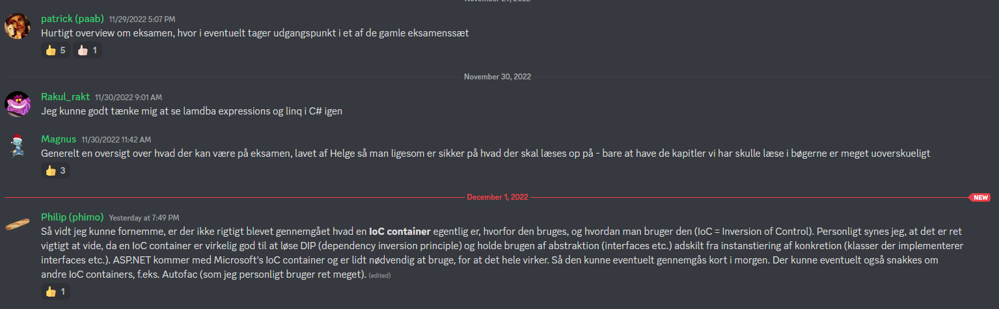

# C♯ 12:

`await this._course.DisposeAsync()`

Rasmus Lystrøm
Associate Professor
ITU

---

# When in doubt; read the docs!

---

# A note on the exam

---

# Steps

1) Read through the whole thing – cover to cover
2) Read through the whole thing – cover to cover **AGAIN**
3) Choose an order:
    * Solve the easiest
    * The most points
    * The ones you know you can do
4) Get cracking!

---

# Questions

---

# Curriculum

## (non-exclusive list)

- Unit Testing with `xunit` and (`Moq` or `NSubstitute`)
- Linq using query syntax and extension method syntax
- Regular expressions (simple ones)
- Lambda expressions
- Entity Framework Core
- ASP.NET Core Web API (Minimal API syntax)
- HTTP, JSON, and REST
- SOLID principles - detect and fix
- `async`/`await`, `Parallel`

---

# Demos

## Lambda expressions and Linq

## IoC Containers

---

# Exam questions walk-through

## Demo

---

# Questions and Feedback

## Please fill out the course evaluation

---

# Thank You

 
 
 
 
 
 
 
 
 
 
