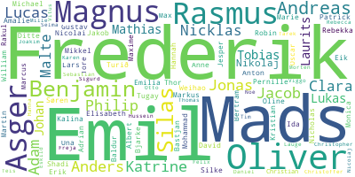
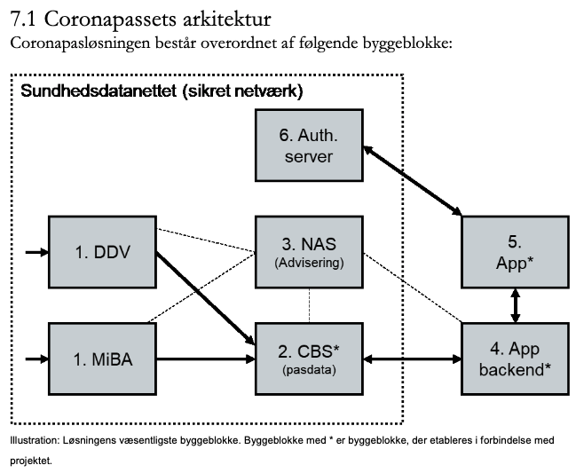
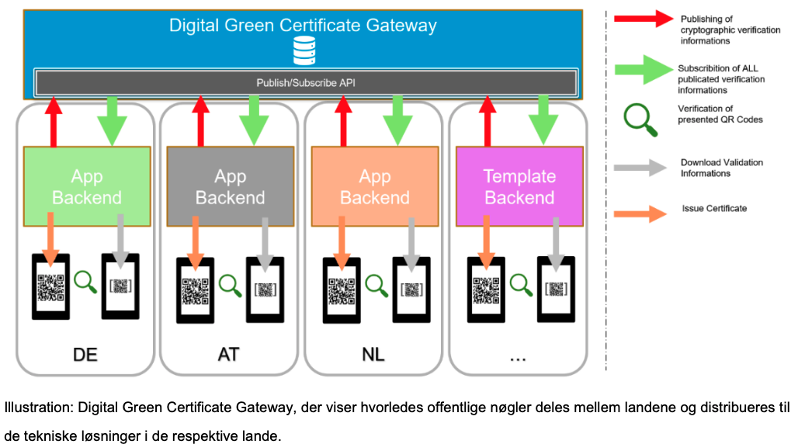

class: center, middle

# Analysis, Design and Software Architecture

## Software Engineering Session 1

Helge Pfeiffer, Assistant Professor, 
[Research Center for Government IT](https://www.itu.dk/forskning/institutter/institut-for-datalogi/forskningscenter-for-offentlig-it),  
[IT University of Copenhagen, Denmark](https://www.itu.dk) 
`ropf@itu.dk`

---

class: center, middle

# About this course

---

### Who are we?

  * TAs: Emily, Gustav, Mikkel, Mille, Tamara
  * Teachers: Helge, Rasmus

Contact us and the TAs via Discord.

---

### The Teaching Assistants (in alphabetical order)

  * Emily
  * Gustav
  * Mikkel
  * Mille
  * Tamara

---

### Rasmus

  * You will meet him on Friday, where he will introduce himself.

---

### Helge

  * Dipl-Inf. in Software Engineering from Friedrich-Schiller Universität Jena
  * PhD in Software Engineering from ITU
  * Software engineer at DMI
  * Lecturer at Cphbusiness
  * Since January 2019 back to ITU as adjunkt in the Center for Government IT

---

### Who are you?

---

### Your Expectations

<iframe src="menti_results.pdf" width="100%" height=600 scrolling="auto"></iframe>

---

### Our Expectations

  * Having fun with our work.
  * Hopefully, presenting relevant aspects of software engineering that are representative for your future professional tasks.
  * That you support each other when working through the course material, on the assignments, and on the project.
  * That you work *continuously* (as we do) on this course.
  * That you work for the about **20-24 hours** per week on this course.
    - This is the amount of time corresponding to 15 ECTS.
  * That you work on the exercises during the exercise classes.
  * That you work collaboratively in public repositories on GitHub.
  * Do not be afraid to talk to me during classes.

Note, be prepared for **quite a bit of work** and many **moments of despair** :(

This is unfortunately how learning works. At the moment it hurts but once you know how to solve your problems, solutions appear to be easy and straight forward.

---

## Grade distribution BDSA 2021

<iframe src="images/grades.html"
    sandbox="allow-same-origin allow-scripts"
    width="100%"
    height="300"
    scrolling="no"
    seamless="seamless"
    frameborder="0">
</iframe>

That is, more than a quarter of the students failed the exam and had to take the re-exam.

From these numbers and from feedback, we know that many students believe that this is the most difficult course during your BSc. But that should not block you.

---

### Schedule and Material

  * Schedule: https://github.com/itu-bdsa/lecture-notes#schedule
  * Course's repository: https://github.com/itu-bdsa/lecture-notes

---

### LearnIT

Find on LearnIT (https://learnit.itu.dk/course/view.php?id=3021292) the:

  * official course description,
  * intended learning outcomes, and
  * exam description

---

### Lectures are not recorded?

  * After almost two years of online and remote teaching, I want to reestablish the "real" thing.
  * Experience shows, that lectures are watched to a way lower degree than people believe.

---

### SW Eng. Lectures are not recorded?

  * Recording lectures does not contribute positively to student attendance and attainment, see e.g., Edwards et al. [_"A study exploring the impact of lecture capture availability and lecture capture usage on student attendance and attainment"_](https://link.springer.com/article/10.1007/s10734-018-0275-9)
  
  

---
### SW Eng. Lectures are not recorded?

  * Online videos are not climate friendly, see e.g., [_"Climate crisis: The unsustainable use of online video – A practical case study for digital sobriety"_ (2019).](https://theshiftproject.org/wp-content/uploads/2019/07/2019-02.pdf)

  

---

### Lectures are not recorded, what can I do?

  * Come **prepared** to the lecture and exercise sessions, i.e., study the preparation material *before* coming to class.
  * Take notes!
    * Either with pen and paper (best for your brain and retention, see e.g., [Mueller et al. "The Pen Is Mightier Than the Keyboard: Advantages of Longhand Over Laptop Note Taking "](https://journals.sagepub.com/doi/abs/10.1177/0956797614524581)) or some other technology.
  * Share your notes with each other.
    * If you want to, we can establish a note sharing channel, either on Discord, Teams, in a Git repository, physically, etc.

---

class: center, middle

# What are we going to do in this course?

---

# What are we going to do in this course?

<iframe src="https://itustudent.itu.dk/Your-Programme/BSc-Programmes/BSc-in-Software-Development"
    sandbox="allow-same-origin allow-scripts"
    width="100%"
    height="300"
    scrolling="auto"
    seamless="seamless"
    frameborder="0">
</iframe>

  * You know how to program in the object-oriented language Java (1st semester)
  * You executed a first software development project (2nd semester)
  * This term: how to develop software when nobody gives you a [well-prepared list of requirements for your project](https://learnit.itu.dk/pluginfile.php/318781/mod_resource/content/2/project.pdf).

---

# What are we going to do in this course?

  > [previously], we assumed that we more or less know what the classes are that we should use to solve our problems. In a real software project, deciding what classes to use to implement a solution to a problem can be one of the most difficult tasks. [...]
  >
  > These initial steps of developing a software system are generally referred to as _analysis and design_. We analyze the problem, and then we design a solution.
  >
  > Barnes et al. _Objects First with Java: A Practical Introduction Using BlueJ_ (Sixth Edition)

--

### What else do Barnes et al. describe?

  * 
  *
  * 
   
<!--   * Analysis
    - Noun/verb method for class and method identification
    - CRC (class/responsibilities/collaborators) cards with scenarios for analysis
  * Class and interface design
    - Prototyping
  * Design patterns -->

---

# Case: Coronapas App

--

Not a small software project:

  > [...] den samlede pris for appen ventes at løbe op i 46,9 millioner kroner, mens udgiften til udviklingsfasen, der løber frem til udgangen af maj ventes at lande på 17,3 millioner kroner.

  > https://www.computerworld.dk/art/256654/her-kan-du-hente-danmarks-spritnye-coronapas-app

---

# Case: Coronapas App

### Stakeholders:
  * Digitaliseringsstyrelsen
  * Netcompany and Trifork
  * ???

---

# Case: Coronapas App &mdash; How do you think it works?

--

<tiny> 
Source <a href="https://digst.dk/media/24346/whitepaper-om-coronapas_290521.pdf">Whitepaper om coronapas-appen</a>.
</tiny>

---

# Case: Coronapas App &mdash; How do you think it works?

<tiny> 
Source <a href="https://digst.dk/media/24346/whitepaper-om-coronapas_290521.pdf">Whitepaper om coronapas-appen</a>.
</tiny>

---

### What to do now?

  * Before the next session on Friday you have two exercise sessions á 2 hours each.
  * I would like you to work in groups of 6.
  * Implode the Coronapas App. That is, each group answers the following questions and create two posters:
    - A knowledge map about the Coronapas App
    - An ignorance map about the Coronapas App

---

### What to do now?

List of questions about the Coronapas App:

1. Who makes it? How is it made? What are its parts? What are the stages in its creation process?
1. What kind of professionals are involved in making expert decisions regarding its development, production, and dissemination?
1. What are the regulations concerning it? How do these regulations help constitute it?
1. How is it created after government decided to have one?
1. How can it be illustrated? How can its parts be illustrated?
1. Is there something that is reused during its creation, operation and maintenance?
1. What is done to make sure it works as intended?
1. How is it actually build and distributed?
1. How does it impact organizations (e.g., schools, businesses, governments)? How does it impact personal life (e.g., family, friendship)?

---

### What to do now?

  * Form groups of six people.
  * Map your answers to the questions above in a *knowledge map* (using for example the [mindmap notation](https://en.wikipedia.org/w/index.php?title=Mind_map#Gallery)) using pen and paper.
    - While doing that, **do not** google to increase your knowledge about the Coronapas App.
  * Thereafter, create an *ignorance map*. That is, note in a diagram as above everything that you do not know about the Coronapas App with respect to the questions above and with respect to your own questions.
    - While doing so try to figure out and note down where you could find answers to your questions and knowledge to topics that you don't know.

Wednesday at the end of the exercise session take a picture of your posters and send them to me via the Discord channel: 

---

### Your turn!

<!-- 

## EDB

## Informatik
 -->

<!-- 
https://ing.dk/artikel/nye-datacentre-oeger-dansk-elforbrug-markant-192681
https://www.information.dk/indland/2017/01/nye-datacentre-staa-tredjedel-oeget-elforbrug-fremtiden-kan-komme-koste-klimaet-skatteyderne-dyrt
https://csr.dk/kan-gr%C3%B8n-kode-g%C3%B8re-digitalisering-b%C3%A6redygtig
https://fagsiderne.dk/jagten-paa-det-groenne-it-er-skudt-i-gang-fra-it-huset-edora/ -->