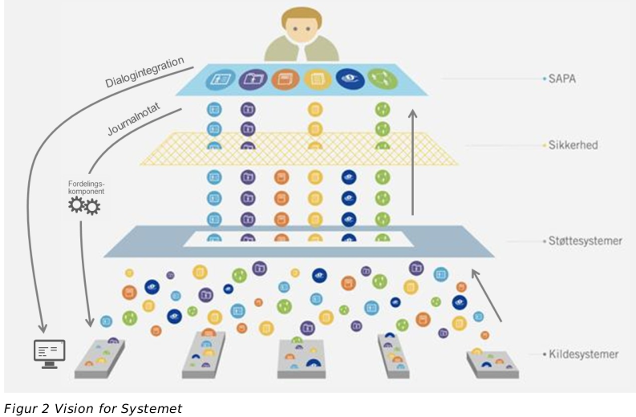
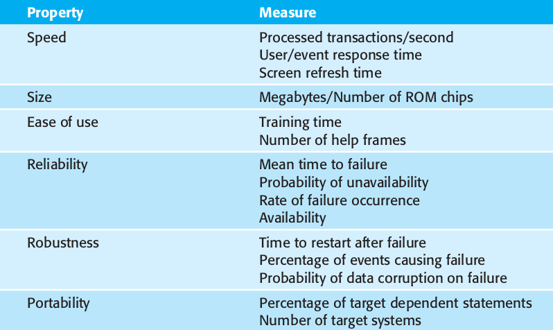
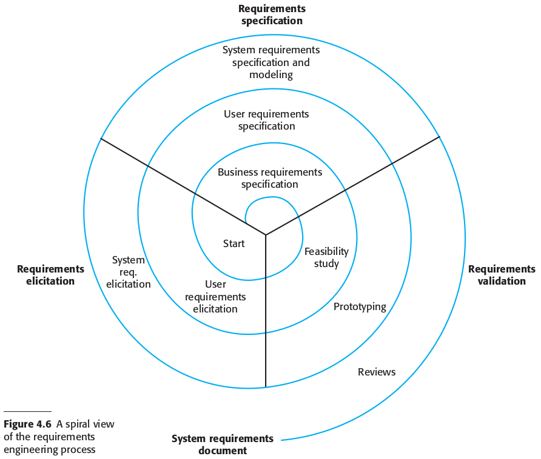
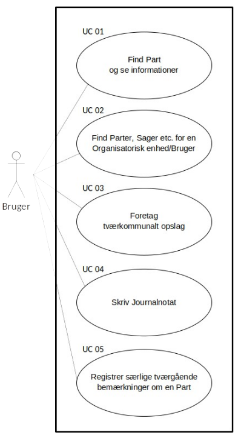
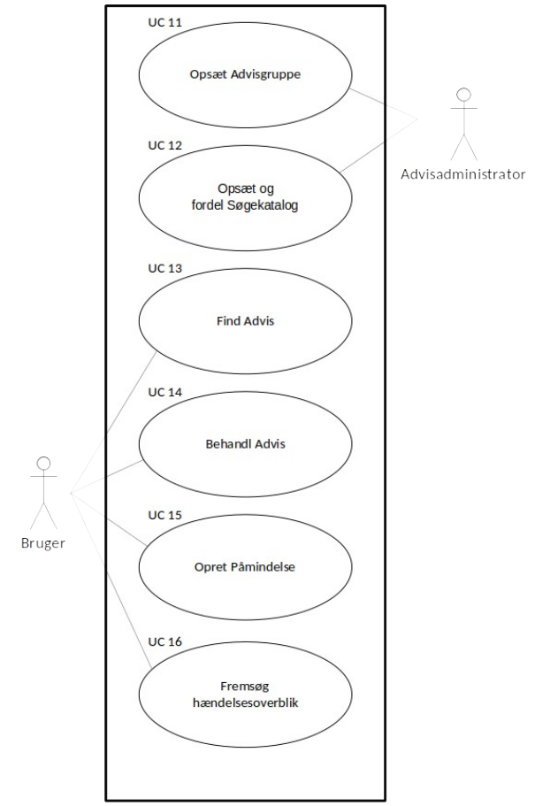
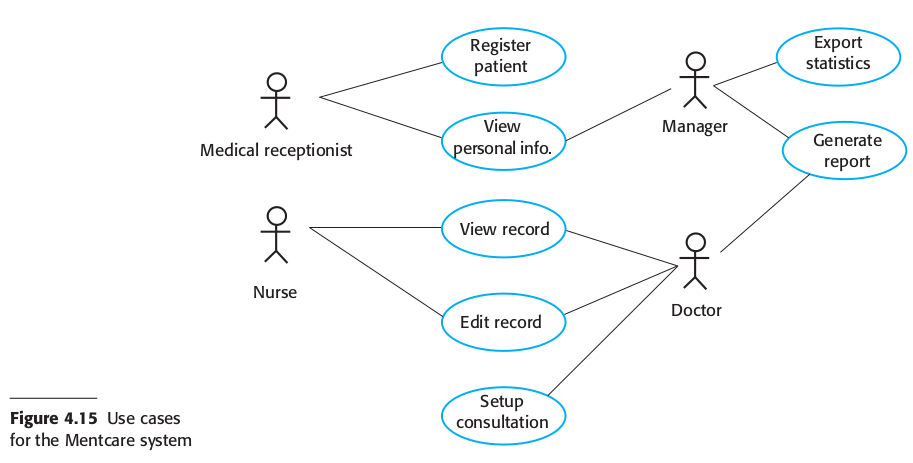
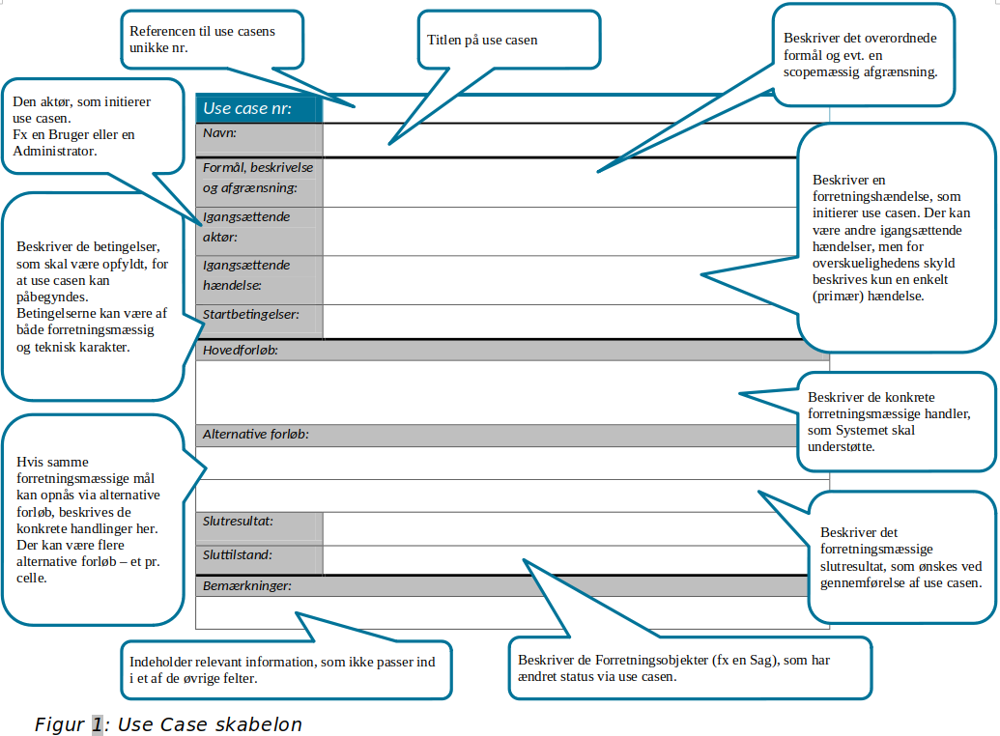
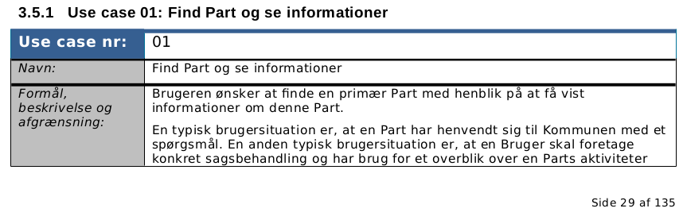
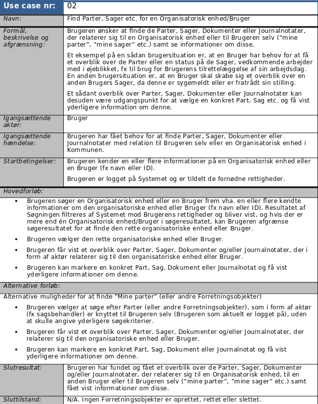

class: center, middle

# Analysis, Design and Software Architecture

## Software Engineering Session 3

Helge Pfeiffer, Assistant Professor, 
[Research Center for Government IT](https://www.itu.dk/forskning/institutter/institut-for-datalogi/forskningscenter-for-offentlig-it),  
[IT University of Copenhagen, Denmark](https://www.itu.dk) 
`ropf@itu.dk`

---

class: center, middle

# Info, Feedback, and Recap

---

### Info: Assignments

  * [Assignments 1 to 5 are mandatory](https://github.com/itu-bdsa/lecture-notes#assignments)
  * Assignment 0:
    - was not mandatory
    - 73 of 138 students handed-in, hmmm
    - Hand-in requirement was: Link to GitHub repository with PDF in it.
      - A link to an Overleaf project is not a PDF file.
      - Idea was that everybody hands-in to train the hand-in process :)

--

  * Hand-in requirements for Assignment 01, see <https://github.com/itu-bdsa/assignment-01/#submitting-the-assignment> **and** every member of the assignment groups has to hand-in!

---

class: center, middle

# Requirements

---

### Requirements?

  > **requirement**
  >
  > statement which translates or expresses a need and its associated constraints (3.1.7) and conditions (3.1.6)
  >
  > Note 1 to entry: Requirements exist at different levels in the system structure.
  >
  > Note 2 to entry: A requirement is an expression of one or more particular needs in a very specific, precise and unambiguous manner.
  >
  > Note 3 to entry: A requirement always relates to a system, software or service, or other item of interest.
  >
  > [ISO/IEC/IEEE 29148:2018(en) Systems and software engineering — Life cycle processes — Requirements engineering](https://www.iso.org/obp/ui/#iso:std:iso-iec-ieee:29148:ed-2:v1:en)

--

---------

  > **software requirements specification (SRS)**. (1) documentation of the essential requirements (functions, performance, design constraints, and attributes) of the software and its external interfaces 
  >
  > [IEEE 1012-2016 IEEE Standard for System, Software, and Hardware Verification and Validation, 3.1.29](https://standards.ieee.org/ieee/1012/5609/)

---

### Case: Sags- og Partsoverblik (SAPA) system

<tiny> 
Source: <a href="https://share-komm.kombit.dk/P011/Delte%20dokumenter/Kravspecifikation%20juli%202014%20v.%201.0.docx?d=wf7c67ea529124e898db8668f91f01201">Sags- og Partsoverblik (SAPA) Kravspecifikation juli 2014 v. 1.0</a>.
</tiny>

---

### Requirements in the wild

  * Navigate to <https://menti.com>
  * Login to quiz with code: **4425 3618**

---

### Requirements

  > If a company wishes to let a contract for a large software development project, it must define its needs in a **sufficiently abstract way that a solution is not predefined**. The requirements must be written so that **several contractors can bid for the contract, offering, perhaps, different ways of meeting the client organization’s needs**. Once a contract has been awarded, the contractor must write a system definition for the client in more detail so that the client understands and can validate what the software will do. Both of these documents may be called the requirements document for the system.
  >
  > A. M. Davis _"Software Requirements: Objects, Functions and States."_

---

### Non-functional requirements need to be testable

  > A common problem with non-functional requirements is that stakeholders propose requirements as general goals, such as ease of use, the ability of the system to recover from failure, or rapid user response. Goals set out good intentions but cause problems for system developers as they leave scope for interpretation and subsequent dispute once the system is delivered.
  >
  > Whenever possible, you should write non-functional requirements quantitatively so that they can be objectively tested.
  >
  > Sommerville _"Software Engineering"_ (10th Ed.)

---

### Kinds of requirements in SAPA system

  * Funktionelt (forretningskrav).
  * Ikke-funktionelt (løsningsorienterede krav).
  * Lov og politik (lovmæssige og politiske krav til Systemet)

Divided into:

  * Minimumskrav (MK)
  * Krav (K)
  * Option (O)

---

### Can you provide examples for:

  > Non-functional requirements may affect the overall architecture of a system
  > 
  > Sommerville _"Software Engineering"_ (10th Ed.)

--

<!-- Discuss Response time, availability, etc.  -->

<tiny> 
Source: Sommerville <i> "Software Engineering" (10th Ed.)</i>.
</tiny>

---

### Requirements need to be completely specified upfront?

The [Sags- og Partsoverblik (SAPA) system](https://share-komm.kombit.dk/P011/Delte%20dokumenter/Kravspecifikation%20juli%202014%20v.%201.0.docx?d=wf7c67ea529124e898db8668f91f01201) has a complete requirements specification document before any work on the system started.

Does it have to be like that?

--

Depends on the kind of project and its contract.

---

### Requirements specification in _"traditional"_ projects

  > Ideally, the functional requirements specification of a system should be both **complete** and **consistent**. Completeness means that all services and information required by the user should be defined. Consistency means that requirements should not be contradictory.
  >
  > Sommerville _"Software Engineering"_ (10th Ed.)

--

--------

  > I forbindelse med EU-udbud har kunden, som en del af udbudsmaterialet, fremlagt denne del af leverancebeskrivelsen, som består af kundens kravspecifikation. I det omfang leverandøren ikke opfylder kravspecifikationen ved den tilbudte løsning, skal leverandøren i sit tilbud foretage ændringer i kravspecifikationen, således at der i tilbudet er fuld overensstemmelse mellem kravspecifikationen og løsningsbeskrivelsen. Leverandørens ændringer vil herefter inden for tildelingskriterierne indgå som del af kundens vurdering af de afgivne tilbud.
  >
  > [...] Kundens kravspecifikation skal indeholde **alle kundens** krav til leverancen.
  >
  > [Bilag til K02 Standardkontrakt for længerevarende IT-projekt](https://digst.dk/media/12791/endelig-bilag-og-vejledning-k02-pdf.pdf)

--

--------

 > Gennemførelsesfasen: Projektets leverancer udvikles og leveres. Det er i denne fase, at projektet foretager **kravspecifikation**, **udbud** og **udvikling** af leverancer samt den organisatoriske og tekniske **implementering**. Der følges op på tidlige indikatorer for gevinster, og dele af gevinstrealiseringen kan være i gang. Projektgrundlaget og business casen opdateres fortsat, og projektet skal statusrapportere til Statens It-råd.
  >
  > [_"Vejledning til Statens IT-projektmodel"_](https://digst.dk/media/18239/01-vejledning-til-statens-it-projektmodel-v-13.pdf)

<!-- https://digst.dk/styring/projektstyring/statens-it-projektmodel/kom-i-gang-med-it-projektmodellen/ -->

---

### Requirements specification in _agile_ projects

  > **Leverancebeskrivelsens udvikling**
  >
  > Leverandøren skal ved opfyldelsen af Kontrakten **levere en ydelse**, der **frembringes agilt uden at modtage en komplet kravspecifikation**. Leverancebeskrivelsen fastlægger således Kontraktens Omfang, men indeholder ved Kontraktens indgåelse **ikke alle de detaljerede krav** til løsningen.
  >
  > [...] Ved Kontraktens indgåelse er kravene til løsningen overordnet og behovsorienteret formuleret. Kravene nedbrydes og detaljeres herefter løbende.
  > 
  > [K03 Standardkontrakt for længerevarende IT-projekt baseret på en agil metode Bilag](https://digst.dk/media/12797/k03-bilag-pdf.pdf)

--

--------

  > An example of a successful contract is one I negotiated for a large, multiyear, half-million-line project in 1994. We, the development team, were paid a relatively low monthly rate. Large payouts were made to us when we delivered certain large blocks of functionality. Those **blocks were not specified in detail** by the contract. Rather, the contract stated that the payout would be made for a block when the **block passed the customer’s acceptance test**. The details of those acceptance tests were not specified in the contract.
  >
  > Robert C. _"Martin Agile Principles, Patterns, and Practices in C#"_

---

### Btw.: Who are stakeholders?

  > 1. Patients whose information is recorded in the system and relatives of these patients.
  >
  > 2. Doctors who are responsible for assessing and treating patients.
  >  
  > 3. Nurses who coordinate the consultations with doctors and administer some treatments.
  >
  > 4. Medical receptionists who manage patients’ appointments.
  >
  > 5. IT staff who are responsible for installing and maintaining the system.
  >
  > 6. A medical ethics manager who must ensure that the system meets current ethical guidelines for patient care.
  >
  > 7. Health care managers who obtain management information from the system.
  >
  > 8. Medical records staff who are responsible for ensuring that system information can be maintained and preserved, and that record keeping procedures have been properly implemented.
  >
  > Sommerville _"Software Engineering"_ (10th Ed.)

--

-----------------

  > **Stakeholders** range from end-users of a system through managers to external stakeholders such as regulators, who certify the acceptability of the system.
  > 
  > **System stakeholders** include anyone who is affected by the system in some way and so anyone who has a legitimate interest in it. 
  >
  > Sommerville _"Software Engineering"_ (10th Ed.)

---

### Requirements Engineering Process

<tiny> 
Source: Sommerville <i> "Software Engineering" (10th Ed.)</i>.
</tiny>

That is real: See evolution of requirements specification of KOMBIT's SAPA system <https://share-komm.kombit.dk/P011/Delte%20dokumenter/Forms/KS.aspx>

---

### Feasibility studies

  > Requirements engineering is usually presented as the first stage of the software engineering process. However, some understanding of the system requirements may have to be developed before a decision is made to go ahead with the procurement or development of a system. This early-stage RE establishes a high-level view of what the system might do and the benefits that it might provide. These may then be considered in a **feasibility study**, which **tries to assess whether or not the system is technically and financially feasible**.
  >
  > Sommerville _"Software Engineering"_ (10th Ed.)

---

### Is Requirements engineering an analysis or a design activity?

---

### Who writes down requirements?

  * You for a company that sells something to a client.
  * A client for the company.
  * Some hybrid of the above.

---

class: center, middle

# Use Cases and Use Case Diagrams

---

### Case: Sags- og Partsoverblik (SAPA) system

<tiny> 
Source: <a href="https://share-komm.kombit.dk/P011/Delte%20dokumenter/Kravspecifikation%20juli%202014%20v.%201.0.docx?d=wf7c67ea529124e898db8668f91f01201">Sags- og Partsoverblik (SAPA) Kravspecifikation juli 2014 v. 1.0</a>.
</tiny>

---

### Use Case Diagrams — First UML Notation

<table>
    <tr>
        <td>
            
        </td>
        <td>
            What is the meaning of:
            <ul>
                <li>the stick figure</li>
                <li>lines</li>
                <li>ovals</li>
                <li>rectangle</li>
            </ul>
            <tiny> 
            Source: <a href="https://share-komm.kombit.dk/P011/Delte%20dokumenter/Kravspecifikation%20juli%202014%20v.%201.0.docx?d=wf7c67ea529124e898db8668f91f01201">Sags- og Partsoverblik (SAPA) Kravspecifikation juli 2014 v. 1.0</a>.
            </tiny>
        </td>
    </tr>
</table>

---

### Use Case Diagrams 

<table>
    <tr>
        <td>
            
        </td>
        <td>
            <ul>
                <li>What is the meaning of the stick figure to the right?</li>
                <li>Do stick figures always represent humans?</li>
                <li>Are such use case diagrams important?</li>
            </ul>
            <tiny> 
            Source: <a href="https://share-komm.kombit.dk/P011/Delte%20dokumenter/Kravspecifikation%20juli%202014%20v.%201.0.docx?d=wf7c67ea529124e898db8668f91f01201">Sags- og Partsoverblik (SAPA) Kravspecifikation juli 2014 v. 1.0</a>.
            </tiny>
        </td>
    </tr>
</table>

---

### Use Case Diagrams

<tiny> 
Source: I. Sommerville <i>Software Engineering (10th Edition)</i>
</tiny>

What is the major issue with this use case diagram from Sommerville compared to the two previous use case diagrams?

---

### More complex Use Case Diagrams

<tiny> 
Source: <a href="https://www.uml-diagrams.org/use-case-diagrams.html">System Use Case Diagrams</a>.
</tiny>

---

### Use Cases in the wild

You read in Sommerville about requirements specification via structured natural language.
Let's have a look on how these could look like in case of the requirements specification document of the Sags- og Partsoverblik (SAPA) system.

<tiny> 
Source: <a href="https://share-komm.kombit.dk/P011/Delte%20dokumenter/Kravspecifikation%20juli%202014%20v.%201.0.docx?d=wf7c67ea529124e898db8668f91f01201">Sags- og Partsoverblik (SAPA) Kravspecifikation juli 2014 v. 1.0</a>.
</tiny>

---

### Use Cases in the wild

--

<iframe src="material/Kravspecifikation juli 2014 v. 1.0.pdf" width="100%" height=600 scrolling="auto"></iframe>

---

### Use Cases in the wild

---

<iframe src="material/Kravspecifikation juli 2014 v. 1.0.pdf" width="100%" height=600 scrolling="auto"></iframe>

---

### Use Case

  > **use case.**
  >
  > **(1)** in UML, a complete task of a system that provides a measurable result of value for an actor 
  >
  > [ISO/IEC/IEEE 24765:2017 Systems and software engineering-Vocabulary](https://www.iso.org/standard/71952.html) 
  >
  > **(2)** description of behavioral requirements of a system and its interaction with a user 
  >
  > [ISO/IEC/IEEE 26515: 2018 Systems and software engineering: Developing information for users in an agile environment, 4.15](https://www.iso.org/standard/70880.html)
  >
  > **(3)** specification of a sequence of actions, including variants, that a system (or other entity) can perform, interacting with actors of the system
  > Note: More formally, a use case defines a set of use case instances or scenarios.
  >
  > [ISO/IEC 23643:2020, Software and systems engineering--Capabilities of software safety and security verification tools, 3.31](https://www.iso.org/standard/76517.html)

---

### Scenarios?

  > **scenario** 
  >
  > 1. step-by-step description of a series of events that occur concurrently or sequentially cf. use case
  > Note: A scenario can be a user story, use case, operational concept, or sequence of events the software may encounter.
  >
  > [ISO/IEC/IEEE 24765:2017(en) Systems and software engineering — Vocabulary](https://www.iso.org/obp/ui/#iso:std:iso-iec-ieee:24765:ed-2:v1:en) 

--

--------

  > **operational scenario**
  > 1. description of an imagined sequence of events that includes the interaction of the product or service with its environment and users, as well as interaction among its product or service components
  > 
  > Note: Operational scenarios are used to evaluate the requirements and design of the system and to verify and validate the system.
  >
  > [ISO/IEC/IEEE 29148:2011 Systems and software engineering — Life cycle processes — Requirements engineering, 4.1.15](https://www.iso.org/obp/ui/#iso:std:iso-iec-ieee:29148:ed-2:v1:en)

---

### Observation

Multiple requirements per use case for SAPA requirements specification document.

<iframe src="material/Kravspecifikation juli 2014 v. 1.0.pdf" width="100%" height=600 scrolling="auto"></iframe>

---

### Exercise &mdash; Your turn!

<!-- 
 -->

Watch the video below and assume that the narrator tells you about an envisioned system, not one that already exists:

<iframe width="560" height="315" src="https://www.youtube-nocookie.com/embed/XYGubkLrRtA" title="YouTube video player" frameborder="0" allow="accelerometer; autoplay; clipboard-write; encrypted-media; gyroscope; picture-in-picture" allowfullscreen></iframe>

  * Identify three requirements that a spreadsheet application should fulfill
  * Does the narrator describe user or system requirements?
  * List names of use cases.

  * Do that on  <https://menti.com>
  * Login to quiz with code: **84 13 23 4**

---

### Links to other requirements specifications

  * [Kommunernes Pensionssystem (Social Pension)](https://www.kombit.dk/sites/default/files/user_upload/documents/Social_Pension/Bilag%202.1%20Kravspecifikation%20Leverand%C3%B8rh%C3%B8ring.pdf)
  * [Fællesoffentlig Elektronisk Sags- og Dokumenthåndtering](https://www.google.dk/url?sa=t&rct=j&q=&esrc=s&source=web&cd=&ved=2ahUKEwjRj7uWnYD6AhWpl4sKHbtnAeIQFnoECAYQAQ&url=https%3A%2F%2Fwww.digitaliser.dk%2Fresource%2F3791016%2Fartefact%2FDenfllesoffentligeESDHkravspecifikationversion01.pdf%3Fartefact%3Dtrue%26PID%3D3791045&usg=AOvVaw2Pe7EDKbMAMLsrWuqa-QKC)
  * [Samlet socialfagligt it-system](https://www.google.dk/url?sa=t&rct=j&q=&esrc=s&source=web&cd=&ved=2ahUKEwjRj7uWnYD6AhWpl4sKHbtnAeIQFnoECBEQAQ&url=https%3A%2F%2Fsocialstyrelsen.dk%2Ffiler%2Ftvaergaende%2Fvum-2.0%2Fvum-2-0-kravspecifikation-september-2020.docx&usg=AOvVaw3o8j5wK3Vy5D494P6-Q3pi)
  * [Det Nationale Indikator Projekt IT system](http://www.epj-observatoriet.dk/publikationer/nip.pdf)
  * [Proces- og Dokumentstyringssystem](https://stps.dk/da/om-os/maal-og-opgaver/udbud/proces-og-dokumentstyringssystem/~/media/C26218D03C9D4A4582C0AFDEC46C2780.ashx)

<!-- https://share-komm.kombit.dk/P011/Delte%20dokumenter/SAPA%20kravspecifikation%20Version%200.7%20-%2019.%20december%202013.pdf2013.pdf
 -->

<!-- https://www.hofor-tekniskdesign.dk/wp-content/uploads/2020/08/BET-101-B2-Membraner-26082020.pdf
https://www.version2.dk/artikel/derfor-gik-det-galt-efi-systemet
https://indblik.dk/eksperter-kritiserer-regeringens-coronapas-kan-gaa-rigtigt-galt/
 -->
---

### Your turn!

  * Go to the exercise session.
  * Work in your assignment triplet, see <https://github.com/itu-bdsa/assignment-01/README_GROUPS.md>
  * Work on the exercises of the assignment, see <https://github.com/itu-bdsa/assignment-01/README.md>

Via [LearnIT Hand-in](https://learnit.itu.dk/mod/assign/view.php?id=163682), hand-in a link to the Git repository on GitHub with your solution, at latest on Friday at 10:00.
