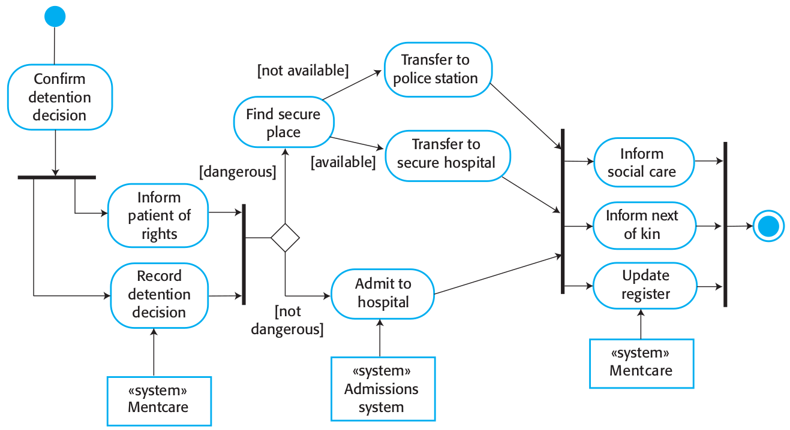
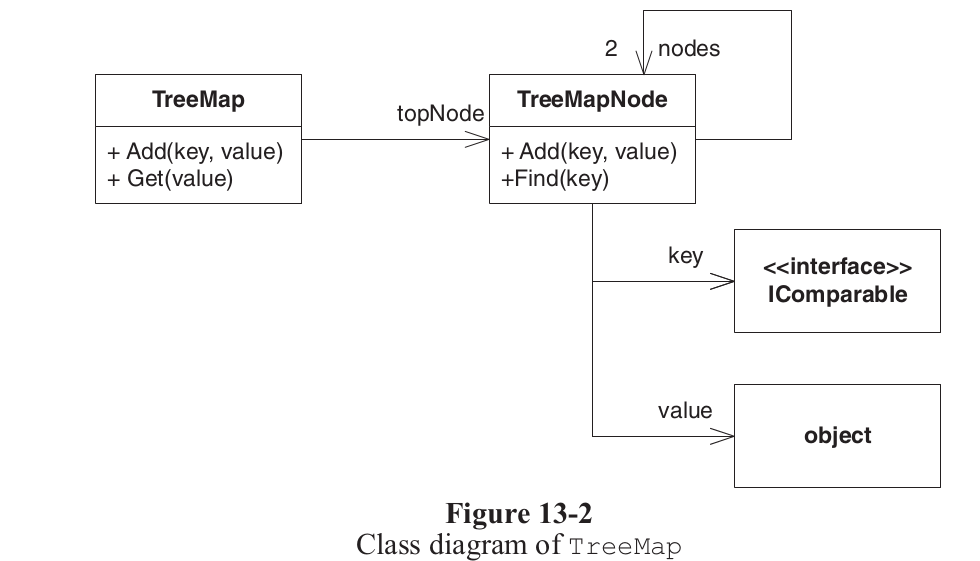
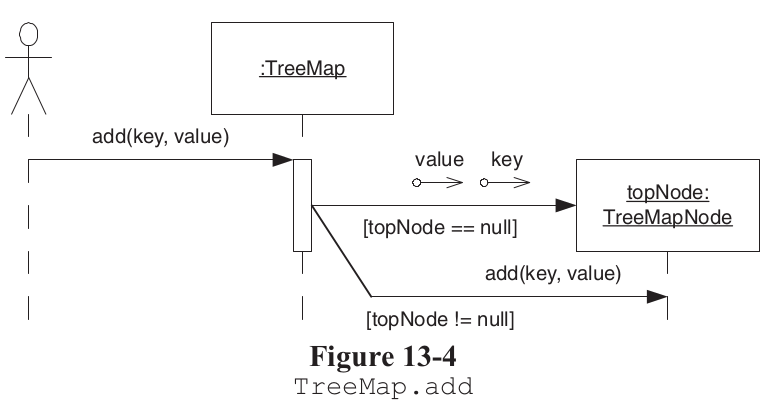
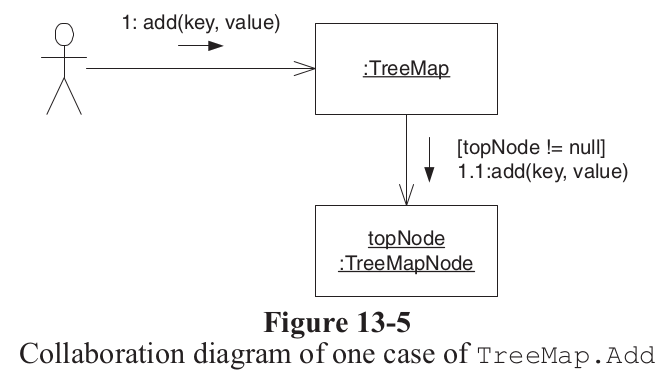
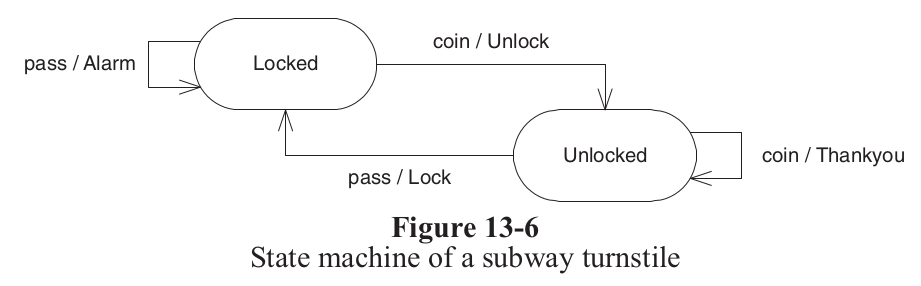
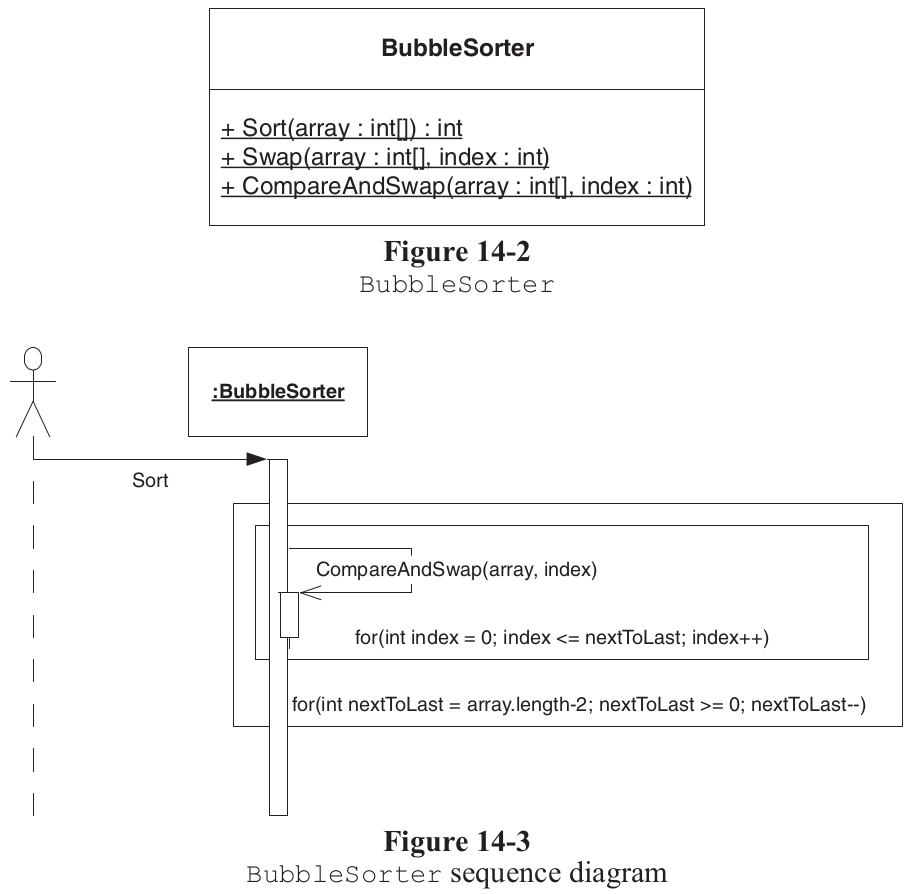
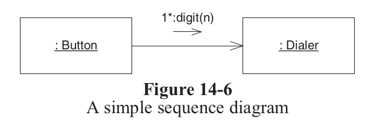
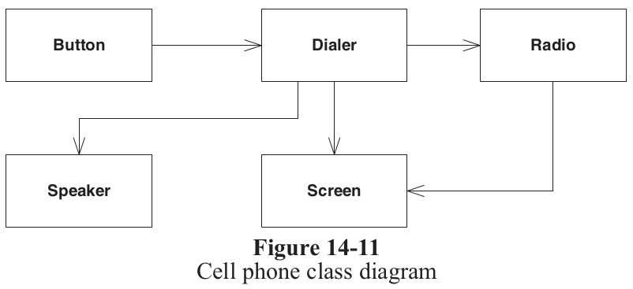
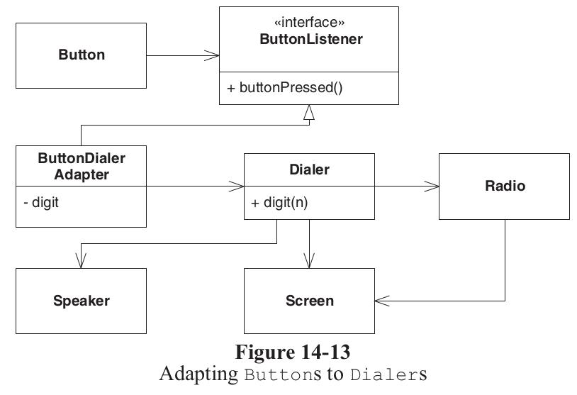

class: center, middle

# Analysis, Design and Software Architecture

## Software Engineering Session 4

Helge Pfeiffer, Assistant Professor, 
[Research Center for Government IT](https://www.itu.dk/forskning/institutter/institut-for-datalogi/forskningscenter-for-offentlig-it),  
[IT University of Copenhagen, Denmark](https://www.itu.dk) 
`ropf@itu.dk`

---

class: center, middle

# Info, Feedback, and Recap

---

### Assignment feedback

Do **not** send pull requests with your work to the assignment repositories!

The only reason to send a pull request to an assignment repository is to inform us about a change in your group.

--

But I already started working on the assignment and want to send a pull request with only the group change information... How to do that?

Use the power of Git's branching capabilities:

  * Checkout the original version that you forked
  * Create and switch to a new branch
  * Modify the the group members.
  * Push that to a new remote branch
  * Send a pull-request from that one to the assignment repository
  * Continue your work by switching back to your work branch 

---

### Assignment feedback

I did not hand in? What to do?

Helge has to think about that. I was not prepared for that case and have to figure out how to handle that.

---

### Assignment feedback

**Conformance to requirements!**

  > To submit the assignment you need to create a PDF document using LaTeX that contains the answers to the questions **and** a link to a public GitHub repository that contains a fork of the assignments repository with the completed code.
  > 
  > The PDF file must conform to the following **naming convention: `group_<x>_<id1>_<id2>_<id3>_assignment_01.pdf`**, where `<x>` is replaced by the number of your group from [README_GROUPS.md](./README_GROUPS.md) and `<id1>`, `<id2>`, and `<id3>` are your respective ITU identifiers. 
  > 
  > You submit via [LearnIT](https://learnit.itu.dk/mod/assign/view.php?id=164354).
  > 
  > <https://github.com/itu-bdsa/assignment-01/#submitting-the-assignment>

Which of the following PDF files conforms to the file name requirement above?

  1. `Assignment1.pdf`
  2. `Group_1_aaaa_bbbb_cccc_assignment_01.pdf`
  3. `group_1_aaaa_bbbb_cccc.pdf`
  4. `Assignment_01-2.pdf`
  5. `group_1_aaaa_bbbb_cccc_assignment_01.pdf`

---

### Assignment feedback

**Conformance to requirements!**

  > To submit the assignment you need to create a PDF document using LaTeX that contains the answers to the questions **and** a link to a public GitHub repository that contains a fork of the assignments repository with the completed code.
  > 
  > The PDF file must conform to the following **naming convention: `group_<x>_<id1>_<id2>_<id3>_assignment_01.pdf`**, where `<x>` is replaced by the number of your group from [README_GROUPS.md](./README_GROUPS.md) and `<id1>`, `<id2>`, and `<id3>` are your respective ITU identifiers. 
  > 
  > You submit via [LearnIT](https://learnit.itu.dk/mod/assign/view.php?id=164354).
  > 
  > <https://github.com/itu-bdsa/assignment-01/#submitting-the-assignment>

Which of the following PDF files conforms to the file name requirement above?

  1. ✗ `Assignment1.pdf`
  2. ✗ `Group_1_aaaa_bbbb_cccc_assignment_01.pdf`
  3. ✗ `group_1_aaaa_bbbb_cccc.pdf`
  4. ✗ `Assignment_01-2.pdf`
  5. ✓ `group_1_aaaa_bbbb_cccc_assignment_01.pdf`

---

### How to address that issue as an agile software engineer?

For example, include an acceptance test in your GitHub actions that build the PDF from the LaTeX sources.

---

### Assignment feedback

**Conformance to requirements!**

  > To submit the assignment you need to create a PDF document using LaTeX that contains the answers to the questions **and** a link to a public GitHub repository that contains a fork of the assignments repository with the completed code.
  > 
  > The PDF file must conform to the following **naming convention: `group_<x>_<id1>_<id2>_<id3>_assignment_01.pdf`**, where `<x>` is replaced by the number of your group from [README_GROUPS.md](./README_GROUPS.md) and `<id1>`, `<id2>`, and `<id3>` are your respective ITU identifiers. 
  > 
  > You submit via [LearnIT](https://learnit.itu.dk/mod/assign/view.php?id=164354).
  > 
  > <https://github.com/itu-bdsa/assignment-01/#submitting-the-assignment>

Which of the following actions satisfies the requirement above?

  * Handing in a link to a repository only
  * Handing in a PDF file only
  * Handing in a link to a repository and a PDF file

---

### Assignment feedback

**Conformance to requirements!**

  > To submit the assignment you need to create a PDF document using LaTeX that contains the answers to the questions **and** a link to a public GitHub repository that contains a fork of the assignments repository with the completed code.
  > 
  > The PDF file must conform to the following **naming convention: `group_<x>_<id1>_<id2>_<id3>_assignment_01.pdf`**, where `<x>` is replaced by the number of your group from [README_GROUPS.md](./README_GROUPS.md) and `<id1>`, `<id2>`, and `<id3>` are your respective ITU identifiers. 
  > 
  > You submit via [LearnIT](https://learnit.itu.dk/mod/assign/view.php?id=164354).
  > 
  > <https://github.com/itu-bdsa/assignment-01/#submitting-the-assignment>

Which of the following actions satisfies the requirement above?

  * ✗ Handing in a link to a repository only
  * ✗ Handing in a PDF file only
  * ✓ Handing in a link to a repository and a PDF file

---

### No feedback on assignments???

I talked about it in the very first session.

However, if you listen carefully today you will receive feedback on some of the SW Engineering exercises.

Additionally, read what Mikkel writes you:

  > Tomorrow I will do a walkthrough of assignment 1 in room 4A12 where you can see my take on a possible solution to last weeks hand-in. It will start at ca. 16.15 and will probably take about an hour. This will be a recurring thing for the next few weeks with the coming assignments as well. It is completely optional.
  > 
  > You are of course welcome to work on the current assignment and get help from the TAs in room 2A12 as per usual. See you then!
  > 
  > https://learnit.itu.dk/mod/forum/discuss.php?d=31559

Furthermore, ask the TAs during the exercise sessions. They will provide feedback too.

---

### How is it going so far?

<iframe src="../../evaluations/BDSA 2022 - Early feedback.pdf" width="100%" height=600 scrolling="auto"></iframe>

<!-- ---

TODO: Add

Requirements and from mentimeter exercise -->

---

class: center, middle

# The Unified Modeling Language (UML)

---

### Why model?

  > Models are used during the requirements engineering process to help derive the detailed requirements for a system, during the design process to describe the system to engineers implementing the system, and after implementation to document the system’s structure and operation.
  >
  > 1. As a way to stimulate and focus **discussion** about an existing or proposed system.
  >
  > 2. As a way of **documenting** an existing system.
  >
  > 3. As a detailed system **description** that can be used to generate a system implementation.
  >
  > Sommerville _"Software Engineering"_
  
-----------------

  > The most common purposes for creating sketches and diagrams were **designing**, **explaining**, and **understanding**, but **analyzing** requirements was also named often.
  > 
  > [S. Baltes et al. _"Sketches and Diagrams in Practice"_](https://arxiv.org/pdf/1706.09172.pdf)

Models are a tool to order your thoughts.

---

### Why model with the Unified Modeling Language (UML)?

<tiny> 
Source: <a href="https://www.researchgate.net/publication/339556639_Development_of_an_autonomous_object_transfer_system_by_an_unmanned_aerial_vehicle_based_on_binocular_vision">Autonomous Object Transfer System</a>.
</tiny>

---

### Why model with the Unified Modeling Language (UML)?

<tiny> 
Source: <a href="https://www.researchgate.net/figure/Software-system-architecture-diagram_fig1_337606477">Software system architecture diagram of DOMIRISK</a>.
</tiny>

---

### Why model with the Unified Modeling Language (UML)?

<tiny> 
Source: <a href="https://www.conceptdraw.com/examples/amazon-erd">Amazon Web Services</a>.
</tiny>

---

### Why model with the Unified Modeling Language (UML)?

  > The creation of UML was originally motivated by the desire to standardize the disparate notational systems and approaches to software design.
  >
  > https://en.wikipedia.org/wiki/Unified_Modeling_Language

<tiny> 
Source: <a href="https://www.emaze.com/@ALQLCIZO">UML Lenguaje de Modelado</a>.
</tiny>

---

### When to draw models as diagrams?

  > * Several people need to understand the structure of a particular part of the design because they are all going to be working on it simultaneously.
  > * You want team consensus, but two or more people disagree on how a particular element should be designed.
  > * You want to play with a design idea, and the diagrams can help you think it through.
  > * You need to explain the structure of some part of the code to someone else or to yourself.
  > * It’s close to the end of the project, and your customer has requested them as part of a documentation stream for others.
  >
  > Robert C. Martin et al. _"Agile Principles, Patterns, and Practices in C#"_

---

### Diagram types

<tiny> 
Source: <a href="https://en.wikipedia.org/wiki/Unified_Modeling_Language">Wikipedia: Unified Modeling Language</a>.
</tiny>
<!-- 
 -->

---

### Diagram types

Depending on the version of UML, there are 13 or more diagram types.
Different people consider different diagram types to be of varying utility

  > 1. **Activity diagrams**, which show the activities involved in a process or in data
processing.
  > 2. **Use case diagrams**, which show the interactions between a system and its
­environment.
  > 3. **Sequence diagrams**, which show interactions between actors and the system and
between system components.
  > 4. **Class diagrams**, which show the object classes in the system and the associations between these classes.
  > 5. **State diagrams**, which show how the system reacts to internal and external events.
  >
  > Sommerville _"Software Engineering"_

  > 1. **Class Diagrams**
  > 2. **Object Diagrams**
  > 3. **Sequence Diagrams** 
  > 4. **Collaboration Diagrams**
  > 5. **State Diagrams**
  > 6. **Use Cases**
  >   
  > Robert C. Martin _"Agile Principles, Patterns, and Practices in C#"_

<!-- https://ase.in.tum.de/lehrstuhl_1/files/teaching/ws0607/Software%20Engineering%20I/L2Dist_ModelingWithUML_Part1.pdf

http://ceur-ws.org/Vol-1078/paper1.pdf

https://medium.com/nerd-for-tech/how-to-generate-uml-diagrams-from-your-existing-code-814d27bd1537
 -->

---

### Diagram types in reality...

  > Sketches are mostly informal and UML is rarely used. Their main purposes are understanding and designing and the lifespan is in most cases only a few days. Sketches are rarely archived and are mainly related to classes and methods.
  >
  > The majority of sketches and diagrams were informal. Whereas 40% of them contained no UML elements at all, 48% contained at least some, and only 9% consisted solely of UML elements. Respondents’ remarks indicate that if UML is used, it is often not used strictly as defined in the standard.
  > 
  > [S. Baltes et al. _"Sketches and Diagrams in Practice"_](https://arxiv.org/pdf/1706.09172.pdf)

---

class: center, middle

# Introduction to Modeling with UML

---

### UML Notation Cheatsheet

UML is a formal language. Even though you might use it later informally, you have to be able to understand and produce valid UML diagrams.

<iframe src="https://loufranco.com/wp-content/uploads/2012/11/cheatsheet.pdf" width="80%" height=400 scrolling="auto"></iframe>

<tiny> 
Source: <a href="https://loufranco.com/blog/uml-cheatsheet">UML Cheatsheet</a>.
</tiny>

---

### Intro to modeling

In assignment 01, you saw the [following natural language specification of a _version control system_](https://github.com/itu-bdsa/assignment-01/blob/main/README.md#software-engineering):

  > I want a version control system that records changes to a file or set of files over time so that I can recall specific versions later.
  > This system should work on any kind of files may they contain source code, configuration data, diagrams, binaries, etc.
  > 
  > I want to use such a system to be able to revert selected files back to a previous state, revert the entire project back to a previous state, to compare changes over time, to see who last modified something that might be causing a problem, who introduced an issue and when, etc.

---

### Model a class diagram

--

### Model a sequence diagram

--

### Model a state chart

--

### Model an activity diagram

---

### The previous models are expressing what?

  * The problem domain (conceptual model)
  * The solution domain (specification/implementation model)

--

  > A conceptual-level diagram does not define source code; nor should it. A specification-level diagram that describes the solution to a problem does not have to look anything like the conceptual-level diagram that describes that problem.
  > 
  > Robert C. Martin et al. _"Agile Principles, Patterns, and Practices in C#"_

---

class: center, middle

# Specification/Implementation Models

---

### Case: [Git](https://github.com/git/git/) &mdash; A UML class diagram

<tiny> 
Source: <a href="https://astahblog.com/2015/09/08/git-data-model/">Git Data Model</a>.
</tiny>

  * How to read this diagram?
  * What does the diagram illustrate?
  * Is it correct?
  * How would you improve it?

<!-- UML default multiplicity on references?
task correct it/enhance it

multiplicity on Commit self-reference
name on Commit self-reference
 -->
---

### Case: [Git](https://github.com/git/git/) &mdash; A UML Object diagram

#### `git clone`

<tiny> 
Source: <a href="https://astahblog.com/2015/09/08/git-data-model/">Git Data Model</a>.
</tiny>

---

### Case: [Git](https://github.com/git/git/) &mdash; Another UML Object diagram

#### `git push`

<tiny> 
Source: <a href="https://astahblog.com/2015/09/08/git-data-model/">Git Data Model</a>.
</tiny>
---

### Case: [Git](https://github.com/git/git/) &mdash; Yet Another UML Object diagram

#### `git pull`

<tiny> 
Source: <a href="https://astahblog.com/2015/09/08/git-data-model/">Git Data Model</a>.
</tiny>

---

### Case: [Git](https://github.com/git/git/) &mdash; A UML Sequence Diagram

<tiny> 
Source: <a href="https://git-scm.com/book/en/v2/Git-Basics-Recording-Changes-to-the-Repository">S. Chacon et al. <i>Pro Git</i></a>.
</tiny>

  * How do you read the above?
  * Is it a good use of a sequence diagram?
  * If not, which UML diagram could serve better? 

---

### Case: [Git](https://github.com/git/git/) &mdash; Another UML Sequence Diagram

<tiny> 
Source: <a href="https://git-scm.com/book/en/v2/Distributed-Git-Contributing-to-a-Project">S. Chacon et al. <i>Pro Git</i></a>.
</tiny>

  * How do you read the above?
  * What kind of diagram is it?
  * Is it valid UML?
  * Is it a suitable communication tool?

---

### How to read a UML activity diagram?

<tiny> 
Source: Sommerville <i>Software Engineering</i>.
</tiny>

  * What is the meaning the solid black lines above?
  * What is the meaning of a diamond?
  * Could you have used this kind of diagram already in this course?

---

### Quiz

What should be fixed in the following diagram:

--

`topNode` is a:

  1. method in `TreeMapNode`
  2. method in `TreeMap`
  3. variable in `TreeMapNode`
  4. variable in `TreeMap`

---

### Quiz

Why are there no arrows back from the right most box to the left?

--

What is the issue of this diagram compared to the previous one?

--

The `TreeMap` box in the diagram represents:

  1. a method
  2. a variable
  3. an object
  4. a class

---

### Quiz

  > A link exists wherever one object can send a message to another. Traveling over those links are the messages themselves. They are depicted as the smaller arrows. The messages are labeled with the name of the message, its sequence number, and any guards that apply.

What is a _message_ in OO?

---

### Quiz

What should be added to the diagram to make it more explicit? 

---

### Quiz

Why are these not good UML diagrams?

---

### Quiz

The diagram shows:

  1. an object diagram
  2. a sequence diagram
  3. a class diagram
  4. a collaboration diagram

---

### Quiz

Why would one change the simple class structure to the left into the more difficult one to the right?

<table>
    <tr>
        <td></td>
        <td></td>
    </tr>
</table>

---

### Your turn!

  * Go to the exercise session.
  * Work in your assignment triplet, see <https://github.com/itu-bdsa/assignment-03/README_GROUPS.md>
  * Work on the exercises of the assignment, see <https://github.com/itu-bdsa/assignment-03/README.md>

Via [LearnIT Hand-in](https://learnit.itu.dk/mod/assign/view.php?id=165090), hand-in a link to the Git repository on GitHub with your solution, at latest on Friday at 10:00.

