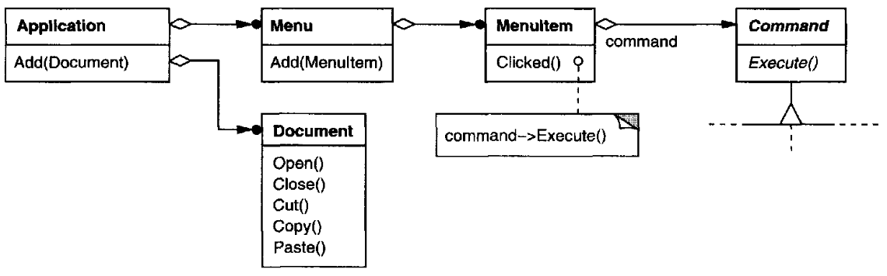

class: center, middle


# Analysis, Design and Software Architecture

## Software Engineering Session 6

Helge Pfeiffer, Assistant Professor,<br>
[Research Center for Government IT](https://www.itu.dk/forskning/institutter/institut-for-datalogi/forskningscenter-for-offentlig-it),<br> 
[IT University of Copenhagen, Denmark](https://www.itu.dk)<br>
`ropf@itu.dk`

---

class: center, middle

# Info, Feedback, and Recap

---

### Assignment feedback

  * Due to low attendance, Mikkel will not hold a separate run through of a possible solution to the assignments.
  * However, he will be in the Wednesday exercise session and can show/discuss an exemplary solution on demand.

---

### Assignment 4: Groups Issue

  * How many of you work in groups as in assignment 3?
  * How many of you work in groups as published too late for assignment 4?

Then we do...

---

### Important: Late submissions of assignments

In case you did not yet submit your solution to assignment 02 due to some unfortunate reason, you can do so before this Friday (Oct. 7th) 23:59.

You hand-in your late assignment via LearnIT (https://learnit.itu.dk/mod/assign/view.php?id=164797) by providing a link to your repository and by uploading a PDF file as specified in the original task description (https://github.com/itu-bdsa/assignment-02/blob/main/README.md)

Important, this is the final deadline for late hand-ins of assignment 02. If you do not submit your solution before the deadline, it cannot be approved. Remember approval of mandatory assignments is necessary to be eligible for the exam.

In case you got your assignment 02 already approved on LearnIT, please disregard this message.

---

class: center, middle

# Some leftovers from last week

---

### What is the problem with SOLID Design Principles and Design Smells?

  * Highly subjective
  * Cannot be measured objectively and automatically

--

I am not aware of **scientific evidence** that application of SOLID principles (or other design principles) in (agile) software engineering leads to more **flexible**, **maintainable**, and **reusable** software.

Some studies in that area that are non-conclusive with regards to the above are:

  * [_Measuring Impact of Dependency Injection on Software Maintainability_](https://www.mdpi.com/2073-431X/11/9/141/pdf?version=1663661562)
  * [H.K. Jun et al. _Evaluating the Impact of Design Patterns on Software Maintainability: An Empirical Evaluation_](https://www.researchgate.net/profile/Muhammad-Ehsan-Rana/publication/357824214_Evaluating_the_Impact_of_Design_Patterns_on_Software_Maintainability_An_Empirical_Evaluation/links/6201f2185bdf0f2ef854c480/Evaluating-the-Impact-of-Design-Patterns-on-Software-Maintainability-An-Empirical-Evaluation.pdf)
  * [J. Bräuer et al. _Measuring object-oriented design principles: The results of focus group-based research_](https://www.sciencedirect.com/science/article/pii/S016412121830044X)
  * [G. Samarthyam et al. _MIDAS: A design quality assessment method for industrial software_](https://ieeexplore.ieee.org/document/6606640)

---

### What is the problem with SOLID Design Principles and Design Smells?

The only thing that we know that matters is _size_.
The smaller the better or the ["Worse is better" design principle](https://en.wikipedia.org/wiki/Worse_is_better)

  > Result: **None of the 12 investigated smells** was significantly associated with increased effort after we adjusted for file size and the number of changes; [...] **File size** and the **number of changes explained** almost all of the modeled **variation in effort**. Conclusion: The effects of the 12 smells on maintenance effort were limited. To **reduce maintenance effort**, a **focus on reducing code size** and the work practices that **limit the number of changes** may be more beneficial than refactoring code smells.
  >
  > [D.I.K. Sjøberg et al. _"Quantifying the Effect of Code Smells on Maintenance Effort"_](https://sci-hub.ru/10.1109/tse.2012.89)

--

#### Good theses topics!


Studying effectiveness of certain design principles on **flexibility**, **maintainability**, or **reusability** of software are good thesis projects. Talk to me if you are interested.

---

### Hmmm, why apply SOLID then?

This is the state of the art in software engineering.

We do not know better what works and what does not.
For example the SOLID design principles are one "bid on" how to adapt object-oriented software for change.

Other people have other opinions on software design principles.

--

### You can only criticize what you know and understand...

In the above, I only highlighted our lack of scientific evidence with respect to the effectiveness of SOLID principles.

I **did not** mean to say that they are thereby irrelevant and that you do not have to know them!

---

### The Unix philosophy

  > 1. Make each program do one thing well. To do a new job, build afresh rather than complicate old programs by adding new "features".
  > 2. Expect the output of every program to become the input to another, as yet unknown, program. Don't clutter output with extraneous information. Avoid stringently columnar or binary input formats. Don't insist on interactive input.
  > 3. Design and build software, even operating systems, to be tried early, ideally within weeks. Don't hesitate to throw away the clumsy parts and rebuild them.
  > 4. Use tools in preference to unskilled help to lighten a programming task, even if you have to detour to build the tools and expect to throw some of them out after you've finished using them.
  >
  > <https://en.wikipedia.org/wiki/Unix_philosophy>

---

### KISS, YAGNI, CUPID, ...

  * _Keep It Simple Stupid_ (KISS) or _Keep It Small And Simple_
    > The principle is best exemplified by the story of Johnson handing a team of design engineers a handful of tools, with the challenge that the jet aircraft they were designing must be repairable by an average mechanic in the field under combat conditions with only these tools. Hence, the "stupid" refers to the relationship between the way things break and the sophistication available to repair them. 
    >
    > <https://en.wikipedia.org/wiki/KISS_principle>
 
--

  * _You Aren't Gonna Need It_ (YAGNI)

    > a principle which arose from extreme programming (XP) that states a programmer should not add functionality until deemed necessary.
    >
    > <https://en.wikipedia.org/wiki/You_aren%27t_gonna_need_it>

--

  * CUPID Design Principles
    > * **Composable**: plays well with others
    > * **Unix philosophy**: does one thing well
    > * **Predictable**: does what you expect
    > * **Idiomatic**: feels natural
    > * **Domain-based**: the solution domain models the problem domain in language and structure
    > 
    > [Dan North _"CUPID—for joyful coding"_](https://dannorth.net/2022/02/10/cupid-for-joyful-coding/)

<!-- CUPID
https://dannorth.net/2021/03/16/cupid-the-back-story/

  >  Why Every Element of SOLID is Wrong
  >
  > https://speakerdeck.com/tastapod/why-every-element-of-solid-is-wrong

 -->

---

### How do tools assess SOLID design?


For example, [_NDepend_](https://www.ndepend.com/) is a code quality assessment tool.
In a blog post, the company behind the tool explains how to [_"Use NDepend to Measure How SOLID Your Code Is"_](https://blog.ndepend.com/solid-code/) via the following static analysis rules:

  * [Avoid Types Too Big](https://www.ndepend.com/default-rules/NDepend-Rules-Explorer.html?ruleid=ND1000#!) (**SRP**) 
  * [Avoid Types With Too Many Methods](https://www.ndepend.com/default-rules/NDepend-Rules-Explorer.html?ruleid=ND1001#!) (**SRP**) 
  * [Avoid Types With Too Many Fields](https://www.ndepend.com/default-rules/NDepend-Rules-Explorer.html?ruleid=ND1002#!) (**SRP**) 
  * [Avoid Methods That Are Too Big and Too Complex](https://www.ndepend.com/default-rules/NDepend-Rules-Explorer.html?ruleid=ND1003#!) (**SRP**) 
  * [Avoid Methods With Too Many Parameters](https://www.ndepend.com/default-rules/NDepend-Rules-Explorer.html?ruleid=ND1004#!) (**SRP**) 
  * [Avoid Methods With Too Many Local Variables](https://www.ndepend.com/default-rules/NDepend-Rules-Explorer.html?ruleid=ND1008#!) (**SRP**) 
  * [Base class should not use derivatives](https://www.ndepend.com/default-rules/NDepend-Rules-Explorer.html?ruleid=ND1201#!) (**OCP**) 
  * [Do implement methods that throw NotImplementedException](https://www.ndepend.com/default-rules/NDepend-Rules-Explorer.html?ruleid=ND1312#!) (**LSP**)
  * [Avoid interfaces too big](https://www.ndepend.com/default-rules/NDepend-Rules-Explorer.html?ruleid=ND1200#!) (**ISP**)
  * [Higher cohesion - lower coupling](https://www.ndepend.com/default-rules/NDepend-Rules-Explorer.html?ruleid=ND1408#!) (**DIP**)
---

### How do tools assess SOLID design?

Not at all, they focus on other (similar) design principles.
For example, [_BetterCodeHub_](https://www.bettercodehub.com/)/[_Sigrid_](https://www.softwareimprovementgroup.com/solutions/sigrid-software-assurance-platform/) assess the following ten guidelines via static analysis rules, see [J. Visser et al._Building Maintainable Software, C# Edition: Ten Guidelines for Future-Proof Code_](https://www.labunix.uqam.ca/~tremblay_gu/MGL7460/Liens/Building_Maintainable_Software_SIG.pdf):
  
  1. Write Short Units of Code
  1. Write Simple Units of Code
  1. Write Code Once
  1. Keep Unit Interfaces Small
  1. Separate Concerns in Modules
  1. Couple Architecture Components Loosely
  1. Keep Architecture Components Balanced
  1. Keep Your Codebase Small
  1. Automate Tests
  1. Write Clean Code

---

class: center, middle

# Design Patterns

---

### Design Patterns in other domains


---

### Design Patterns in other domains


<table>
    <tr>
        <td></td>
        <td></td>
    </tr>
    <tr>
        <td></td>
        <td></td>
    </tr>
</table>


---

### Inspiration from _A Pattern Language_


  > Each _pattern_ describes a problem which occurs over and over again in our environment, and then describes the core of the solution to that problem, in such a way that you can use this solution a million times over, without ever doing it the same way twice
  >
  > C. Alexander et al. (1977) _A Pattern Language: Towns, Buildings, Construction_

---

### Inspiration from _A Pattern Language_

**Pattern 11: Local Transport Areas**

<table>
  <tr>
    <th rowspan="2"></th>
    <td></td>
  </tr>
  <tr>
    <td></td>
  </tr>
</table> 

<tiny> 
Source: C. Alexander et al. (1977) <i>A Pattern Language: Towns, Buildings, Construction.</i>
</tiny>

---

### What are Design Patterns?

  > Patterns and Pattern Languages are ways to describe best practices, good designs, and capture experience in a way that it is possible for others to reuse this experience.
  >
  > <https://hillside.net/patterns>

--

-----------

  > Patterns have made a huge impact on object-oriented software design. As well as being tested solutions to common problems, they have become a vocabulary for talking about a design. You can therefore explain your design by describing the patterns that you have used.
  >
  > Sommerville _"Software Engineering"_

---

### Design Patterns in Software Engineering

... are something fairly recent.
In 1994, Gamma, Helm, Johnsen, and Vlissides (Gang of Four Book) published their book on Design Patterns in object-oriented software.

<table>
  <tr>
    <td></td>
    <td></td>
  </tr>
</table>

---


### What are Design Patterns?

  > Point of view affects one's interpretation of what is and isn't a pattern. One person's pattern can be another person's primitive building block. For this book we have concentrated on patterns at a certain level of abstraction. Design patterns are not about designs such as linked lists and hash tables that can be encoded in classes and reused as is. Nor are they complex, domain-specific designs for an entire application or subsystem. The design patterns in this book are **descriptions of communicating objects and classes that are customized to solve a general design problem in a particular context**.
  >
  > E. Gamma et al. _Design Patterns_

--

---------

##### Design of what?

Class structures or behavior of object-oriented systems.
Note, still quite fine-grained. **Not** on architectural level yet.
We will talk about patterns of more high-level design next week.

--

---------
##### Important!


  > The choice of programming language is important because it influences one's point of view. Our patterns assume Smalltalk/C++-level language features, and that choice determines what can and cannot be implemented easily. If we assumed procedural languages, we might have included design patterns called "Inheritance," "Encapsulation," and "Polymorphism."
  >
  > E. Gamma et al. _Design Patterns_


---

### Design Patterns

After looking at principles of _good_ object-oriented design, we are now looking at _design patterns_.

You read about the following design patterns so far:

  1. Command (APPP)
  1. Active Object (APPP)
  1. Template Method (APPP)
  1. Strategy (APPP)
  1. Facade (APPP)
  1. Mediator (APPP)
  1. Singleton (APPP)
  1. Monostate (APPP)
  1. Null Object (APPP)
  1. Observer (SE)
  1. Service Locator (Fowler)
  1. Dependency Injection (Fowler)

You will read about some more during the fall break.

---

### Gang of Four Book: Design Patterns

Note, not all design patterns originate from the GoF Design Patterns book.


* Creational Patterns
  1. Singleton
* Structural Patterns
  1. Facade
* Behavioral Patterns
  1. Command
  1. Mediator
  1. Strategy
  1. Template Method
  1. Observer

-----------

  1. Null Object
  1. Active Object
  1. Monostate
  1. Service Locator
  1. Dependency Injection

---

### Relations of Design Patterns according to GoF


---

### Quiz: Which pattern is this?

  * Navigate to <https://menti.com>
  * Login to quiz with code: **6224 2647**

---

### Command Pattern

  > **Intent**
  > Encapsulate a request as an object, thereby letting you parameterize clients with different requests, queue or log requests, and support undoable operations.




<tiny> Source: Gamma et al. <i>Design Patterns</i>.</tiny>

<!-- ---

### Active Object Pattern
 -->

---

### Template Method


  > **Intent** Define the skeleton of an algorithm in an operation, deferring some steps to subclasses. Template Method lets subclasses redefine certain steps of an algorithm without changing the algorithm's structure.
  >
  > Gamma et al. _Design Patterns_.


<tiny> Source: <a href="https://betterprogramming.pub/design-patterns-template-method-5400dde7bb72">Design Patterns: Template Method</a>.
</tiny>

---

### Strategy Pattern

  > **Intent** Define a family of algorithms, encapsulate each one, and make them interchangeable. Strategy lets the algorithm vary independently from clients that use it.
  >
  > Gamma et al. _Design Patterns_.


<tiny> Source: Example adapted from <a href="https://cathyatseneca.gitbooks.io/design-patterns-in-uml/content/strategy.html">Design Patterns in UML</a>.
</tiny>


<!-- 
https://learn.microsoft.com/en-us/dotnet/csharp/whats-new/tutorials/mixins-with-default-interface-methods
 -->
---

### Facade Pattern: Imposing Policy

  > **Intent** Provide a unified interface to a set of interfaces in a subsystem. Facade defines a higher-level interface that makes the subsystem easier to use.
  >
  > Gamma et al. _Design Patterns_.


---

### Mediator Pattern

  > **Intent** Define an object that encapsulates how a set of objects interact. Mediator promotes loose coupling by keeping objects from referring to each other explicitly, and it lets you vary their interaction independently.
  >
  > Gamma et al. _Design Patterns_.

<table>
  <tr>
    <td></td>
    <td></td>
  </tr>
</table>


<tiny> 
Source: E. Gamma et al. <i>Design Patterns</i>.
</tiny>

<!-- 

  > Imposing policy can be done from above, using FACADE, if that policy needs to be big and visible. On the other hand, if subtlety and discretion are needed, MEDIATOR may be the more appropriate choice. FACADEs are usually the focal point of a convention. Everyone agrees to use the FACADE instead of the objects beneath it. MEDIATOR, on the other hand, is hidden from the users. Its policy is a fait accompli rather than a matter of convention.
  >
  > Robert C. Martin et al. _"Agile Principles, Patterns, and Practices in C#"_
 -->

---

### Null Object Pattern

  > By using this pattern, we can ensure that functions always return valid objects, even when they fail. Those objects that represent failure do “nothing.”
  > 
  > Robert C. Martin et al. _"Agile Principles, Patterns, and Practices in C#"_


<tiny> 
Source: <a href="https://betterprogramming.pub/design-patterns-null-object-5ee839e37892">Design Patterns: Null Object</a>.
</tiny>

---

### Alternatives to Null Object Pattern in C♯?


```csharp
List<string> list = null;
int count;
if (list != null)
{
    count = list.Count;
}
else
{
    count = 0;
}
```

```csharp
List<string> list = null;
int count = list?.Count ?? 0;
```

<tiny> 
Source: <a href="https://enterprisecraftsmanship.com/posts/3-misuses-of-operator-in-c-6/">Enterprise Craftsmanship Blog</a>.
</tiny>


  > Null-object pattern can be seen as a special case of the Strategy pattern
  >
  > <https://en.wikipedia.org/wiki/Null_object_pattern#C#>

---

### Observer pattern

  > **Intent** Define a one-to-many dependency between objects so that when one object changes state, all its dependents are notified and updated automatically.
  > 
  > Gamma et al. _Design Patterns_.


<!--   > [C. Larman _Applying UML and Patterns_](https://personal.utdallas.edu/~chung/SP/applying-uml-and-patterns.pdf)
 -->
---

### Observer pattern in C♯/.Net


See <https://learn.microsoft.com/en-us/dotnet/standard/events/observer-design-pattern>

---

### Composition or delegation over Inheritance???


Inheritance hierarchy of WPF:


  > Like most brave new worlds, this one turned out to be a bit too starry-eyed. By 1995, it was clear that inheritance was very easy to overuse and that overuse of inheritance was very costly. Gamma, Helm, Johnson, and Vlissides went so far as to stress: “Favor object composition over class inheritance.” So we cut back on our use of inheritance, often replacing it with composition or delegation.
  >
  > Robert C. Martin et al. _"Agile Principles, Patterns, and Practices in C#"_


What is the implication of this?

<!-- LSP less important and ISP easily broken -->

<!-- https://scottlilly.com/c-design-patterns-composition-over-inheritance/

<iframe width="560" height="315" src="https://www.youtube.com/embed/pQm-BqK2fhc" title="YouTube video player" frameborder="0" allow="accelerometer; autoplay; clipboard-write; encrypted-media; gyroscope; picture-in-picture" allowfullscreen></iframe>
 -->

---

### Design Patterns Cheatsheet


<iframe src="http://www.mcdonaldland.info/files/designpatterns/designpatternscard.pdf" width="80%" height=500 scrolling="auto"></iframe>


---

### Scientist's opinion about design patterns


  > We show that, contrary to popular beliefs, design patterns in practice impact negatively several quality attributes, thus providing concrete evidence against common lore. [...]
  > we bring further evidence that design patterns should be used with caution during development because they may actually impede maintenance and evolution.
  >
  > [F. Khomh et al. _"Do Design Patterns Impact Software Quality Positively?"_](https://www.ptidej.net/courses/log6306/fall16/readingnotes/3%20-%20Khomh%20et%20al.%20-%20Do%20Design%20Patterns%20Impact%20Software%20Quality%20Positively.pdf)


---

class: center, middle

# Non-OO Design Patterns

---

### Concurrency Patterns (in Go)

Next time with Rasmus, you are going to talk about _concurrency_.

There exists a plethora of design patterns only for that (might be relevant for your Distributed Systems course).


<tiny> 
Source: <a href="https://divan.dev/posts/go_concurrency_visualize/">Visualizing Concurrency in Go</a>.
</tiny>

---

### Concurrency Patterns (in Go)

For example, Pools of Workers in Go:

```go
func worker(id int, jobs <-chan int, results chan<- int) {
    for j := range jobs {
        fmt.Println("worker", id, "started  job", j)
        time.Sleep(time.Second)
        fmt.Println("worker", id, "finished job", j)
        results <- j * 2
    }
}

func main() {
    const numJobs = 5
    jobs := make(chan int, numJobs)
    results := make(chan int, numJobs)

    for w := 1; w <= 3; w++ {
        go worker(w, jobs, results)
    }

    for j := 1; j <= numJobs; j++ {
        jobs <- j
    }
    close(jobs)

    for a := 1; a <= numJobs; a++ {
        <-results
    }
}
```
<tiny> 
Source: <a href="https://gobyexample.com/worker-pools">Go by Example: Worker Pools</a>.
</tiny>

---

### Composition over Inheritance example in Python

```python
class Logger:
    def __init__(self, filters, handlers):
        self.filters = filters
        self.handlers = handlers

    def log(self, message):
        if all(f.match(message) for f in self.filters):
            for h in self.handlers:
                h.emit(message)

class TextFilter:
    def __init__(self, pattern):
        self.pattern = pattern

    def match(self, text):
        return self.pattern in text

class FileHandler:
    def __init__(self, file):
        self.file = file

    def emit(self, message):
        self.file.write(message + '\n')
        self.file.flush()

class SocketHandler:
    def __init__(self, sock):
        self.sock = sock

    def emit(self, message):
        self.sock.sendall((message + '\n').encode('ascii'))
```

<tiny> 
Source: <a href="https://python-patterns.guide/gang-of-four/composition-over-inheritance/#solution-4-beyond-the-gang-of-four-patterns">Python Design Patterns</a>.
</tiny>

---

### Composition over Inheritance example in Ruby

```ruby
module Debug
  def whoAmI?
    "#{self.type.name} (\##{self.id}): #{self.to_s}"
  end
end
class Phonograph
  include Debug
  # ...
end
class EightTrack
  include Debug
  # ...
end
```

```
ph = Phonograph.new("West End Blues")
et = EightTrack.new("Surrealistic Pillow")
ph.whoAmI?  »   "Phonograph (#537766170): West End Blues"
et.whoAmI?  »   "EightTrack (#537765860): Surrealistic Pillow"
```

<tiny> 
Source: <a href="https://ruby-doc.com/docs/ProgrammingRuby/html/tut_modules.html">Programming Ruby: Modules</a>.
</tiny>

---

### Your turn!


  * Go to the exercise session.
  * Work in your assignment triplet, see <https://github.com/itu-bdsa/assignment-04/README_GROUPS.md>
  * Work on the exercises of the assignment, see <https://github.com/itu-bdsa/assignment-04/README.md>


Via [LearnIT Hand-in](https://learnit.itu.dk/mod/assign/view.php?id=166021), hand-in a link to the Git repository on GitHub with your solution, at latest on Friday at 10:00.
