class: center, middle


# Analysis, Design and Software Architecture

## Software Engineering Session 7

Helge Pfeiffer, Assistant Professor,<br>
[Research Center for Government IT](https://www.itu.dk/forskning/institutter/institut-for-datalogi/forskningscenter-for-offentlig-it),<br> 
[IT University of Copenhagen, Denmark](https://www.itu.dk)<br>
`ropf@itu.dk`

---

class: center, middle

# Info, Feedback, and Recap

---

### Assignment feedback

**Conformance to requirements!**


  > To submit the assignment you need to create a PDF document using LaTeX that contains the answers to the questions **and** a link to a public GitHub repository that contains a fork of the assignments repository with the completed code.
  > 
  > The PDF file must conform to the following **naming convention: `group_<x>_<id1>_<id2>_<id3>_assignment_01.pdf`**, where `<x>` is replaced by the number of your group from [README_GROUPS.md](./README_GROUPS.md) and `<id1>`, `<id2>`, and `<id3>` are your respective ITU identifiers. 

Which of the following PDF files conforms to the file name requirement above?

  1. ✗ `Assignment1.pdf`
  2. ✗ `Group_1_aaaa_bbbb_cccc_assignment_01.pdf`
  3. ✗ `group_1_aaaa_bbbb_cccc.pdf`
  4. ✗ `Assignment_01-2.pdf`
  5. ✓ `group_1_aaaa_bbbb_cccc_assignment_01.pdf`

---

### Assignment feedback

Removing people without contacting them is perhaps not a good practice.
In case you are left alone without a group, better consult the README_GROUPS.md file and organize a new one.

---

### Important: Late submissions of assignments

In case you did not yet submit your solution to assignment 03 due to some unfortunate reason, you can do so before this Friday (Oct. 14th) 23:59.

You hand-in your late assignment via LearnIT (<https://learnit.itu.dk/mod/assign/view.php?id=165090>) by providing a link to your repository and by uploading a PDF file as specified in the original task description (<https://github.com/itu-bdsa/assignment-03/blob/main/README.md>)

Important, this is the final deadline for late hand-ins of assignment 03. If you do not submit your solution before the deadline, it cannot be approved. Remember approval of mandatory assignments is necessary to be eligible for the exam.

In case you got your assignment 03 already approved on LearnIT, please disregard this message.

---

class: center, middle

# Architectural Design Decisions

---

### Architecture, what was that again?

  > * _architecture_ is concerned with the **selection of architectural elements**, **their interactions**, and **the constraints on those elements** and their **interactions** necessary to provide a framework in which to **satisfy the requirements** and serve as a **basis for the design**;
  > * _design_ is concerned with the modularization and detailed interfaces of the design elements, their algorithms and procedures, and the data types needed to support the architecture and to satisfy the requirements;
  >
  > [Dewayne E. Perry et al. _Foundations for the Study of Software Architecture_](https://dl.acm.org/doi/pdf/10.1145/141874.141884)

--

--------

  > Architecture represents the set of **significant design decisions** that shape the form and the function of a system, where **significant is measured by cost of change.**
  > 
  > [Grady Booch](https://twitter.com/Grady_Booch/status/1301810358819069952)

--


<hr>

  > Architecture is about **the important stuff**. Whatever that is”. On first blush, that sounds trite, but I find it carries a lot of richness. It means that the heart of thinking architecturally about software is to decide what is important, (i.e. what is architectural), and then expend energy on keeping those architectural elements in good condition. For a developer to become an architect, they need to be able to recognize what elements are important, recognizing what elements are likely to result in serious problems should they not be controlled.
  >
  > [Martin Fowler _"Design - Who needs an architect?"_](https://ieeexplore.ieee.org/document/1231144)


---

### Architectural design decisions

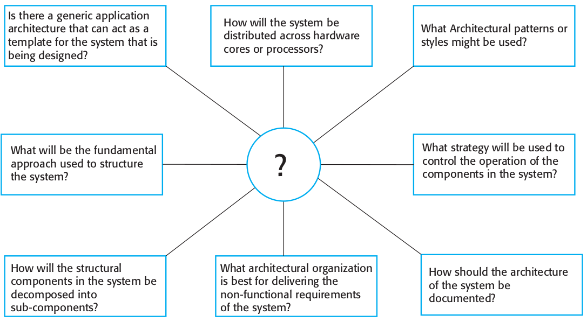 

<tiny> 
Source: Sommerville <i>Software Engineering</i>.
</tiny>

---

### Architecture in the small vs. in the large


  > 1. **Architecture in the small** is concerned with the architecture of individual programs. At this level, we are concerned with the way that an individual program is decomposed into components.
  > 2. **Architecture in the large** is concerned with the architecture of complex enterprise systems that include other systems, programs, and program components. These enterprise systems may be distributed over different computers, which may be owned and managed by different companies.
  >
  > Sommerville _Software Engineering_

---

### [Case: API for NRK TV, NRK Super, and NRK Radio](https://nrkbeta.no/2017/04/29/undoing-the-harm-of-layers/)

##### First partitioning strategy: Technology-oriented decomposition


##### Dependencies of NRK API assemblies:


---

##### Dependencies of NRK API namespaces:


  > As we approach a new problem we look for strategies to decompose that problem. The primary axis we choose for decomposition is fundamental to the architecture of the system we build. Technological boundaries are easy to identify in the codebase, and as such it is a tempting decomposition strategy.
  > I will illustrate the harmful strategy of partitioning by technological boundaries [...] 
  > a simpler design was achieved using a domain-based decomposition strategy.
  >
  > <https://nrkbeta.no/2017/04/29/undoing-the-harm-of-layers/>

---

### Parnas' recommendation for architectural decomposition


  > it is almost always incorrect to begin the decomposition of a system into modules on the basis of a flowchart. We propose instead that one begins with a list of difficult design decisions or **design decisions which are likely to change**. **Each module is then designed to hide such a decision** from the others.
  > 
  > [D.L. Parnas _On the criteria to be used in decomposing systems into modules_](https://dl.acm.org/doi/pdf/10.1145/361598.361623)

---

### [Case: API for NRK TV, NRK Super, and NRK Radio](https://nrkbeta.no/2017/04/29/undoing-the-harm-of-layers/)

##### Next partitioning strategy: Functional-oriented decomposition


##### Dependencies of refactored NRK API assemblies:


---

##### Dependencies of refactored NRK API namespaces:


--

Was that case an example of:

  1. architecture in the small or 
  2. architecture in the large?

---

### The “4+1” view model

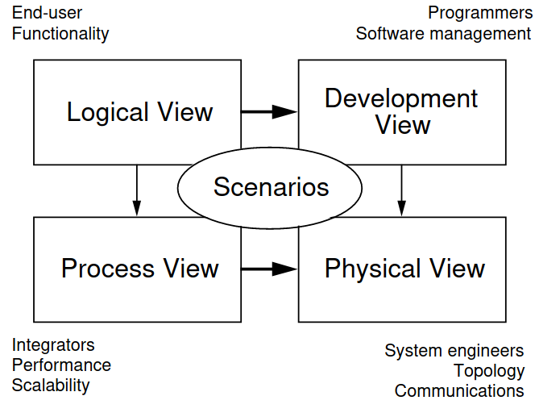

<tiny> 
Source: <a href="https://www.researchgate.net/profile/Philippe-Kruchten/publication/220018231_The_41_View_Model_of_Architecture/links/0046351a4dc4f9da04000000/The-4-1-View-Model-of-Architecture.pdf">P. Kruchten <i>Architectural Blueprints—The “4+1” View Model of Software Architecture</i></a>.
</tiny>

1. **logical view**, [...] key abstractions in the system as objects or classes. Entities should be related to system requirements.
2. **process view**, system composition of interacting processes (runtime). Allows assessment of non-functional ­system characteristics.
3. **development view**, [...] software decomposition for development, i.e., mapping to team structures
4. **physical view**, distribution of software components over hardware. Illustrates system deployment.


---

### The “4+1” view model


<tiny> 
Source: <a href="https://www.researchgate.net/profile/Philippe-Kruchten/publication/220018231_The_41_View_Model_of_Architecture/links/0046351a4dc4f9da04000000/The-4-1-View-Model-of-Architecture.pdf">P. Kruchten <i>Architectural Blueprints—The “4+1” View Model of Software Architecture</i></a>.
</tiny>

What is the _"+1"_ view?

---

class: center, middle

# Notations for depicting SW architecture

---

### Case: Coronapas App &mdash;


<tiny> 
Source <a href="https://digst.dk/media/24346/whitepaper-om-coronapas_290521.pdf">Whitepaper om coronapas-appen</a>.
</tiny>

---

### Notations for depicting SW architecture

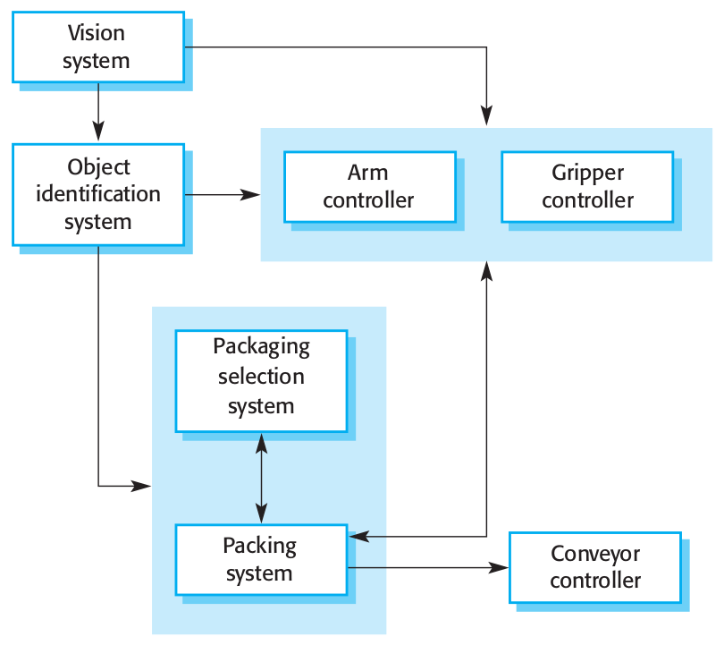

--

  > System architectures are often modeled informally using **simple block diagrams** [...] 
  > Each **box** in the diagram represents a **component**. Boxes within boxes indicate that the component has been decomposed to **subcomponents**. **Arrows** mean that **data and or control signals** are passed from component to component in the direction of the arrows. 

  > Block diagrams present a high-level picture of the system structure, which people from different disciplines, who are involved in the system development process, can readily understand.
  >
  > Sommerville _Software Engineering_

---

### Notations for depicting SW architecture

I think Sommerville dismisses UML too quickly as not being suitable for depicting software architectures or certain perspectives of it.

In the following, I introduce:

  * UML Package Diagrams
  * UML Component Diagrams, and
  * UML Deployment Diagrams

---

### UML Package Diagrams


<tiny> 
Source: <a href="https://www.uml-diagrams.org/package-diagrams-overview.html">Package Diagram</a>.
</tiny>

What is in these packages?

---

### UML Component Diagrams


--

  >  A component is a **class** representing a modular part of a system with encapsulated content and whose manifestation is replaceable within its environment.
  >
  > A component has its behavior defined in terms of provided interfaces and required interfaces (potentially exposed via ports).
  >
  > Component serves as a type whose conformance is defined by these provided and required interfaces (encompassing both their static as well as dynamic semantics). One component may therefore be substituted by another only if the two are type conformant. 

<tiny> 
Source: <a href="https://www.uml-diagrams.org/component-diagrams.html">Component Diagram</a>.
</tiny>

---

### Detour: What is a _component_???

--

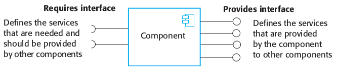

--

  > A software element that conforms to a standard component model and can be independently deployed and composed without modification according to a composition standard.
  >
  > W.T. Councill et al. _"Definition of a Software Component and Its Elements."_

--

---------

  > A software component is a unit of composition with contractually-specified interfaces and explicit context dependencies only. A software component can be deployed independently and is subject to composition by third parties.
  > 
  > C. Szyperski _"Component Software: Beyond Object-Oriented Programming"_

---

### Detour: Characteristics of Components


  > 1. The component is an independent executable entity that is defined by its interfaces. You don’t need any knowledge of its source code to use it. It can either be referenced as an external service or included directly in a program.
  >
  > 2. The services offered by a component are made available through an interface, and all interactions are through that interface. The component interface is expressed in terms of parameterized operations, and its internal state is never exposed.

---

### Detour: What could be a _Component_ in practice?


<!-- https://peter.bourgon.org/applied-go-kit/#11 -->


---

#### Example: The Open Service Gateway Initiative (OSGi)

  > The Open Service Gateway Initiative is a specification defining a Java-based component system. 
  >
  > <https://www.baeldung.com/osgi>


<tiny> 
Source: <a href="https://en.wikipedia.org/wiki/OSGi">Wikipedia: OSGi</a>.
</tiny>

---

#### Example: The Open Service Gateway Initiative (OSGi)

  > The Open Service Gateway Initiative is a specification defining a Java-based component system. 
  >
  > <https://www.baeldung.com/osgi>

Life-cycle of an OSGi Bundle


<tiny> 
Source: <a href="https://en.wikipedia.org/wiki/OSGi">Wikipedia: OSGi</a>.
</tiny>

---

#### Jakarta Enterprise Beans

<https://projects.eclipse.org/projects/ee4j.ejb>

  > EJB is a server-side software component that encapsulates business logic of an application. An EJB web container provides a runtime environment for web related software components, including computer security, Java servlet lifecycle management, transaction processing, and other web services.
  >
  > <https://en.wikipedia.org/wiki/Jakarta_Enterprise_Beans>

---

#### Android Applications (APK)


```xml
<activity ...>
    <intent-filter>
        <action android:name="android.intent.action.GET_CONTENT" />
        <data android:type="image/*" />
        <category android:name="android.intent.category.DEFAULT" />
        <!-- The OPENABLE category declares that the returned file is accessible
             from a content provider that supports OpenableColumns
             and ContentResolver.openFileDescriptor() -->
        <category android:name="android.intent.category.OPENABLE" />
    </intent-filter>
</activity>
```


<https://developer.android.com/guide/components/intents-common>

---

#### Today: Likely Docker containers

Encapsulate entire applications with all their dependencies:

```dockerfile
FROM ruby:2.5
RUN apt-get update -qq && apt-get install -y nodejs postgresql-client
WORKDIR /myapp
COPY Gemfile /myapp/Gemfile
COPY Gemfile.lock /myapp/Gemfile.lock
RUN bundle install

# Add a script to be executed every time the container starts.
COPY entrypoint.sh /usr/bin/
RUN chmod +x /usr/bin/entrypoint.sh
ENTRYPOINT ["entrypoint.sh"]
EXPOSE 3000

# Configure the main process to run when running the image
CMD ["rails", "server", "-b", "0.0.0.0"]
```

<a href="https://raw.githubusercontent.com/itu-devops/lecture_notes/master/sessions/session_02/images/deps.png">
</a>

---

#### Docker Compose File

Declarative description of an architecture:

```yaml
version: "3.9"
services:
  db:
    image: postgres
    volumes:
      - ./tmp/db:/var/lib/postgresql/data
    environment:
      POSTGRES_PASSWORD: password
  web:
    build: .
    command: bash -c "rm -f tmp/pids/server.pid && bundle exec rails s -p 3000 -b '0.0.0.0'"
    volumes:
      - .:/myapp
    ports:
      - "3000:3000"
    depends_on:
      - db
```

More on that in the elective [_DevOps, Software Evolution and Software Maintenance_](https://github.com/itu-devops/lecture_notes/blob/master/sessions/session_02/Session%202.ipynb)...

---

### End of detour...

---

### UML Component Diagrams


<tiny> 
Source: <a href="https://www.uml-diagrams.org/component-diagrams.html">Component Diagram</a>.
</tiny>

What is in these components?

---

### UML Deployment Diagrams


<tiny> 
Source: <a href="https://www.uml-diagrams.org/deployment-diagrams-overview.html">Specification Level Deployment Diagram</a>.
</tiny>

---

### UML Instance Level Deployment Diagrams


<tiny> 
Source: <a href="https://www.uml-diagrams.org/deployment-diagrams-overview.html">Instance Level Deployment Diagram</a>.
</tiny>

---

### Network Architecture

  > UML standard has no separate kind of diagrams to describe network architecture and provides no specific elements related to the networking. Deployment diagrams could be used for this purpose usually with some extra networking stereotypes. Network architecture diagram will usually show networking nodes and communication paths between them.


<tiny> 
Source: <a href="https://www.uml-diagrams.org/network-architecture-diagrams.html">Network Architecture Diagrams</a>.
</tiny>

---

### Alternative to UML: [The C4 Model: Context, Containers, Components, and Code](https://c4model.com/)

  > However, it's very likely that the majority of the software architecture diagrams you've seen are a confused mess of boxes and lines. An unfortunate and unintended side effect of the Manifesto for Agile Software Development is that many teams have stopped or scaled back their diagramming and documentation efforts, including the use of UML.
  >
  > [S. Brown _The C4 Model for Software Architecture_](https://www.infoq.com/articles/C4-architecture-model/)


---

### [The C4 Model: Context, Containers, Components, and Code](https://c4model.com/)


<tiny> 
Source: <a href="https://www.infoq.com/articles/C4-architecture-model/">The C4 Model for Software Architecture</a>.
</tiny>

---

### [The C4 Model: Context, Containers, Components, and Code](https://c4model.com/)

  > Level 1, a system context diagram, shows the software system you are building and how it fits into the world in terms of the people who use it and the other software systems it interacts with.


<tiny> 
Source: <a href="https://www.infoq.com/articles/C4-architecture-model/">The C4 Model for Software Architecture</a>.
</tiny>

---

### [The C4 Model: Context, Containers, Components, and Code](https://c4model.com/)

  > Level 2, a container diagram, zooms into the software system, and shows the containers (applications, data stores, microservices, etc.) that make up that software system. Technology decisions are also a key part of this diagram.


<tiny> 
Source: <a href="https://www.infoq.com/articles/C4-architecture-model/">The C4 Model for Software Architecture</a>.
</tiny>

---

### [The C4 Model: Context, Containers, Components, and Code](https://c4model.com/)

  > Level 3, a component diagram, zooms into an individual container to show the components inside it. These components should map to real abstractions (e.g., a grouping of code) in your codebase.


<tiny> 
Source: <a href="https://www.infoq.com/articles/C4-architecture-model/">The C4 Model for Software Architecture</a>.
</tiny>

---

### [The C4 Model: Context, Containers, Components, and Code](https://c4model.com/)

  > Level 4, [...] zoom into an individual component to show how that component is implemented.


<tiny> 
Source: <a href="https://www.infoq.com/articles/C4-architecture-model/">The C4 Model for Software Architecture</a>.
</tiny>

---

### [The C4 Model: Context, Containers, Components, and Code](https://c4model.com/)


 > Regardless of the notation that you use, I would recommend that every element includes a name, the element type (i.e., "Person", "Software System", "Container", or "Component"), a technology choice (if appropriate), and some descriptive text.
 >
 > [The C4 Model for Software Architecture](https://www.infoq.com/articles/C4-architecture-model/)

--

<iframe width="560" height="315" src="https://www.youtube.com/embed/x2-rSnhpw0g" title="YouTube video player" frameborder="0" allow="accelerometer; autoplay; clipboard-write; encrypted-media; gyroscope; picture-in-picture" allowfullscreen></iframe>


---

class: center, middle

# Architectural Patterns

---

### Quiz

  * Navigate to <https://menti.com>
  * Login to quiz with code: **35 76 39 2**

---

### Client-Server architecture

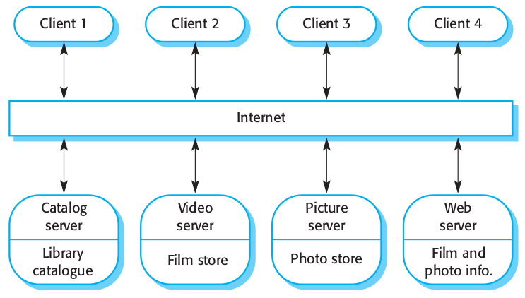

<tiny> 
Source: Sommerville <i>Software Engineering</i>.
</tiny>

---

### Client-Server architecture — Case: SAPA system

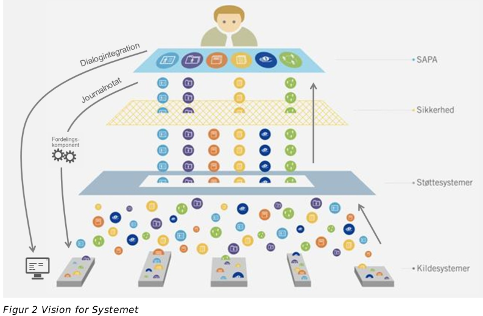

<tiny> 
Source: <a href="https://share-komm.kombit.dk/P011/Delte%20dokumenter/Kravspecifikation%20juli%202014%20v.%201.0.docx?d=wf7c67ea529124e898db8668f91f01201">Sags- og Partsoverblik (SAPA) Kravspecifikation juli 2014 v. 1.0</a>.
</tiny>

---

### Layered architecture

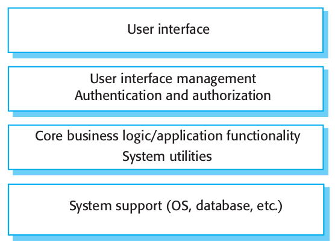

---

### Layered architecture — Case: SAPA system


<tiny> 
Source: <a href="https://share-komm.kombit.dk/P011/Delte%20dokumenter/Kravspecifikation%20juli%202014%20v.%201.0.docx?d=wf7c67ea529124e898db8668f91f01201">Sags- og Partsoverblik (SAPA) Kravspecifikation juli 2014 v. 1.0</a>.
</tiny>

---

### Model-View-Controller architecture

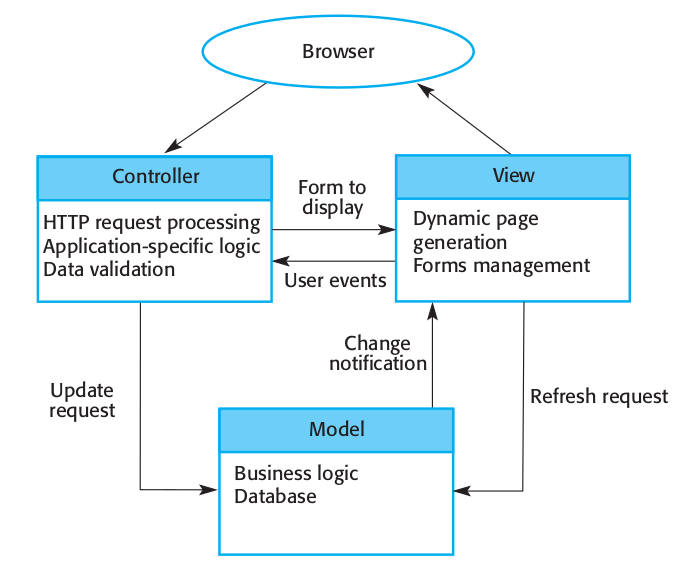
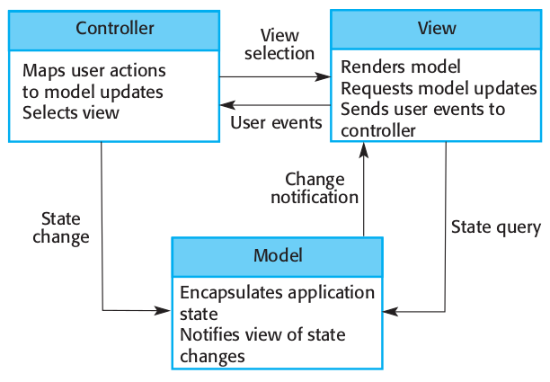

---

### Pipes and Filter architecture

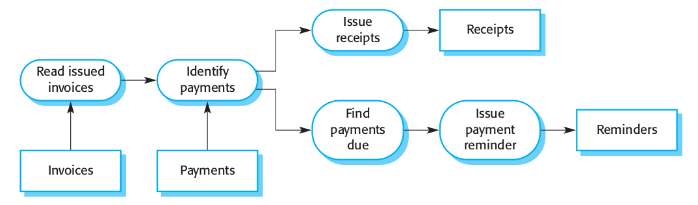

--

A small system that visualizes number of commit per author in a Git repository (identified by email address).

```bash
git log --full-history --date=short --pretty=format:"%ae" | \
    sort | \
    uniq -c | \
    awk '{ print $2 "," $1}' | \
    ./plot.py
```

What are the components in there?

---

### Repository architecture

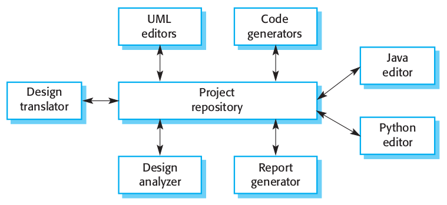

Example system: [Eclipse IDE](https://www.eclipse.org/ide/)

---

### Peer-to-peer architecture

<table>
    <tr>
        <td>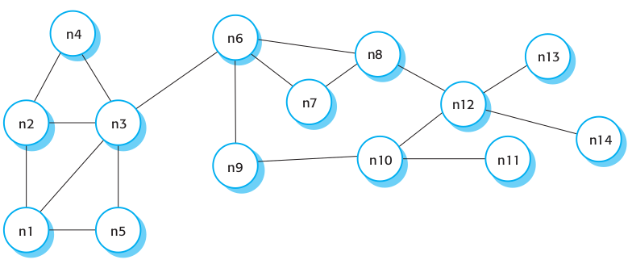</td>
        <td>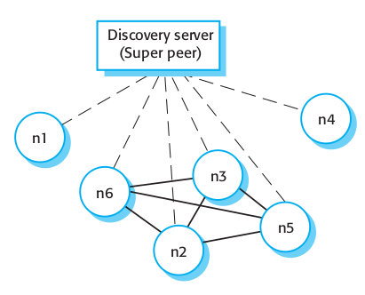</td> 
    </tr>
</table>


Example system: [The Interplanetary File System (IPFS)](https://ipfs.io)


---

### Your turn!


  * Go to the exercise session.
  * Work in your assignment triplet, see <https://github.com/itu-bdsa/assignment-05/README_GROUPS.md>
  * Work on the exercises of the assignment, see <https://github.com/itu-bdsa/assignment-05/README.md>


Via [LearnIT Hand-in](https://learnit.itu.dk/mod/assign/view.php?id=166606), hand-in a link to the Git repository on GitHub with your solution, at latest on Friday at 10:00.
