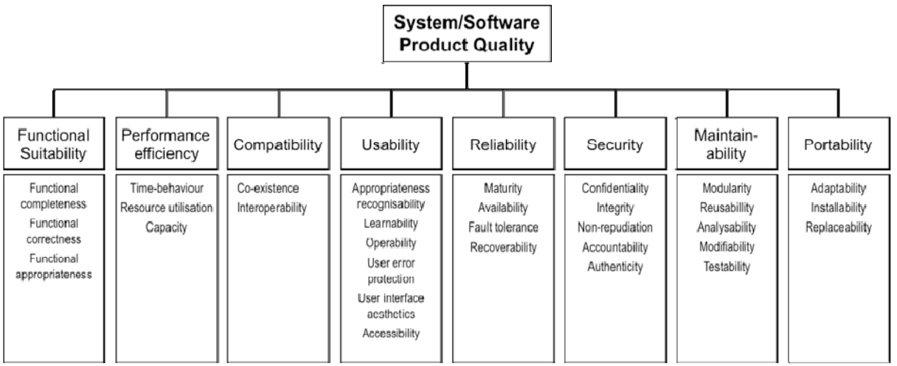
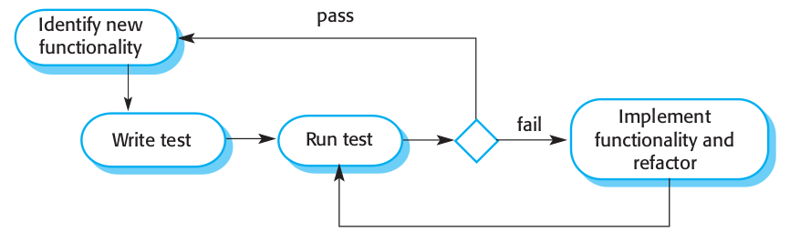
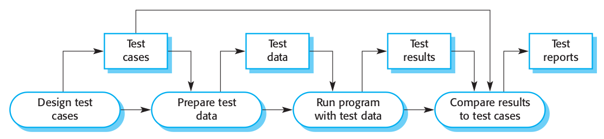
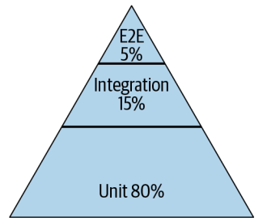
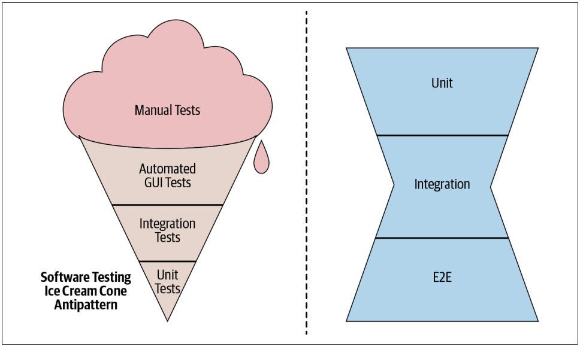

class: center, middle


# Analysis, Design and Software Architecture

## Software Engineering Session 9

Helge Pfeiffer, Assistant Professor,<br>
[Research Center for Government IT](https://www.itu.dk/forskning/institutter/institut-for-datalogi/forskningscenter-for-offentlig-it),<br> 
[IT University of Copenhagen, Denmark](https://www.itu.dk)<br>
`me@itu.dk`

---

class: center, middle

# Info and Feedback

---

### Project

Assignments are over, the project started last week.

<https://github.com/itu-bdsa/project-description>

  * Some of you are not registered in project groups yet?
  * Not all groups registered their project repository on GitHub yet?

---

### Project

Are these good unit tests?

```csharp
namespace Some.Tests;

public class UnitTest1
{
    [Fact]
    public void Test1()
    {
        true.Should().Be(true);
    }
}
```

---

### Project

Are these good unit tests?

```csharp
namespace Some.Tests;

public class freqTest
{

    //TODO: Implement Tests for Frequency Commits
    [Fact]
    public void Given_no_Author_Then_Outputs_All_Commits_Per_Date()
    {
    
    }
}
```

---

### Project

Are these good unit tests?

```csharp
namespace Some.Test;

public class GitInsightTest
{

    [Fact]
    public void Should_load_a_repository_from_path()
    {
        // Given

        // When

        // Then
    }
}
```

---

### Project

Is that a good `GitInsight` application corresponding to week one of the project?

```csharp
Console.WriteLine("Hello, World!");
```

---

### Project

Parsing command line arguments...

  * [CommandLineParser](https://github.com/commandlineparser/commandline>)
  * [System.CommandLine](https://github.com/dotnet/command-line-api)
  * [FluentCommandLineParser](https://fclp.github.com/fluent-command-line-parser)
    - Perhaps not a good choice since _a)_ the project page cannot be reached and _b)_ the last update to it was in 2017. 
  * [CommandLineArgumentsParser](https://github.com/j-maly/CommandLineParser)

These are the first four results when [searching NuGet for `command line parser`](https://www.nuget.org/packages?q=command+line+parser).

---

### Project... Design

Interactive choice of program parameters, why is that not really recommended?

```csharp
public class Program{

    public static void Main(String[] args){
        Console.WriteLine("Enter github repo path");
        var path = Console.ReadLine();
        Console.WriteLine("Choose desired info");
        Console.WriteLine("1) Commit Frequency Mode");
        Console.WriteLine("2) Commit Author Mode");
        int chosenMode = int.Parse(Console.ReadLine()!);
        switch (chosenMode) {
            case 1:
                ...
            case 2:
                ...
        }
    }
```

--

  > 2. Expect the output of every program to become the input to another, as yet unknown, program. Don't clutter output with extraneous information. Avoid stringently columnar or binary input formats. Don't insist on interactive input.
  >
  > [The Unix philosophy](../swe_06/Slides.md#the-unix-philosophy)

Code with interactive input is hard to unit test.

---

### Project... Dates

As you likely realized from the project description of last week and during your project work, you have to handle _dates_.
Many of you treat dates so far as strings.
Depending on the task that might not be advisable.

For future project work and work in general, you might want to treat date- and timestamps as actual timestamp objects, see e.g., [.Net documentation for handling (parsing, serialization, etc.) timestamps](https://learn.microsoft.com/en-us/dotnet/api/system.datetime?view=net-6.0)

---

### Project... `libgit2sharp` does not work on my Apple M1

We build software, which is a difficult business as you remember.
In case of problems like that, start with checking a project's issue tracker:

<https://github.com/libgit2/libgit2sharp/issues/1932>

Likely and hopefully, installing a "bleeding edge" version of the library will help, see <https://www.nuget.org/packages/LibGit2Sharp/0.27.0-preview-0182>

---

### Project... Applying patterns preemptively?


Even though coined at performance optimizations:

  > There is no doubt that the grail of efficiency leads to abuse. Programmers waste enormous amounts of time thinking about, or worrying about, the speed of noncritical parts of their programs, and these attempts at efficiency actually have a strong negative impact when debugging and maintenance are considered. We should forget about small efficiencies, say about 97% of the time: **premature optimization is the root of all evil**.
  >
  > D. Knuth

Premature optimization in design, i.e., application of patterns that are not needed yet is not advisable, see R. Martins.

---

### Project... TA reviews

From this week on, you will have every second week a review meeting (15 to 20 minutes) with one of the TAs.

Coordination of which group meets with which TA takes place via Discord.

--

### Project... This week's iteration

You will add a persistence feature to your applications: <https://github.com/itu-bdsa/project-description#week-two-week-44>

---

### Trial Exam

For this week, I publish a simulation of the exam [here](BDSA21-22-Simulation.pdf).
It simulates ca. 40% of a real exam.
That is, use the exercise sessions of either today or tomorrow, to simulate conducting the exam for you.

The exam will be a pen and paper exam.
Consequently, simulate it accordingly and try to not use any other material than your brain, a pen, and paper.

Next week, I will publish some more older simulation exams that you can use to prepare.

---

class: center, middle

# Testing Software

---

### Why shall we do that at all?


  > Testing is intended to show that a program does what it is intended to do and to ­discover program defects before it is put into use.
  >
  > Sommerville _Software Engineering_

---

### Why shall we do that at all?

--

Software Quality:

  > degree to which a software product satisfies stated and implied needs when used under specified conditions
  >
  > [_Systems and software engineering — Systems and software Quality Requirements and Evaluation (SQuaRE) — System and software quality models_, International Organization for Standardization, Geneva, CH, Standard, May 2015](https://www.iso.org/obp/ui/#iso:std:iso-iec:25010:ed-1:v1:en)

----------

  > degree to which a software product meets established requirements
  >
  > [_IEEE 730-2014 IEEE Standard for Software Quality Assurance Processes_](https://standards.ieee.org/standard/730-2014.html)


---

### Why shall we do that at all?

--

Software Quality: ISO/IEC 25000 Quality characteristics



Source: https://www.iso.org/obp/ui/#iso:std:iso-iec:25010:ed-1:v1:en

---

### Why shall we do that at all?

  > GWS is the web server responsible for serving Google Search queries and is as important to Google Search as air traffic control is to an airport. Back in 2005, as the project swelled in size and complexity, productivity had slowed dramatically. Releases were becoming buggier, and it was taking longer and longer to push them out. Team members had little confidence when making changes to the service, and often found out something was wrong only when features stopped working in production. (At one point, more than 80% of production pushes contained user-affecting bugs that had to be rolled back.)

--

  > To address these problems, the tech lead (TL) of GWS decided to institute a policy of engineer-driven, automated testing. As part of this policy, all new code changes were required to include tests, and those tests would be run continuously. Within a year of instituting this policy, the number of emergency pushes dropped by half. This drop occurred despite the fact that the project was seeing a record number of new changes every quarter.
  >
  > T. Winters et al. _Software Engineering at Google_

---

### What are tests?

  > The simplest test is defined by:
  > * A single behavior you are testing, usually a method or API that you are calling
  > * A specific input, some value that you pass to the API
  > * An observable output or behavior
  > * A controlled environment such as a single isolated process
  >
  > T. Winters et al. _Software Engineering at Google_

---

### Testing stages


  > 1. Development testing, where the system is tested during development to discover bugs and defects. System designers and programmers are likely to be involved in the testing process.
  > 2. Release testing, where a separate testing team tests a complete version of the system before it is released to users. The aim of release testing is to check that the system meets the requirements of the system stakeholders.
  > 3. User testing, where users or potential users of a system test the system in their own environment. For software products, the “user” may be an internal marketing group that decides if the software can be marketed, released and sold. Acceptance testing is one type of user testing where the customer formally tests a system to decide if it should be accepted from the system supplier or if further development is required.
  >
  > Sommerville _Software Engineering_

---

### Test-driven Development



Source: Sommerville _Software Engineering_

---

### Unit Testing

What is the _unit_ in unit testing?

--

<!-- 
```bash
git clone https://github.com/dotnet/samples.git dotnet_samples
cd dotnet_samples/core/getting-started/unit-testing-using-dotnet-test/
dotnet test
```
 -->

```csharp
using System;

namespace Prime.Services
{
    public class PrimeService
    {
        public bool IsPrime(int candidate)
        {
            if (candidate < 2)
            {
                return false;
            }

            for (var divisor = 2; divisor <= Math.Sqrt(candidate); divisor++)
            {
                if (candidate % divisor == 0)
                {
                    return false;
                }
            }
            return true;
        }
    }
}
```

--

```csharp
using System;
using Prime.Services;
using Xunit;

namespace Prime.UnitTests.Services
{
    public class PrimeService_IsPrimeShould
    {
        private readonly PrimeService _primeService;

        public PrimeService_IsPrimeShould()
        {
            _primeService = new PrimeService();
        }

        #region Sample_TestCode
        [Theory]
        [InlineData(-1)]
        [InlineData(0)]
        [InlineData(1)]
        public void IsPrime_ValuesLessThan2_ReturnFalse(int value)
        {
            var result = _primeService.IsPrime(value);

            Assert.False(result, $"{value} should not be prime");
        }
        #endregion

        [Theory]
        [InlineData(2)]
        [InlineData(3)]
        [InlineData(5)]
        [InlineData(7)]
        public void IsPrime_PrimesLessThan10_ReturnTrue(int value)
        {
            var result = _primeService.IsPrime(value);

            Assert.True(result, $"{value} should be prime");
        }

        [Theory]
        [InlineData(4)]
        [InlineData(6)]
        [InlineData(8)]
        [InlineData(9)]
        public void IsPrime_NonPrimesLessThan10_ReturnFalse(int value)
        {
            var result = _primeService.IsPrime(value);

            Assert.False(result, $"{value} should not be prime");
        }
    }
}
```

Source: https://learn.microsoft.com/en-us/dotnet/core/testing/unit-testing-with-dotnet-test

---

### White-box and black-box testing

Do you remember what they were?

  > _White-box_ testing, sometimes called structural testing or internal testing, **focuses on the text of the program**. The tester constructs a test suite [...] that demonstrates that all branches of the program’s choice and loop constructs — `if`, `while`, `switch`, `try`-`catch`-`finally`, and so on — can be executed. The test suite is said to cover the statements of the program.
  >
  > _Black-box_ testing, sometimes called external testing, **focuses on the problem that the program is supposed to solve**; or more precisely, the problem statement or specification for the program. The tester constructs a test data set that includes ‘typical’ as well as ‘extreme’ input data. In particular, one must include inputs that are described as exceptional or erroneous in the problem description.
  >
  > P. Sestoft [_Software Testing_](https://learnit.itu.dk/mod/resource/view.php?id=151551)

---

### Integration Testing

--

 

--

Sommerville calls it _component testing_

  > In contrast to unit tests, integration tests:
  > 
  > * Use the actual components that the app uses in production.
  > * Require more code and data processing.
  > * Take longer to run.
  >
  > https://learn.microsoft.com/en-us/aspnet/core/test/integration-tests?view=aspnetcore-6.0

---

### Integration Testing

  > Integration tests check whether different chunks of code are interacting successfully in a local environment. A “chunk of code” can manifest in many ways, but generally integration tests involve verifying service/API interactions. Since integration tests are generally local, you may need to mock different services.
  >
  > https://www.twilio.com/blog/unit-integration-end-to-end-testing-difference


  > Integration tests possess the next level of complexity in the testing pyramid. They are more complex than the unit tests because you need to handle code block dependency. You are testing how a code snippet (the method most of the time) depends on another method to run and pass some value to it.
  >
  > [...] there is no special syntax to do it. It’s the same syntax used in unit tests. It’s just called integration since it’s testing code that depends on another.
  >
  > https://moduscreate.com/blog/an-overview-of-unit-integration-and-e2e-testing/

---

### Example: Integration testing


```csharp
using System.Threading.Tasks;
using Microsoft.AspNetCore.Mvc.Testing;
using Xunit;

namespace RazorPagesProject.Tests.IntegrationTests
{
    #region snippet1
    public class BasicTests 
        : IClassFixture<WebApplicationFactory<RazorPagesProject.Startup>>
    {
        private readonly WebApplicationFactory<RazorPagesProject.Startup> _factory;

        public BasicTests(WebApplicationFactory<RazorPagesProject.Startup> factory)
        {
            _factory = factory;
        }

        [Theory]
        [InlineData("/")]
        [InlineData("/Index")]
        [InlineData("/About")]
        [InlineData("/Privacy")]
        [InlineData("/Contact")]
        public async Task Get_EndpointsReturnSuccessAndCorrectContentType(string url)
        {
            // Arrange
            var client = _factory.CreateClient();

            // Act
            var response = await client.GetAsync(url);

            // Assert
            response.EnsureSuccessStatusCode(); // Status Code 200-299
            Assert.Equal("text/html; charset=utf-8", 
                response.Content.Headers.ContentType.ToString());
        }
    }
    #endregion
}
```

Source: https://github.com/dotnet/AspNetCore.Docs/blob/main/aspnetcore/test/integration-tests/samples/3.x/IntegrationTestsSample/tests/RazorPagesProject.Tests/IntegrationTests/BasicTests.cs


<!-- 
More example integration tests here:
https://github.com/dotnet/AspNetCore.Docs/tree/main/aspnetcore/test/integration-tests/samples/

git clone https://github.com/dotnet/AspNetCore.Docs dotnet_asp_core_docs/
cd dotnet_asp_core_docs/aspnetcore/test/integration-tests/samples/
dotnet test

-->

---

### Case of integration test

[`realworld`](https://github.com/gothinkster/realworld) is a clone of the blogging platform Medium.
It consists of a back-end and a front-end, which are separated by an [OpenAPI interface](https://github.com/gothinkster/realworld/blob/main/api/openapi.yml).
The project provides a collection of HTTP queries as a [Postman collection](https://github.com/gothinkster/realworld/blob/main/api/Conduit.postman_collection.json) and the test suite can be run via a [shell script](https://github.com/gothinkster/realworld/blob/main/api/run-api-tests.sh)

Testing the API means testing all the units behind it in combination, i.e., integrated.
<!-- docker run -d -p 8080:8080 --name realworldbe helgecph/realworldbackend
 -->

---

### Testing with test data



Source: Sommerville _Software Engineering_

---

### Where does the test data come from?

I heard that some of you experimented with mocking Git repositories for your test suites.
Others use Git repositories in the Git project repository, which is not necessarily a good idea.

#### Case: [PyDriller](https://github.com/ishepard/pydriller)

  > PyDriller is a Python framework that helps developers in analyzing Git repositories. With PyDriller you can easily extract information about commits, developers, modified files, diffs, and source code.
  >
  > https://github.com/ishepard/pydriller

The authors manually created a set of Git repositories that form the input to the test suite.
They are [distributed as a ZIP file together with the sources of the project](https://github.com/ishepard/pydriller/blob/master/test-repos.zip).
One has to manually unzip this test data before executing the test suite.

---

### End-to-end testing

Sommerville calls it _system testing_

--

#### End-to-end testing with Selenium

  > The story starts in 2004 at ThoughtWorks in Chicago, with Jason Huggins building the Core mode as "JavaScriptTestRunner" for the testing of an internal Time and Expenses application (Python, Plone). Automatic testing of any applications is core to ThoughtWork's style, given the Agile leanings of this consultancy. He has help from Paul Gross and Jie Tina Wang. For them, this was a day job.
  > 
  > Jason started demoing the test tool to various colleagues. Many were excited about its immediate and intuitive visual feedback, as well as its potential to grow as a reusable testing framework for other web applications.
  > 
  > https://www.selenium.dev/history/

<!-- 
https://www.selenium.dev/
https://selenium-python.readthedocs.io/

```bash
pip install selenium
wget https://github.com/mozilla/geckodriver/releases/download/v0.32.0/geckodriver-v0.32.0-linux64.tar.gz
tar xzvf geckodriver-v0.32.0-linux64.tar.gz
rm geckodriver-v0.32.0-linux64.tar.gz
```

 -->

---

### UI Tests with Selenium

```python
from time import sleep
import pymongo
from selenium import webdriver
from selenium.webdriver.common.by import By
from selenium.webdriver.common.keys import Keys
from selenium.webdriver.support.ui import WebDriverWait
from selenium.webdriver.support import expected_conditions as EC


GUI_URL = "http://localhost:5000/register"
driver = webdriver.Firefox(executable_path="./geckodriver")


def register_user_via_gui(driver, data):
    driver.get(GUI_URL)

    wait = WebDriverWait(driver, 5)
    buttons = wait.until(EC.presence_of_all_elements_located((By.CLASS_NAME, "actions")))
    input_fields = driver.find_elements(By.TAG_NAME, "input")

    for idx, str_content in enumerate(data):
        input_fields[idx].send_keys(str_content)
    input_fields[4].send_keys(Keys.RETURN)

    wait = WebDriverWait(driver, 5)
    flashes = wait.until(EC.presence_of_all_elements_located((By.CLASS_NAME, "flashes")))

    return flashes


with webdriver.Firefox(executable_path="./geckodriver") as driver:
    assert register_user_via_gui(driver, ["Me", "me@some.where", "secure123", "secure123"])[0].text == "You were successfully registered and can login now"

# cleanup
DB_URL = "mongodb://localhost:27017/test"
db_client = pymongo.MongoClient(DB_URL, serverSelectionTimeoutMS=5000)    
db_client.test.user.delete_one({"username": "Me"})
```

--

Another tool for UI tests that you might want to consider is [`cypress`](https://www.cypress.io/)


---

### End-to-end Tests with Selenium

```python
import pymongo
from selenium import webdriver
from selenium.webdriver.common.by import By
from selenium.webdriver.common.keys import Keys
from selenium.webdriver.support.ui import WebDriverWait
from selenium.webdriver.support import expected_conditions as EC


GUI_URL = "http://localhost:5000/register"
DB_URL = "mongodb://localhost:27017/test"
db_client = pymongo.MongoClient(DB_URL, serverSelectionTimeoutMS=5000)


def get_user_by_name(db_client, name):
    return db_client.test.user.find_one({"username": name})


def register_user_via_gui(driver, data):
    driver.get(GUI_URL)

    wait = WebDriverWait(driver, 5)
    buttons = wait.until(EC.presence_of_all_elements_located((By.CLASS_NAME, "actions")))
    input_fields = driver.find_elements(By.TAG_NAME, "input")

    for idx, str_content in enumerate(data):
        input_fields[idx].send_keys(str_content)
    input_fields[4].send_keys(Keys.RETURN)

    wait = WebDriverWait(driver, 5)
    flashes = wait.until(EC.presence_of_all_elements_located((By.CLASS_NAME, "flashes")))

    return flashes


with webdriver.Firefox(executable_path="./geckodriver") as driver:
    assert get_user_by_name(db_client, "Me") == None
    assert register_user_via_gui(driver, ["Me", "me@some.where", "secure123", "secure123"])[0].text == "You were successfully registered and can login now"
    assert get_user_by_name(db_client, "Me")["username"] == "Me"

db_client.test.user.delete_one({"username": "Me"})  # cleanup
```

---

### Selenium in C♯

Of course, you can use Selenium from C♯ too

```csharp
using System;
using OpenQA.Selenium;
using OpenQA.Selenium.Firefox;
using OpenQA.Selenium.Support.UI;

class HelloSelenium
{
    static void Main()
    {
        using(IWebDriver driver = new FirefoxDriver())
        {
            WebDriverWait wait = new WebDriverWait(driver, TimeSpan.FromSeconds(10));
            driver.Navigate().GoToUrl("https://www.google.com/ncr");
            driver.FindElement(By.Name("q")).SendKeys("cheese" + Keys.Enter);
            wait.Until(webDriver => webDriver.FindElement(By.CssSelector("h3")).Displayed);
            IWebElement firstResult = driver.FindElement(By.CssSelector("h3"));
            Console.WriteLine(firstResult.GetAttribute("textContent"));
        }
    }
}
```

Source: https://en.wikipedia.org/wiki/Selenium_(software)

---

### End-to-end Testing with Playwright

A newer alternative to Selenium by Microsoft is [`Playwright`](https://playwright.dev/dotnet/)

```csharp
using System.Text.RegularExpressions;
using System.Threading.Tasks;
using Microsoft.Playwright.NUnit;
using NUnit.Framework;

namespace PlaywrightTests;

[Parallelizable(ParallelScope.Self)]
[TestFixture]
public class Tests : PageTest
{
    [Test]
    public async Task HomepageHasPlaywrightInTitleAndGetStartedLinkLinkingtoTheIntroPage()
    {
        await Page.GotoAsync("https://playwright.dev");

        // Expect a title "to contain" a substring.
        await Expect(Page).ToHaveTitleAsync(new Regex("Playwright"));

        // create a locator
        var getStarted = Page.Locator("text=Get Started");

        // Expect an attribute "to be strictly equal" to the value.
        await Expect(getStarted).ToHaveAttributeAsync("href", "/docs/intro");

        // Click the get started link.
        await getStarted.ClickAsync();

        // Expects the URL to contain intro.
        await Expect(Page).ToHaveURLAsync(new Regex(".*intro"));
    }
}
```


```bash
dotnet new nunit -n PlaywrightTests
cd PlaywrightTests
dotnet add package Microsoft.Playwright.NUnit
dotnet build
# Echo install the required browsers, do this once
pwsh bin/Debug/net6.0/playwright.ps1 install

dotnet test -- NUnit.NumberOfTestWorkers=5
BROWSER=webkit HEADED=1 dotnet test
```

Source: https://playwright.dev/dotnet/docs/intro


The main difference to Selenium is that Selenium supports writing test for real device clouds and remote servers, see https://www.browserstack.com/guide/playwright-vs-selenium

---

### Testing at Google

Recommended distribution of tests:



Source: T. Winters et al. _Software Engineering at Google_

---

### Testing at Google, Test suite anti-patterns



Source: T. Winters et al. _Software Engineering at Google_

---

### Performance testing

  > Performance testing helps to maintain systems properly and fix defects before problems reach system users. It helps maintain the efficiency, responsiveness, scalability, and speed of applications when compared with business requirements. When done effectively, performance testing should give you the diagnostic information necessary to eliminate bottlenecks, which lead to poor performance. A bottleneck occurs when data flow is either interrupted or stops due to insufficient capacity to handle the workload.
  >
  > https://learn.microsoft.com/en-us/azure/architecture/framework/scalability/performance-test

--

#### Load testing

  > Load testing measures system performance as the workload increases. It identifies where and when your application breaks, so you can fix the issue before shipping to production. It does this by testing system behavior under typical and heavy loads.
  > Load testing takes places in stages of load.
  > 
  > https://learn.microsoft.com/en-us/azure/architecture/framework/scalability/performance-test

--

#### Stress testing

  > Unlike load testing, which ensures that a system can handle what it's designed to handle, stress testing focuses on overloading the system until it breaks. A stress test determines how stable a system is and its ability to withstand extreme increases in load. It does this by testing the maximum number requests from another service (for example) that a system can handle at a given time before performance is compromised and fails. Find this maximum to understand what kind of load the current environment can adequately support.
  > 
  > https://learn.microsoft.com/en-us/azure/architecture/framework/scalability/performance-test

---

### [`hey`](https://github.com/rakyll/hey)., A tool for performance testing

One possible tool for performance testing is [`hey`](https://github.com/rakyll/hey).

```
$ hey http://google.com

Summary:
  Total:    0.6924 secs
  Slowest:  0.2726 secs
  Fastest:  0.0797 secs
  Average:  0.1668 secs
  Requests/sec: 288.8435
  

Response time histogram:
  0.080 [1]     |■
  0.099 [2]     |■
  0.118 [2]     |■
  0.138 [29]    |■■■■■■■■■■■■■■■■■■
  0.157 [65]    |■■■■■■■■■■■■■■■■■■■■■■■■■■■■■■■■■■■■■■■■
  0.176 [32]    |■■■■■■■■■■■■■■■■■■■■
  0.195 [26]    |■■■■■■■■■■■■■■■■
  0.215 [19]    |■■■■■■■■■■■■
  0.234 [15]    |■■■■■■■■■
  0.253 [8]     |■■■■■
  0.273 [1]     |■


Latency distribution:
  10% in 0.1325 secs
  25% in 0.1414 secs
  50% in 0.1573 secs
  75% in 0.1928 secs
  90% in 0.2179 secs
  95% in 0.2333 secs
  99% in 0.2400 secs

Details (average, fastest, slowest):
  DNS+dialup:   0.0089 secs, 0.0797 secs, 0.2726 secs
  DNS-lookup:   0.0018 secs, 0.0000 secs, 0.0163 secs
  req write:    0.0001 secs, 0.0000 secs, 0.0008 secs
  resp wait:    0.0841 secs, 0.0493 secs, 0.2035 secs
  resp read:    0.0049 secs, 0.0003 secs, 0.0147 secs

Status code distribution:
  [200] 200 responses
```

```
$ hey http://localhost:5000

Summary:
  Total:    80.0062 secs
  Slowest:  0.0000 secs
  Fastest:  0.0000 secs
  Average:   NaN secs
  Requests/sec: 2.4998
  

Response time histogram:


Latency distribution:

Details (average, fastest, slowest):
  DNS+dialup:    NaN secs, 0.0000 secs, 0.0000 secs
  DNS-lookup:    NaN secs, 0.0000 secs, 0.0000 secs
  req write:     NaN secs, 0.0000 secs, 0.0000 secs
  resp wait:     NaN secs, 0.0000 secs, 0.0000 secs
  resp read:     NaN secs, 0.0000 secs, 0.0000 secs

Status code distribution:

Error distribution:
  [118] Get "http://localhost:5000": context deadline exceeded (Client.Timeout exceeded while awaiting headers)
  [82]  Get "http://localhost:5000/public": context deadline exceeded (Client.Timeout exceeded while awaiting headers)
```

---

### Behavior-driven Development, a kind of Acceptance Tests

Sommerville calls it _requirements-based testing_

  > A general principle of good requirements engineering practice is that requirements should be testable. That is, the requirement should be written so that a test can be designed for that requirement. A tester can then check that the requirement has been satisfied. Requirements-based testing, therefore, is a systematic approach to test-case design where you consider each requirement and derive a set of tests for it. Requirements-based testing is validation rather than defect testing—you are trying to demonstrate that the system has properly implemented its requirements.
  >
  > Sommerville _Software Engineering_

---

### Cucumber

Originally implemented in and for Ruby, `Cucumber` popularized Behavior-driven Development (BDD), which is also called Acceptance Test-driven Development (ATDD).


```gherkin
Feature: Withdraw Money from ATM

    A user with an account at a bank would like to withdraw money from an ATM.

    Provided she has a valid account and debit or credit card, she is allowed to make the transaction. The ATM will tend the requested amount of money, return her card, and subtract amount of the withdrawal from the user's account.

Scenario: Elda wants to withdraw money from her bank account at an ATM
    Given Elda has a valid Credit or Debit card
    And her account balance is $100
    When she inserts his card
    And withdraws $45
    Then the ATM returns $45
    And her account balance is $55
```

Source: https://en.wikipedia.org/wiki/Cucumber_(software)

---

### Cucumber

```gherkin
Feature: Withdraw Money from ATM

    A user with an account at a bank would like to withdraw money from an ATM.

    Provided she has a valid account and debit or credit card, she is allowed to make the transaction. The ATM will tend the requested amount of money, return her card, and subtract amount of the withdrawal from the user's account.

Scenario Outline: A user withdraws money from an ATM
    Given <Name> has a valid Credit or Debit card
    And their account balance is <OriginalBalance>
    When they insert their card
    And withdraw <WithdrawalAmount>
    Then the ATM returns <WithdrawalAmount>
    And their account balance is <NewBalance>

    Examples:
      | Name   | OriginalBalance | WithdrawalAmount | NewBalance |
      | Elda   | 100             | 45               | 55         |
      | Gaurav | 100             | 40               | 60         |
      | Ed     | 1000            | 200              | 800        |
```

Source: https://en.wikipedia.org/wiki/Cucumber_(software)

---

### In .Net, Cucumber is [SPECFlow](https://specflow.org/)

<table>
    <tr>
        <td></td>
        <td></td>
    </tr>
</table>


Source: https://docs.specflow.org/projects/getting-started/en/latest/index.html

---

### Why does BDD matter?

Because it is a way to bridge requirements engineering and implementation.
For example, the Danish standard contracts ask for the formulation of acceptance tests, which might be handled via Cucumber features.

  > Det anbefales, at Kunden ved formuleringen af kravene samtidig foretager en indledende formulering af det tilhørende acceptkriterie til brug for Interne Tests. Derved sikres, at kravene kan verificeres og ikke bliver for upræcise.
  > 
  > [K03 Standardkontrakt for længerevarende It-projekt baseret på en agil metode BILAG](https://digst.dk/media/12797/k03-bilag-pdf.pdf)

<!-- 

  * https://digst.dk/styring/standardkontrakter/k02-standardkontrakt-for-laengerevarende-it-projekter/
https://digst.dk/media/12785/endelig-vejledning-til-kontrakt-k02-pdf.pdf
https://digst.dk/styring/standardkontrakter/k03-standardkontrakt-for-agile-it-projekter/

https://specflow.org/


https://www.softwaretestinghelp.com/specflow-and-selenium/

 -->

---

# Architectural Testing with [`ArchUnit`](https://www.archunit.org/)

Example:


```java
noClasses().that().resideInAPackage("..source..")
    .should().dependOnClassesThat().resideInAPackage("..foo..")
```

Source: https://www.archunit.org/use-cases

---

# Architectural Testing with [`ArchUnitNet`](https://github.com/TNG/ArchUnitNET)

[`ArchUnit`](https://www.archunit.org/) can be used in .Net too:

```csharp
using ArchUnitNET.Domain;
using ArchUnitNET.Loader;
using ArchUnitNET.Fluent;
using Xunit;

//add a using directive to ArchUnitNET.Fluent.ArchRuleDefinition to easily define ArchRules
using static ArchUnitNET.Fluent.ArchRuleDefinition;


namespace ExampleTest
{
    public class ExampleArchUnitTest
    {
        // TIP: load your architecture once at the start to maximize performance of your tests
        private static readonly Architecture Architecture = new ArchLoader().LoadAssemblies(
                System.Reflection.Assembly.Load("ExampleClassAssemblyName")
                System.Reflection.Assembly.Load("ForbiddenClassAssemblyName")
            .Build();
        // replace <ExampleClass> and <ForbiddenClass> with classes from the assemblies you want to test

        //declare variables you'll use throughout your tests up here
        //use As() to give them a custom description
        private readonly IObjectProvider<IType> ExampleLayer =
            Types().That().ResideInAssembly("ExampleAssembly").As("Example Layer");

        private readonly IObjectProvider<Class> ExampleClasses =
            Classes().That().ImplementInterface("IExampleInterface").As("Example Classes");

        private readonly IObjectProvider<IType> ForbiddenLayer =
            Types().That().ResideInNamespace("ForbiddenNamespace").As("Forbidden Layer");

        private readonly IObjectProvider<Interface> ForbiddenInterfaces =
            Interfaces().That().HaveFullNameContaining("forbidden").As("Forbidden Interfaces");


        //write some tests
        [Fact]
        public void TypesShouldBeInCorrectLayer()
        {
            //you can use the fluent API to write your own rules
            IArchRule exampleClassesShouldBeInExampleLayer =
                Classes().That().Are(ExampleClasses).Should().Be(ExampleLayer);
            IArchRule forbiddenInterfacesShouldBeInForbiddenLayer =
                Interfaces().That().Are(ForbiddenInterfaces).Should().Be(ForbiddenLayer);

            //check if your architecture fulfils your rules
            exampleClassesShouldBeInExampleLayer.Check(Architecture);
            forbiddenInterfacesShouldBeInForbiddenLayer.Check(Architecture);

            //you can also combine your rules
            IArchRule combinedArchRule =
                exampleClassesShouldBeInExampleLayer.And(forbiddenInterfacesShouldBeInForbiddenLayer);
            combinedArchRule.Check(Architecture);
        }

        [Fact]
        public void ExampleLayerShouldNotAccessForbiddenLayer()
        {
            //you can give your rules a custom reason, which is displayed when it fails
            //(together with the types that failed the rule)
            IArchRule exampleLayerShouldNotAccessForbiddenLayer = Types().That().Are(ExampleLayer).Should()
                .NotDependOnAny(ForbiddenLayer).Because("it's forbidden");
            exampleLayerShouldNotAccessForbiddenLayer.Check(Architecture);
        }

        [Fact]
        public void ForbiddenClassesShouldHaveCorrectName()
        {
            Classes().That().AreAssignableTo(ForbiddenInterfaces).Should().HaveNameContaining("forbidden")
                .Check(Architecture);
        }

        [Fact]
        public void ExampleClassesShouldNotCallForbiddenMethods()
        {
            Classes().That().Are(ExampleClasses).Should().NotCallAny(
                    MethodMembers().That().AreDeclaredIn(ForbiddenLayer).Or().HaveNameContaining("forbidden"))
                .Check(Architecture);
        }
    }
}
```

---

### Skal testsne vedligeholdes?


---


### Your turn!


  * Go to the exercise session.
  * Register your project groups and project repositories if not done yet, see <https://github.com/itu-bdsa/project-description#week-zero-week-44>
  * Work on the project, see <https://github.com/itu-bdsa/project-description>
  * Either today or tomorrow during the exercises, work on the [Trial Exam](BDSA21-22-Simulation.pdf)