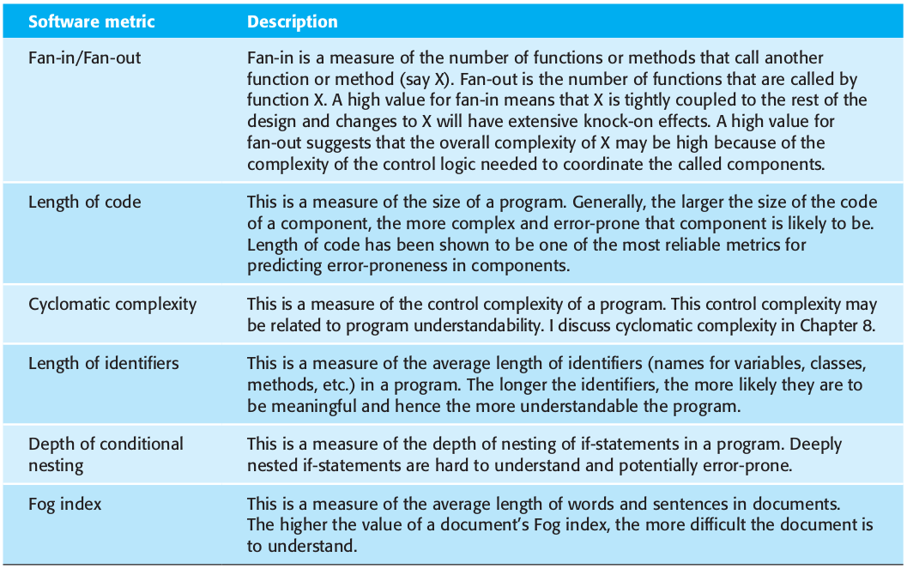

class: center, middle


# Analysis, Design and Software Architecture

## Software Engineering Session 10

Helge Pfeiffer, Assistant Professor,<br>
[Research Center for Government IT](https://www.itu.dk/forskning/institutter/institut-for-datalogi/forskningscenter-for-offentlig-it),<br> 
[IT University of Copenhagen, Denmark](https://www.itu.dk)<br>
`ropf@itu.dk`

---

class: center, middle

# Info and Feedback

---

### .Net Conf 2022

As Rasmus mentioned in class, this year's [.NET Conf 2022](https://www.dotnetconf.net/) takes place online tonight and you can join for free!


---

### Project

Assignments are over, the project started two weeks ago.

<https://github.com/itu-bdsa/project-description>

  * Some of you are not registered in project groups yet?
  * Not all groups registered their project repository on GitHub yet?

---

### Code Review in the large...

I love that I can see that some of the feedback from last week found its way into your projects! ❤❤❤

---

### Are you a week behind?

Some projects seem to be on the stage of two weeks ago and not of what was described as project work for last week...

---

### Naming is a part of design

`RepositoryRepository` is perhaps not a too good name...

  * Why not?
  * How could it be made more clear?

---

### Use Case vs. Use case Diagram?

  * Remember difference between a Use Case and a Use Case Diagram?
  * What was the more important and the more expressive?

---

### Use Case vs. Use case Diagram?

Is the following a functional or a non-functional requirement:

  > Use the 'libgit2sharp' library to collect git repository data.

---

### Structure of your repositories

  * Is an SQLite DB file part of your repository?

--

  * `.DS_Store` files and similar should be ignored in `.gitignore` and removed from the repository (`git rm`)

--

  * Test repos as ZIP files, some projects still rely on Git repositories in Git repositories.


---

### Commented-out tests

```csharp
/*
[Fact]
public void Update_Existing_Repository_Returns_Response_Updated()
{
    var dbRepo = new DbRepositoryUpdateDTO(_singleCommitRepoPath);
    
...

    response.Should().Be(Response.Updated);
    commit!.SHA.Should().Be(realRepo.Commits.FirstOrDefault()!.Sha);
}
*/
```

--

Commented out tests: Provide a rationale for why they are ignored but in the test suite:

```csharp
[Fact(Skip = "Reason")]
```

```csharp
[Theory(Skip ="Reason")]
```

---

### Design

Which design principle is likely not met by the following code?

```csharp
public static Dictionary<string, List<Commit>> GitLogByAllAuthorsByDate(string dateformat = DateFormatNoTime,
    Pathing pathing = SourceCode)
{
    using var repo = new Repository(GetPath(pathing));

    repo.Commits.QueryBy(new CommitFilter { IncludeReachableFrom = repo.Head, SortBy = CommitSortStrategies.Time });
    
    var commitsByAuthor = new Dictionary<string, List<Commit>>();
    var commitsByDate = new Dictionary<string, int>();

    foreach (Commit commit in repo.Commits)
    {
        
        if (commitsByAuthor.ContainsKey(commit.Author.Name))
        {
            commitsByAuthor[commit.Author.Name].Add(commit);
        }
        else
        {
            commitsByAuthor.Add(commit.Author.Name, new List<Commit> { commit });
        }
    }

    foreach (var item in commitsByAuthor)
    {
        //CommitsByAuthor:
        //Key = Author
        //Value = List of commits
        Console.WriteLine("Number of Commits | Date");
        Console.WriteLine("Author: " + item.Key);

        foreach (var commit in item.Value)
        {
            //value = Commit
            var dateFormatted = commit.Author.When.ToString(dateformat, CultureInfo.InvariantCulture);
            if (commitsByDate.ContainsKey(dateFormatted))
            {
                commitsByDate[dateFormatted]++;
            }
            else
            {
                commitsByDate.Add(dateFormatted, 1);
            }
        }

        foreach (var date in commitsByDate)
        {
            Console.WriteLine(date.Value + " | " + date.Key);
        }
    }

    return commitsByAuthor;
}

```

---

### Design

We do Elektronisk databehandling (EDB), see e.g., https://da.wikipedia.org/wiki/Edb

```
+-------+    +------------+    +--------+
| Input | -> | Processing | -> | Output |
+-------+    +------------+    +--------+
```

That view makes it more easy to see responsibilities.

---

### Design

Which design principle(s) is(/are) likely not met with the following code?

```csharp
public void selectCommits()
{
    Console.WriteLine("Selecting data ...");
    StringBuilder sb = new StringBuilder();
    sb.Append("USE [bdsaproject];");
    sb.Append("SELECT * FROM [dbo].[Commits];");
    String sql = sb.ToString();
    SqlCommand command = new SqlCommand(sql, _connection);
    SqlDataReader reader = command.ExecuteReader();
    while (reader.Read())
    {
        Console.WriteLine("{0} {1} {2} {3}", reader.GetInt32(0), reader.GetString(1), reader.GetDateTime(2).ToShortDateString(), reader.GetInt32(3));
    }
    Console.WriteLine("Data selected.");
}
```

---

### Printing versus Logging

```csharp
Console.WriteLine("Repo is  already in DB...");
```

```csharp
_logger.LogInformation("Repo is  already in DB...", DateTimeOffset.UtcNow);
```

See more on <https://learn.microsoft.com/en-us/dotnet/core/extensions/logging?tabs=command-line>

---

### Tests

Do your tests actually test the functional requirements that you stated in your documentation?

These two artifacts have to be in sync.

---

class: center, middle

# Software Quality

---

### Software Quality?

Now that you started implementing your _GitInsight_ systems, some questions might arise:
 
  * Are your _GitInsight_ systems any good?
  * How good/bad are your _GitInsight_ systems?
  * Is there anything one can do to improve quality of your _GitInsight_ systems?

---

### What is Software Quality?

Generally, _quality_ is defined as:

  > "[...] the totality of characteristics of an entity that bear on its ability to satisfy stated and implied needs."
  >
  > [ISO 8402:1994, Quality management and quality assurance – Vocabulary](https://www.iso.org/standard/20115.html)

---

### What is Software Quality?

For the term _software quality_ industrial standards are quite consistent.

  > **(1)** capability of a software product to satisfy stated and implied needs when used under specified conditions
  >
  > [_Systems and software engineering — Systems and software Quality Requirements and Evaluation (SQuaRE) — Guide to
SQuaRE_, International Organization for Standardization, Geneva, CH, Standard, May 2015](https://www.iso.org/obp/ui/#iso:std:64764:en)
  >
  > **(2)** degree to which a software product satisfies stated and implied needs when used under specified conditions
  >
  > [_Systems and software engineering — Systems and software Quality Requirements and Evaluation (SQuaRE) — System and software quality models_, International Organization for Standardization, Geneva, CH, Standard, May 2015](https://www.iso.org/obp/ui/#iso:std:iso-iec:25010:ed-1:v1:en)
  >
  > **(3)** degree to which a software product meets established requirements
  >
  > [_IEEE 730-2014 IEEE Standard for Software Quality Assurance Processes_](https://standards.ieee.org/standard/730-2014.html)

---

### What is Software Quality?

Various stakeholders have particular and varying quality requirements:

  > Good software should deliver the required functionality and performance to the user and should be maintainable, dependable, and usable.
  >
  > Sommerville, _"Software Engineering"_

---

### Software Quality the Elusive Target

Various stakeholders have particular and varying quality requirements:

  > ... David Gamin studied how quality is perceived in various domains, including philosophy, economics, marketing, and operations management. He concluded that "quality is a complex and multifaceted concept" that can be described from five different perspectives.
  >
  >   * The **transcendental view** sees quality as something that can be recognized but not defined.
  >
  >   * The **user view** sees quality as fitness for purpose.
  >
  >   * The **manufacturing view** sees quality as conformance to specification.
  >
  >   * The **product view** sees quality as tied to inherent characteristics of the product.
  >
  >   * The **value-based view** sees quality as dependent on the amount a customer is willing to pay for it.
  >
  > [Kitchenham et al. 1996 _Software Quality: The Elusive Target_](https://ieeexplore.ieee.org/iel1/52/10198/00476281.pdf)

--

One perspective that is missing in the above but that Sommerville describes in chapter 24.4 is the perspective of *software process quality*, which assumes that the better the process leading to a software product the better the product itself.

---

### How to measure software quality and quality attributes?

As Sommerville states, it is neither easy nor straight forward:

  > Unfortunately, it is difficult to make direct measurements of many of the software quality attributes shown in Figure 24.2. Quality attributes such as **maintainability**, **understandability**, and **usability** are external attributes that relate to how developers and users experience the software. They are affected by **subjective factors**, such as **user experience** and **education**, and they cannot therefore be measured objectively. To make a judgment about these attributes, you have to **measure some internal attributes** of the software (such as its size, complexity, etc.) and **assume that these are related to the quality characteristics** that you are concerned with.
  >
  > Sommerville _"Software Engineering"_

--


---

### How to measure software quality and quality attributes?


Source: Sommerville _"Software Engineering"_

---

### Some example metrics



Source: Sommerville _"Software Engineering"_

---

### Some object-oriented example metrics


Source: Sommerville _"Software Engineering"_

---

### How to measure software quality and quality attributes?

Since:

  > 2.There are no standards for software metrics or standardized processes for measurement and analysis. Many companies are reluctant to introduce measurement programs until such standards and supporting tools are available.
  >
  > 3.Measurement may require the development and maintenance of specialized software tools. It is difficult to justify the costs of tool development when the returns from measurement are unknown.
  >
  > Sommerville _"Software Engineering"_


---

### Software Quality Models

No "no standards for software metrics or standardized processes for measurement and analysis"?

Since there are many software quality models. Let's have a look at the earliest Boehm's model from 1976 and more recent ones from the ISO 250x0 series of standards.

---

### Boehm 1976 - Quality Model


Source: [Boehm et al. _"Quantitative evaluation of software quality"_](https://dl.acm.org/ft_gateway.cfm?id=807736&type=pdf)

---

### Boehm 1976 - Quality Model


Source: [Boehm et al. _"Quantitative evaluation of software quality"_](https://dl.acm.org/ft_gateway.cfm?id=807736&type=pdf)

---

### ISO 250x0 - Quality Models


Source: [_ISO/IEC 25000:2014 Systems and software engineering — Systems and software Quality Requirements and Evaluation (SQuaRE) — Guide to SQuaRE_](https://www.iso.org/standard/64764.html)

---

### ISO 25010 - Quality in Use Model


Source: [ISO/IEC 25010:2011
Systems and software engineering — Systems and software Quality Requirements and Evaluation (SQuaRE) — System and software quality models](https://www.iso.org/standard/35733.html)

---

### ISO 25010 - Product Model


Source: [ISO/IEC 25010:2011
Systems and software engineering — Systems and software Quality Requirements and Evaluation (SQuaRE) — System and software quality models](https://www.iso.org/standard/35733.html)


---

### ISO 25023 - Metrics (QMEs)


Here, _operability_ measures where operability is a sub-characteristic of _usability_.

Source: [ISO/IEC 25023:2016
Systems and software engineering — Systems and software Quality Requirements and Evaluation (SQuaRE) — Measurement of system and software product quality](https://www.iso.org/standard/35747.html)

---

### Now, how to asses software quality?

Then one has to define and specify metrics, associate them to the quality attributes of interest, translate these  metrics into precise programs/measures on given artifacts, and define how measured values are aggregated in the end for assessment.

  > The project or organization must start by making a list of nonfunctional requirements that define the "right code." We call this the quality model.
  >
  > Letouzey et al. 2012 _"Managing Technical Debt with the SQALE Method"_

---

### Problematic about Software Quality: "What is Software?"

Remember that _software_ is way more than code!

  > "Software is the collection of all artifacts, which allow (a) suitably educated person(s) with access to specified and suitable hardware to instantiate a running system.
  >
  > Additionally, the collection of such artifacts allow such (a) person(s) to understand and reason about a systems' working and properties and let them understand why the system is as it is and why it behaves the way it does."
  >
  > _Helge's definition of software_

That is, when you want to measure software quality you have to necessarily look at more than just source code.

---

class: center, middle

# Maintainability

---

### Maintainability

As you could already see in the first quality model [Boehm et al. _"Quantitative evaluation of software quality"_](https://dl.acm.org/ft_gateway.cfm?id=807736&type=pdf) _maintainability_ seems to be an important software quality.


Source: [Boehm et al. _"Quantitative evaluation of software quality"_](https://dl.acm.org/ft_gateway.cfm?id=807736&type=pdf)

---

### Maintainability

This is likely due to:

  > M2. Maintenance typically consumes about 40 to 80 percent (60 percent average) of software costs. Therefore, it is probably the most important life cycle phase.
  > 
  > ...
  > 
  > M3. Enhancement is responsible for roughly 60 percent of software maintenance costs. Error correction is roughly 17 percent. So, software maintenance is largely about adding new capability to old software, not about fixing it.
  >
  > ...
  >
  > M5. Most software development tasks and software maintenance tasks are the same—except for the additional maintenance task of "understanding the existing product." This task is the dominant maintenance activity, consuming roughly 30 percent of maintenance time. So, you could claim that maintenance is more difficult than development.
  >
  > [Glass _"Frequently Forgotten Fundamental Facts about Software Engineering"_](http://www.eng.auburn.edu/~kchang/comp6710/readings/Forgotten_Fundamentals_IEEE_Software_May_2001.pdf) 
  
---

### What comprises Maintainance?

  * fixing bugs
  * keeping its systems operational
  * investigating failures
  * adapting it to new platforms
  * modifying it for new use cases
  * repaying technical debt
  * adding new features
  * etc.

Source: Kleppmann _"Designing Data-Intensive Applications"_

---

### Design for Maintainability according to the ISO 25010 Product Model

  * Modularity
  * Reusability 
  * Analysability
  * Modifyability
  * Testability


Source: [ISO/IEC 25010:2011
Systems and software engineering — Systems and software Quality Requirements and Evaluation (SQuaRE) — System and software quality models](https://www.iso.org/standard/35733.html)

---

### [_BetterCodeHub_](https://www.bettercodehub.com/) accesses _maintainability_ automatically

Tools like [_BetterCodeHub_](https://www.bettercodehub.com/)/[_Sigrid_](https://www.softwareimprovementgroup.com/solutions/sigrid-software-assurance-platform/) promise to assess _maintainability_ via the following ten guidelines via static analysis rules:

  1. Write Short Units of Code
  1. Write Simple Units of Code
  1. Write Code Once
  1. Keep Unit Interfaces Small
  1. Separate Concerns in Modules
  1. Couple Architecture Components Loosely
  1. Keep Architecture Components Balanced
  1. Keep Your Codebase Small
  1. Automate Tests
  1. Write Clean Code

Source: [J. Visser et al._Building Maintainable Software, C# Edition: Ten Guidelines for Future-Proof Code_](https://www.labunix.uqam.ca/~tremblay_gu/MGL7460/Liens/Building_Maintainable_Software_SIG.pdf):
  
---

### Design for Maintainability (Kleppmann "Designing Data-Intensive Applications")

...minimize pain during maintenance, and thus avoid creating legacy software ourselves.

  * a) **Operability**
    Make it easy for operations teams to keep the system running smoothly.
  * b) **Simplicity**
    Make it easy for new engineers to understand the system, by removing as much complexity as possible from the system. (Note this is not the same as simplicity of the user interface.)
  * c) **Evolvability**
    Make it easy for engineers to make changes to the system in the future, adapting it for unanticipated use cases as requirements change. Also known as extensibility, modifiability, or plasticity.
    
---

### a) Operability: Making Life Easy for Operations

Support your operations team by providing support to:

  * Monitor the health of the system
  * Quickly restore a service if it goes into a bad state
  * Track down the cause of problems, such as system failures, degraded performance, etc
  * Keep software and platforms up to date
  * Observe how different systems affect each other
  * Anticipate future problems and solve them before they occur (e.g., capacity planning)
  * Establish good practices and tools for deployment, configuration management, etc.
  * Perform complex maintenance tasks, such as moving an application from one platform to another
  * Preserve the group’s knowledge about the system, even as individual people come and go

---

### a) Operability: Making Life Easy for Operations

Good operability means making routine tasks easy:

  * Provide good monitoring to make runtime behavior and system internals visible
  * Provide good support for automation and integration with standard tools
  * Avoid dependency on individual machines
  * Provide good documentation and an easy-to-understand operational model
  * Provide good default behavior, but allow administrators to override defaults when needed
  * Provide self-healing where appropriate
  * Exhibiting predictable behavior, minimizing surprises

---

### b) Simplicity: Managing Complexity

Many of the consecutive and reckless fixes applied to a system, will eventually create a _"big ball of mud"_:

<iframe
    width="100%"
    height="350"
    src="http://laputan.org/mud/mud.html#Abstract"
    frameborder="0"
    allowfullscreen
></iframe>

---

#### Do I have a _"big ball of mud"_?

  * **hacks aimed at solving performance problems**
  * tight coupling of modules
  * tangled dependencies
  * inconsistent naming and terminology
  * explosion of the state space
  
Issues with the _"big ball of mud"_:

  * budgets and schedules are often overrun. 
  * risk of introducing bugs when making a change
  
<!--
removing accidental complexity with the help of abstraction
-->

---

### c) Evolvability: Making Change Easy

  * unlikely that your system’s requirements will remain unchanged forever
  * keeping things operational and simple as described above allows for evolvability
  
  
  
----------

The notes on maintainability above come from chapter 1 _Maintainability_ p.18ff in _Designing Data-Intensive Applications_ by Martin Kleppmann.
  
---

class: center, middle

# Technical Debt

---

### Technical Debt?

  > "Shipping first time code is like going into debt. A little debt speeds development so long as it is paid back promptly with a rewrite. ... The danger occurs when the debt is not repaid. Every minute spent on not-quite-right code counts as interest on that debt."
  >
  > Cunningham 1992 _"The WyCash Portfolio Management System"_
  
--

  - As in the saying *one man's meat is another man's poison*, we do not have generally true measures for software quality, i.e., *quite-right*, see e.g., Kitchenham 1996, Boehm 1976.

  - Often code quality is domain specific as for example stated in the ISO 25000 standard: 
  > "for interactive consumer software, such as word processor, usability and co-existence with other software, such as mailing software, is considered important. For Internet and open systems, security and interoperability are most important."
  >
  > ISO 25000

---

### Technical Debt?


Unfortunately, Technical Debt (TD) is an overloaded metaphor that is used to describe:

  > “technical compromises that are expedient in the short term, but that create a technical context that increases complexity and cost in the long term”
  >
  > Avgeriou et al. [_“Managing technical debt in software engineering (dagstuhl seminar 16162)”_](https://drops.dagstuhl.de/opus/volltexte/2016/6693/pdf/dagrep_v006_i004_p110_s16162.pdf)

--

  - TD is:
  
  > "the cost of the effort required to fix problems that remain in the code when an application is released to operation."
  >
  > [Sappidi et al. 2010 _"CAST Worldwide 1141 Application Software Quality Study"_](https://www.agilealliance.org/wp-content/uploads/2016/01/CAST_2010AnnualReport_KeyFindings_WebFinal.pdf)

--

  - TD is:
  > "a metaphor for the accumulation of unresolved issues in a software project'"
  >
  > Birchall _"Re-Engineering Legacy Software"_

--

  > "the difference between what was promised and what was actually delivered." 
  >
  > [Radigan](https://www.atlassian.com/agile/software-development/technical-debt)

---

### Technical Debt is really:

  > Simply put, ur-technical debt arises when my ideas diverge from my code. That divergence is inevitable with an iterative process.
  >
--
  > [...]
  >
  > When you choose an iterative process, you use that time to deliver several partial solutions. You don’t understand the full requirements until the last iteration, so for most of the year, the ideas in your head are partial. The code embodies your partial understanding because it cannot be more insightful than the ideas in your head. The original paper argues that this is ok, as long as you don’t leave the code in that state forever, and it introduces the debt metaphor
  > 
--
  > [...]
  >
  > As you tackle new requirements, your understanding changes. Cunningham called this consolidation of ideas. New abstractions emerge, either arising from better understanding of the problem or from recognizing a more suitable design as the solution. When using iterative development, this consolidation happens repeatedly across iterations.
  >
  > [G. Fairbanks _"Ur-Technical Debt"_](https://ieeexplore.ieee.org/stamp/stamp.jsp?arnumber=9121630)

---

### Technical Debt is not:


  > technical debt is not bad code, code written by novices, or expedient hacks.
  >
  > [G. Fairbanks _"Ur-Technical Debt"_](https://ieeexplore.ieee.org/stamp/stamp.jsp?arnumber=9121630)

--

  > I’m never in favor of writing code poorly, but I am in favor of writing code to reflect your current understanding of a problem even if that understanding is partial. If you knowingly write hacky code, or you allow inexperienced developers to use their first draft code, you undermine the very thing that makes iterative development viable.
  > 
  > [W. Cunningham _"Ward explains the tech debt metaphor"_](https://www.youtube.com/watch?v=pqeJFYwnkjE)

<!--   > We believe this process
leads to the most appropriate product
in the shortest possible time. ... The
modularity offered by objects and the
practice of consolidation make the al-
ternative, incremental growth, both
feasible and desirable ....” -->

---

### What can we do about SW Quality, Maintainability, and TD?

Some things we can do:
    
  * Introduce certain practices in our development process
  * Introduce quality gates (and tools that check them) into our build processes
    - In your projects these are encoded in your test suites.

---

### Practices for Software Quality

  * Pair programming
  * Test-driven development
  * Code reviews

---

### Pair programming?

  > Code is written by pairs of programmers working together at the same workstation. One member of each pair drives the keyboard and types the code. The other member of the pair watches the code being typed, finding errors and improvements. The two interact intensely. Both are completely engaged in the act of writing software.
  >
  > The roles change frequently. If the driver gets tired or stuck, the pair partner grabs the keyboard and starts to drive. The keyboard will move back and forth between them several times in an hour. The resultant code is designed and authored by both members. Neither can take more than half the credit.
  >
  > R. Martin _"Agile Principles, Patterns, and Practices in C#"_

---

### Pair programming benefits

  > By  working  in tandem,  the  pairs  completed their  assignments 40% to 50% faster.
  >
  > [L. Williams et al. _"Strengthening the Case for Pair Programming"_](https://ieeexplore.ieee.org/stamp/stamp.jsp?arnumber=854064)
 
--

  > The top benefit was fewer bugs in the source code. One person 
said "it greatly reduces bug numbers." Simple bugs were found 
and fixed, as one respondent reported, "there are fewer 'petty'
bugs." In addition, respondents speculated that the longer bugs 
live in the code, the more difficult they are to fix. Using pair programming, "bugs are spotted earlier" in the development process, 
and "may prevent bugs before [they are] deeply embedded."
  > 
  > A. Begel et al. [_"Pair programming: what's in it for me?"_](https://www.researchgate.net/profile/Andrew-Begel/publication/221494979_Pair_Programming_What%27s_in_it_for_Me/links/0c960522018d66773d000000/Pair-Programming-Whats-in-it-for-Me.pdf)

--

  > for a development-time cost of about 15%, pair programming improves design quality, reduces defects, reduces staffing risk, enhances technical skills, improves team communications and is considered more enjoyable at statistically significant levels.
  >
  > A. Cockburn et al. [_"The Costs and Benefits of Pair Programming"_](https://collaboration.csc.ncsu.edu/laurie/Papers/XPSardinia.PDF)

---

### Code review benefits
  
  > At a cost of 1-2% of the project, a 40% decrease in the number of issues  was  found.
  >
  > R.A. Baker Jr [_"Code reviews enhance software quality"_](https://dl.acm.org/doi/pdf/10.1145/253228.253461)

--

  > Findings  show  that  unreviewed  commits  (i.e., commits  that did  not  undergo  a  review  process)  have  over  two  times  more chances of introducing bugs than reviewed commits (i.e., commits that  underwent  a  review  process).  In  addition,  code  committed after  review  has  a  substantially  higher  readability  with  respect to  unreviewed  code.
  >
  > G. Bavota et al. [_"Four eyes are better than two: On the impact of code reviews on software quality"_](http://citeseerx.ist.psu.edu/viewdoc/download?doi=10.1.1.709.2980&rep=rep1&type=pdf)

--

  > we find that both code review coverage and participation share a significant link with software quality. Low code review coverage and participation are estimated to produce components with up to two and five additional post-release defects respectively. Our results empirically confirm the intuition that poorly reviewed code has a negative impact on software quality [...]
  >
  > S. McIntosh [_"The impact of code review coverage and code review participation on software quality: a case study of the Qt, VTK, and ITK projects"_](https://dl.acm.org/doi/abs/10.1145/2597073.2597076)

---

### Test-driven development

  > The first and most obvious effect is that every single function of the program has tests that verify its operation. This suite of tests acts as a backstop for further development. It tells us whenever we inadvertently break some existing functionality. We can add functions to the program or change the structure of the program without fear that in the process, we will break something important. The tests tell us that the program is still behaving properly. We are thus much freer to make changes and improvements to our program.
  >
  > A more important but less obvious effect is that the act of writing the test first forces us into a different point of view. We must view the program we are about to write from the vantage point of a caller of that program. Thus, we are immediately concerned with the interface of the program as well as its function. By writing the test first, we design the software to be conveniently callable.
  >
  > What’s more, by writing the test first, we force ourselves to design the program to be testable. Designing the program to be callable and testable is remarkably important. In order to be callable and testable, the software has to be decoupled from its surroundings. Thus, the act of writing tests first forces us to decouple the software!
  >
  > R. Martin _"Agile Principles, Patterns, and Practices in C#"_

---


### Your turn!


  * Go to the exercise session.
  * Register your project groups and project repositories if not done yet, see <https://github.com/itu-bdsa/project-description#week-zero-week-45>
  * Work on the project, see <https://github.com/itu-bdsa/project-description>
