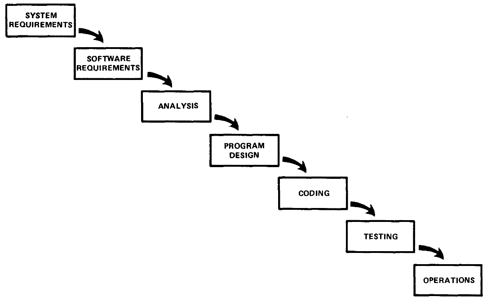

class: center, middle

# Analysis, Design and Software Architecture

## Software Engineering Session 12

Helge Pfeiffer, Assistant Professor, 
[Research Center for Government IT](https://www.itu.dk/forskning/institutter/institut-for-datalogi/forskningscenter-for-offentlig-it),  
[IT University of Copenhagen, Denmark](https://www.itu.dk) 
`ropf@itu.dk`

---

### Evaluation I

Please do that now: https://learnit.itu.dk/mod/questionnaire/view.php?id=167331

---

### Evaluation for us to become better next year

Please do that now: http://207.154.215.89:8888/

---

### Next week: Q&A session

Please write your questions in the [respective channel on Discord](https://discord.com/channels/1009838858663362640/1047092216029515796).

If you like a question of another person and would like to have that addressed too, then just give it a thumbs-up there.

I will inform you via LearnIT once that channel is up.

---

### Exam eligibility

Double check that you have your five mandatory assignments accepted on LearnIT.

If that is not the case but you really want to take part in the exam, talk to me at the end of next week's (Dec. 6th) teaching session.

---

### Software Processes?

  > A software process is a set of related activities that leads to the production of a software system.
  > 
--

  > [...]
  > 1. **Software specification** The functionality of the software and constraints on its operation must be defined.
  > 2. **Software development** The software to meet the specification must be produced.
  > 3. **Software validation** The software must be validated to ensure that it does what the customer wants.
  > 4. **Software evolution** The software must evolve to meet changing customer needs.
  > 
  > Sommerville _Software Engineering_

---

### Software Process?

  * **Plan-driven processes** are processes where all of the process activities are planned in advance and progress is measured against this plan. 
  * In **iterative** or **incremental processes**, planning is incremental and it is easier to
change the process to reflect changing customer requirements.
  * In **agile processes**, planning is incremental and continual as the software is developed. It is therefore easier to change the process to reflect changing customer or product requirements.
    - Development of “shippable” software takes precedence over planning and documentation.

Based on: Sommerville _Software Engineering_ and Tell BDSA'21

---

### Waterfall Software Process Model

Source: Sommerville _Software Engineering_

---

### Waterfall Software Process Model

Source: [Royce 1970, _Managing the development of large software systems_](https://blog.jbrains.ca/assets/articles/royce1970.pdf)

---

### Waterfall Software Process Model

It is a plan-driven and document-oriented process

Source: [Royce 1970, _Managing the development of large software systems_](https://blog.jbrains.ca/assets/articles/royce1970.pdf)

---

### Waterfall Software Process Model Misunderstandings...

  > In my experience, however, the simpler method has never worked on large software development efforts and the costs to recover far exceeded those required to finance the five-step process listed.
  >
  > [Royce 1970, _Managing the development of large software systems_](https://blog.jbrains.ca/assets/articles/royce1970.pdf)

---

### Actually Royce described an iterative process

Source: [Royce 1970, _Managing the development of large software systems_](https://blog.jbrains.ca/assets/articles/royce1970.pdf)

---

### Actually Royce described an iterative process

Source: [Royce 1970, _Managing the development of large software systems_](https://blog.jbrains.ca/assets/articles/royce1970.pdf)

---

### Waterfall Software Process Model Misunderstandings...

  > I should add that in my own experience, Royce is right saying that the waterfall model is a risky approach to software development. In the vast majority of cases I strongly recommend against a waterfall. A waterfall model can work well in small projects where everything is completely known ahead-of-time and the requirements never change, but such projects are rare. [...] In practice, some sort of incremental or iterative approach is usually much less risky. 
  > 
--

  > Once the pictures became widespread, they became fossilized in various organizations and standards. For example, the US Department of Defense (DoD) developed the standards DOD-STD-2167 (4 June 1985), later revised to DOD-STD-2167A (29 Feb 1988), aka "Defense System[s] Software Development". [...] Those standards are officially no longer required, but the practices remain. The [Final Report of the Defense Science Board (DSB) Task Force on the "Design and Acquisition of Software for Defense Systems" (February 14, 2018)](https://www.acq.osd.mil/dsb/reports/2010s/DSB_SWA_Report_FINALdelivered2-21-2018.pdf) explains that the DoD **"still largely buys and develops software developed using the slower traditional Waterfall approach that was mostly abandoned by commercial companies years ago."** Once something becomes entrenched, it is hard to change. 
  > 
  > [D. A. Wheeler _"The Waterfall Model"_](https://dwheeler.com/essays/waterfall.html)

---

### PRINCE2

Why does it matter? Because certain aspects of plan-driven process models survive in contemporary methods.

  > PRINCE2 (PRojects IN Controlled Environments) is a structured **project management method** [...]. PRINCE2 emphasises dividing projects into manageable and controllable stages. 
  >
  > PRINCE2 was developed as a UK government standard for information systems projects.
  > 
  > <https://en.wikipedia.org/wiki/PRINCE2>

Source: <https://www.raahauge-consult.dk/inspiration/prince2-and-agile>

---

### Statens IT-projektmodel

The Danish governmental IT-project model is inspired by PRINCE2 and references plan-driven processes (waterfall model) directly.

  > Statens it-projektmodel er en generel projektledelsesmodel, som kan bruges af alle typer af statslige it-projekter. Modellen indeholder en fasemodel for projektgennemførelse samt en række styringsdokumenter og vejledninger.
  > 
  > <https://digst.dk/styring/projektstyring/statens-it-projektmodel/>

--

  > Statens it-projektmodel er en generel projektledelsesmodel, der skal udgøre et ambitiøst, men også realistisk beslutnings- og styringsgrundlag for alle statslige projekter. Modellen skal understøtte styring og ledelse af projektet igennem hele projektets levetid, og sikre at der også er et fokus på realisering af gevinster fra projektets start og til efter projektets afslutning. Modellen består af fem hovedelementer:
  > 
  > 1. Fem principper for it-projekter i staten
  > 2. En fasemodel der dækker gevinsternes livscyklus
  > 3. Obligatorisk styringsgrundlag
  > 4. Projektorganisationens roller og ansvar
  > 5. Støtteværktøjer og procesguider
  >
  > <https://digst.dk/styring/projektstyring/spoergsmaal-og-svar-faq-til-statens-it-projektmodel/#>

---

###  It-udviklingsmetoder i Statens IT-projektmodel

Source: <https://digst.dk/media/18239/01-vejledning-til-statens-it-projektmodel-v-13.pdf>

---

### Fordele/ulemper ved udviklingsmetoder

  > Det kræver en vis erfaring og modenhed i anvendelse af agile metoder i en organisation, før det overhovedet giver mening at overveje hvilke it-systemer, der bedst udvikles agil, hhv. efter vandfaldsprincipper.
  >
  > <https://digst.dk/media/18239/01-vejledning-til-statens-it-projektmodel-v-13.pdf>

--

Source: <https://digst.dk/media/18239/01-vejledning-til-statens-it-projektmodel-v-13.pdf>

---

### Incremental/iterative development

  > Incremental development in some form is now the most common approach for the development of application systems and software products. This approach can be either plan-driven, agile or, more usually, a mixture of these approaches.
--
  
  >
  > In a plan-driven approach, the system increments are identified in advance; if an agile approach is adopted, the early increments are identified, but the development of later increments depends on progress and customer priorities.
  > 
  > Sommerville _Software Engineering_

---

### Incremental development

Advantages

  > 1. The **cost of implementing requirements changes is reduced**. The amount of analysis and documentation that has to be redone is significantly less than is required with the waterfall model.
  > 2. It is easier to **get customer feedback** on the development work that has been done. Customers can comment on demonstrations of the software and see how much has been implemented. Customers find it difficult to judge progress from software design documents.
  > 3. Early **delivery and deployment of useful software to the customer is possible**, even if all of the functionality has not been included. Customers are able to use and gain value from the software earlier than is possible with a waterfall process.

--

Problems

  > 1. The **process is not visible**. Managers need regular deliverables to measure progress. If systems are developed quickly, it is not cost effective to produce documents that reflect every version of the system.
  > 2. **System structure tends to degrade as new increments are added**. Regular change leads to messy code as new functionality is added in whatever way is possible. It becomes increasingly difficult and costly to add new features to a system. To reduce structural degradation and general code messiness, agile methods suggest that you should regularly refactor (improve and restructure) the software.

---

### There is evidence for that we just work by combining processes

  > Our study revealed that hybrid approaches have become mainstream and are used by companies regardless of company size and industry sector. While standards, norms, and regulations challenge companies, even in regulated domains, companies adopt agile methods. 
  >
--

  > [...]
  > Hybrid approaches used in practice today emerge from pragmatic process selection and evolve over time. [Our] analysis supports West’s “Water-Scrum-Fall” hypothesis by showing that combinations of development approaches follow a pattern in which a traditional process serves as framework redefined by (multiple) fine-grained practices.
  >
  > [Kuhrmann et al. _"Hybrid Software and System Development in Practice: Waterfall,
Scrum, and Beyond"_](https://orbilu.uni.lu/bitstream/10993/31353/1/HELENA-ICSSP%20paper-preprint.pdf)

---

### Agile Manifesto

Source: <https://agilemanifesto.org/>

---

### Agile Principles

  > * Our highest priority is to satisfy the customer through early and continuous delivery of valuable software.
--

  > * Welcome changing requirements, even late in development. Agile processes harness change for the customer's competitive advantage.
--

  > * Deliver working software frequently, from a couple of weeks to a couple of months, with a preference to the shorter timescale.
--

  > * Business people and developers must work together daily throughout the project.
--

  > * Build projects around motivated individuals. Give them the environment and support they need, and trust them to get the job done.
--

  > * The most efficient and effective method of conveying information to and within a development team is face-to-face conversation.
--

  > * Working software is the primary measure of progress.
--

  > * Agile processes promote sustainable development. The sponsors, developers, and users should be able to maintain a constant pace indefinitely.
--

  > * Continuous attention to technical excellence and good design enhances agility.
--

  > * Simplicity--the art of maximizing the amount of work not done--is essential.
--

  > * The best architectures, requirements, and designs emerge from self-organizing teams.
--

  > * At regular intervals, the team reflects on how to become more effective, then tunes and adjusts its behavior accordingly. 
  >
  > <https://agilemanifesto.org/principles.html>

---

### Agile Principles according to Sommerville

Source: Sommerville _Software Engineering_

---

### Extreme Programming (XP)

Source: Sommerville _Software Engineering_

---

### Extreme Programming Practices

---

### Extreme Programming (XP)

  * In XP, a **customer/user is part of the XP team** and is responsible for making
decisions on requirements.
  * Requirements are elicited by writing **User Stories** with the client
    - User stories are high-level scenarios or use cases that encompass a set of
coherent features
  * Planning is driven by requirements and their relative priorities
    - Developers decompose each user story in terms of development tasks that are
needed to realize the features required by the story
  *  Developers estimate the duration of each task in terms of days
    - If a task is planned for more than a couple of weeks, it is further decomposed
into smaller tasks
  * The customer chooses the stories for inclusion in the next release based on their
priorities and the schedule estimates.

Source: Tell BDSA'21

---

### User Stories

User stories in XP are not Use Cases as you got to know them.
Of what do they remind you?

Source: Sommerville _Software Engineering_
 

---

### Scrum

Source: https://amazing-outcomes.de/en/what-we-offer/agile-resources/scrum-framework-poster

---

### Scrum

  > scrum
  >    n 1: (rugby) the method of beginning play in which the forwards
  >         of each team crouch side by side with locked arms; play
  >         starts when the ball is thrown in between them and the two
  >         sides compete for possession [syn: {scrum}, {scrummage}]
  >
  > <http://wordnetweb.princeton.edu/perl/webwn?s=scrum>

Definition (Software Development): scrum is an agile, lightweight process
  *  to **manage and control** software and product development with rapidly
changing requirements
  *  based on improved communication and maximized cooperation.

---

### Scrum

More on that in your 
[_Second Year project: Software Development in Larger Teams_](https://learnit.itu.dk/local/coursebase/view.php?s=ft&view=public&ciid=1174) with Paolo Tell

---

### What to do after this course?

[_Andetårsprojekt: Softwareudvikling i større grupper_](https://learnit.itu.dk/local/coursebase/view.php?s=ft&view=public&ciid=1174) in spring 2023

Elective [_DevOps, Software Evolution and Software Maintenance_](https://learnit.itu.dk/local/coursebase/view.php?s=ft&view=public&ciid=1137) in spring 2023

---

### Potential Theses Topics

#### DaSEA – A Dataset for Software Ecosystem Analysis

The [DaSEA](https://github.com/DaSEA-project/DASEA) project was born out of the research project and MSc of three students.
Find a deeper [description of the dataset in the paper](https://itu.dk/~ropf/blog/assets/msr2022.pdf) and a high-level introduction in [the presentation](https://mybinder.org/v2/gh/DaSEA-project/MSR22-DaSEA-Dataset-Presentation/main?filepath=index.ipynb) and the [presentation video](https://itu.dk/~ropf/presentations/msr2022.html).

Possible projects:

  - Add more miners, especially for other operating systems (APT, Gentoo's portage, RPM, ...)
  - Use the data for your research on software reuse, component metrics, etc.

---

### Potential Theses Topics

#### Implement and Evaluate Criticality Score
 
Recently, Google's Open Source team presented the [criticality score](https://github.com/ossf/criticality_score/blob/a02c8311fbbbd5d569ebaad3106ec08532b3a10c/Quantifying_criticality_algorithm.pdf), a metric to assess [_\"influence and importance\"_](https://github.com/ossf/criticality_score/blob/4a3e3e171ac403344060dbcfc43f47944afe77d0/README.md) of a project in an ecosystem from project specific signals, e.g., number of dependents, commit frequency, etc.\

The project's authors [would like to include a centrality metric in computation of their metric](https://github.com/ossf/criticality_score/issues/53#issuecomment-748556336), which is difficult for systems programming language ecosystems like C/C++.
Find a more detailed [problem description in this paper](https://itu.dk/~ropf/blog/assets/msr2021_pfeiffer.pdf).

Currently, two students are using the [DaSEA dataset](http://dasea.org), to compute ecosystem specific and global centrality ranks and include them in the metric. 
You could take over their project and finalize a tool that computes _critically_ automatically.

<https://github.com/HelgeCPH/critical-projects/blob/master/data/output/nuget_top_1000.csv>

---

### Your turn!

  * Go to the exercise session.
  * Work on the project, see <https://github.com/itu-bdsa/project-description#week-six-week-48>
  * Next week project demo
