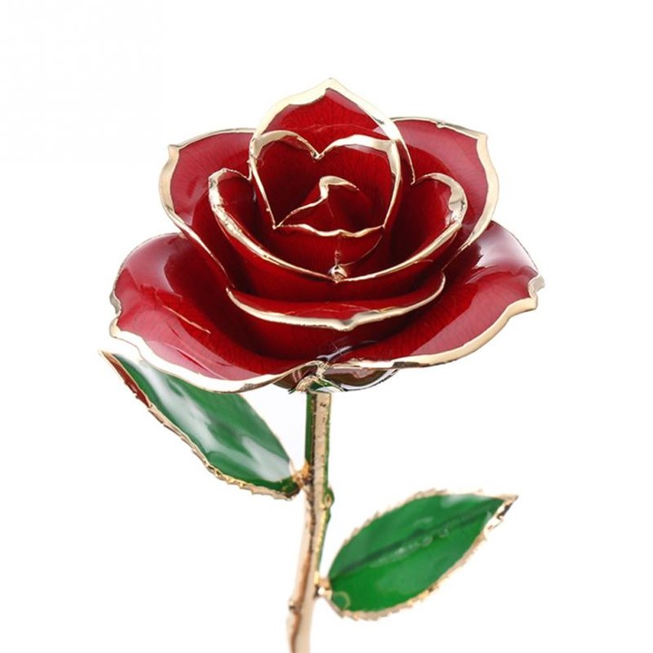

# The Gilded Rose



Rasmus Lystrøm
Associate Professor
ITU

---

# Refactoring kata

Kata: Japanese word, literally meaning “form”.

~ any basic form, routine, or pattern of behavior that is practiced to various levels of mastery

Practice makes perfect

---

# Background

> Hi and welcome to team Gilded Rose. As you know, we are a small inn with a prime location in a prominent city ran by a friendly innkeeper named Allison. We also buy and sell only the finest goods.
Unfortunately, our goods are constantly degrading in **Quality** as they approach their sell by date.
We have a system in place that updates our inventory for us. It was developed by a no-nonsense type named Leeroy, who has moved on to new adventures.
Your task is to add the new feature to our system so that we can begin selling a new category of items. First an introduction to our system:

---

# Specification

- All items have a **SellIn** value which denotes the number of days we have to sell the item
- All items have a **Quality** value which denotes how valuable the item is
- At the end of each day our system lowers both values for every item

Pretty simple, right? Well this is where it gets interesting:

- Once the sell by date has passed, **Quality** degrades twice as fast
- The **Quality** of an item is never negative
- "Aged Brie" actually increases in **Quality** the older it gets
- The **Quality** of an item is never more than 50
- "Sulfuras", being a legendary item, never has to be sold or decreases in Quality
- "Backstage passes", like aged brie, increases in **Quality** as it's **SellIn** value approaches; **Quality** increases by 2 when there are 10 days or less and by 3 when there are 5 days or less but **Quality** drops to 0 after the concert

We have recently signed a supplier of conjured items. This requires an update to our system:

- "*Conjured*" items degrade in **Quality** twice as fast as normal items

---

# Implement "*Conjured*"

```csharp
using System.Collections.Generic;

namespace GildedRose.Console
{
    class Program
    {
        IList<Item> Items;
        static void Main(string[] args)
        {
            System.Console.WriteLine("OMGHAI!");

            var app = new Program()
                          {
                              Items = new List<Item>
                                          {
                                              new Item {Name = "+5 Dexterity Vest", SellIn = 10, Quality = 20},
                                              new Item {Name = "Aged Brie", SellIn = 2, Quality = 0},
                                              new Item {Name = "Elixir of the Mongoose", SellIn = 5, Quality = 7},
                                              new Item {Name = "Sulfuras, Hand of Ragnaros", SellIn = 0, Quality = 80},
                                              new Item
                                                  {
                                                      Name = "Backstage passes to a TAFKAL80ETC concert",
                                                      SellIn = 15,
                                                      Quality = 20
                                                  },
                                              new Item {Name = "Conjured Mana Cake", SellIn = 3, Quality = 6}
                                          }

                          };

            app.UpdateQuality();

            System.Console.ReadKey();

        }

        public void UpdateQuality()
        {
            for (var i = 0; i < Items.Count; i++)
            {
                if (Items[i].Name != "Aged Brie" && Items[i].Name != "Backstage passes to a TAFKAL80ETC concert")
                {
                    if (Items[i].Quality > 0)
                    {
                        if (Items[i].Name != "Sulfuras, Hand of Ragnaros")
                        {
                            Items[i].Quality = Items[i].Quality - 1;
                        }
                    }
                }
                else
                {
                    if (Items[i].Quality < 50)
                    {
                        Items[i].Quality = Items[i].Quality + 1;

                        if (Items[i].Name == "Backstage passes to a TAFKAL80ETC concert")
                        {
                            if (Items[i].SellIn < 11)
                            {
                                if (Items[i].Quality < 50)
                                {
                                    Items[i].Quality = Items[i].Quality + 1;
                                }
                            }

                            if (Items[i].SellIn < 6)
                            {
                                if (Items[i].Quality < 50)
                                {
                                    Items[i].Quality = Items[i].Quality + 1;
                                }
                            }
                        }
                    }
                }

                if (Items[i].Name != "Sulfuras, Hand of Ragnaros")
                {
                    Items[i].SellIn = Items[i].SellIn - 1;
                }

                if (Items[i].SellIn < 0)
                {
                    if (Items[i].Name != "Aged Brie")
                    {
                        if (Items[i].Name != "Backstage passes to a TAFKAL80ETC concert")
                        {
                            if (Items[i].Quality > 0)
                            {
                                if (Items[i].Name != "Sulfuras, Hand of Ragnaros")
                                {
                                    Items[i].Quality = Items[i].Quality - 1;
                                }
                            }
                        }
                        else
                        {
                            Items[i].Quality = Items[i].Quality - Items[i].Quality;
                        }
                    }
                    else
                    {
                        if (Items[i].Quality < 50)
                        {
                            Items[i].Quality = Items[i].Quality + 1;
                        }
                    }
                }
            }
        }

    }

    public class Item
    {
        public string Name { get; set; }

        public int SellIn { get; set; }

        public int Quality { get; set; }
    }

}
```

---

> "make the change easy (warning: this may be hard), then make the easy change"

Kent Beck, 2012

---

# Refactoring

But first: **MAKE THEN CHANGE SAFE!**

Ensure ~100% code coverage in `Program.cs` - specifically the `UpdateQuality()` method.

Test `Main` to verify that in generates the same output

(```dotnet run > output.txt```)

Now fix!

Extract method --> Polymorphism

---

# Code Coverage

[Use code coverage for unit testing](https://learn.microsoft.com/en-us/dotnet/core/testing/unit-testing-code-coverage)

**TODO**: Confirm works and prints code coverage

`dotnet test --collect:"XPlat Code Coverage"`

```txt
+-----------------------+------+--------+--------+
| Module                | Line | Branch | Method |
+-----------------------+------+--------+--------+
| GildedRose            | 0%   | 0%     | 0%     |
+-----------------------+------+--------+--------+
```

---

# .NET Watcher

From the tests folder:

`dotnet watch test --collect:"XPlat Code Coverage"`

---

# Resources

Martin Fowler on Refactoring: <https://martinfowler.com/articles/preparatory-refactoring-example.html>

Sandy Metz on solving the Guilded Rose in Ruby: <https://youtu.be/8bZh5LMaSmE>

The original Gilded Rose by Terry Hughes and Bobby Johnson: <https://github.com/NotMyself/GildedRose>

More katas: <https://kata-log.rocks/>
